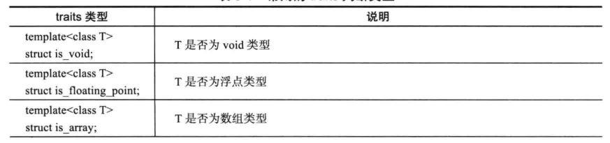
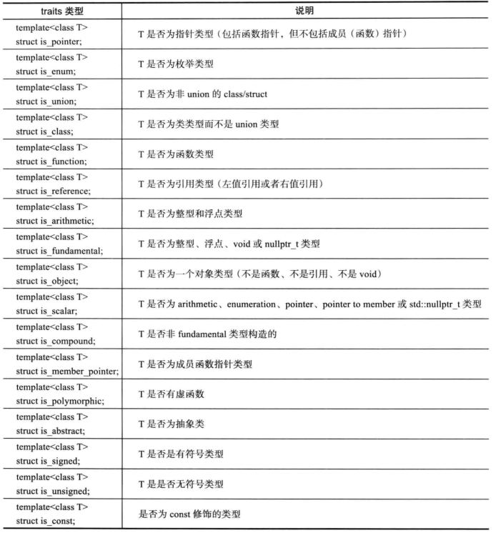
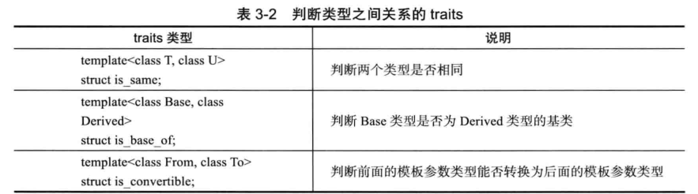
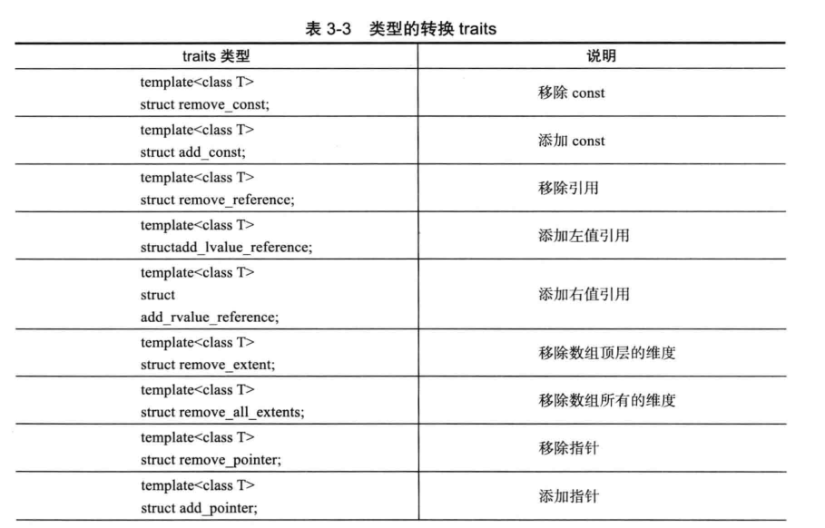
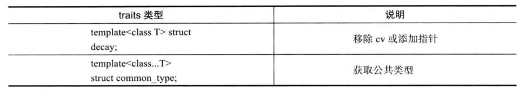

### c++11学习笔记

* 基于范围的for循环中，冒号后面的表达式只会调用一次。

* 范围for循环工作方式：  
    * 普通数组：起始迭代器执行数组起始地址，终止迭代器等于起始地址+size
    * 类对象：调用成员函数，bengin和end
    * 调用全局的begin和end
因此，自定义类对象，需要实现begin和end函数。  

* 自定义迭代器：实现三个函数：++，!=，*  
```cpp
template<typename T>
class iterator
{
public:
    using value_type = T;
    using size_type = size_t;

private:
    size_type curPos;
    value_type value;
    size_type setp;

public:
    iterator(size_type curPos, value_type beginVal, size_type step );

    Iterator& operator++();

    bool operator!=(const iterator other) const;

    value_type operator*() const;
};

template<typename T>
iterator<T>::ietrator(size_type curPos, value_type value, size_type step)
    : curPos{curPos}
    , value{value}
    , step(syep)
    {}

template<typename T>
iterator<T>& operator++() {
    curPos += step;
    return *this;
}

template<typename T>
bool operator!=(const iterator<T>& other) const{
    return curPos != other.curPos;
}

template<typename T>
value_type operator*() const {
    return value;
} 

```

* 使用std::bind，组合函数成新的函数，简化标准库中bind1st，bind2nd（bind1st，bind2nd用于将二元算子转换成一元算子）:
```cpp
//查找大于10的元素个数
int count = std::count_if(cont.begin(), cont.end(), std::bind1st(less<int>, 10));
//查找小于10的元素个数
int counts = std：：count_if(cont.begin(), cont.end(), std::bind2nd(less<int>, 10));

/*使用std::bind进行简化：传入的函数对象参数固定为两个，容器遍历过程中传入的参数使用占位符*/
using std::placeholders::_1;
int count = std::count_if(cont.begin(). cont.end(), std::bind(less<int>, 10, _1));  //大于10
```  
```cpp
//使用bind组合函数
using std::placeholders::_1;
auto great10 = std::bind(great<int>(), _1, 10); //大于10
auto less20 = std::bind(less<int>(), _1, 20); //小于20
auto func = std::bind(std::logical_and<bool>(), great10, less20);
int count  = std::count_if(cont.begin(), cont.end(), func);
```

* auto使用注意是事项：不能用于std::initializeer_list<>的推导。在函数中返回局部变量的{}是不正确的。

* lambda是从11引入的。 [cap] opt -> ret { body }; 

* mutable的作用：在lambda表达式中，按照c++标准，lambda的operator()默认是const，所以即使按值捕获外部变量，也不能修改，需要加上mutable的函数选项，取消默认的const。被mutable修饰，不管有没有参数都要写()。

* lambda表达式转换成函数指针：当且仅当捕获列表为空。 
* tuple：泛化的pair，使用tuple代替3个以上成员的结构体就不合适了
```cpp
//tie返回一个tuple，并且其中元素是左值引用
auto tp = std::tie(1, "hello", 2)；//std::tuple(int&,string&, int&)
//取tuple中的值：get方法，tie方法
int num = tp.get<0>;
int x,z;
std::stirng str;
std::tie(x, str, z);

//使用tie解包，可以使用std::ignore占位
//创建右值引用的tuple，forward_as_tuple
std::map<int, std::string> mp;
mp.emplace(std::forward_as_tuple(10, std::string("hello")));

//std::tuple_cat
auto t = std::tuple_cat(tp, std::make_pair(10, 10.1), std::tie(10));
```

* 万能的函数包装器：
```cpp
template<typename F. typename...Args>
inline auto FuncWrapper(F&& func, Args&&...args) -> decltype(func(std::forward<Args>(args)...)) 
{
    return func(std::forward<Args>(args)...);
}
```

* 11新增的无序容器：unordered_map，unordered_multimap, unordered_set, unordered_multiset。map和set内部是红黑树，插入元素时会自动进行排序，无序容器内部是哈希表。无序容器对于自定义的key，需要提供哈希函数和比较函数
```cpp
struct MyKey{
    std::string name;
    std::string passwd;
};

struct KeyHash
{
    std::size_t operator()(const MyKey& key) const {
        return std::hash<std::string>(key.name) ^ (std::hash<std::string>(key,passwd) << 1);
    }
};

struct keyEqual
{
    bool operator()(const MyKey& key1, const MyKey& key2) const {
        return key1.name  == key2.name &&
            key1.passwd == key2.passwd;
    }
};

int main() 
{
    std::unordered_map<MyKey, std::size_t, KeyHash, KeyEqual> userMp;
}
```

* 编译期常量：
```cpp
template<typename T>
staruct GetSize {
    static const int size = 1;
    enum{ val = 1 };
};
//使用类型萃取:GetSize::value
template<typename>
struct GetSize : std::integral_constant<int, 1>
{};

//integral_constanct的实现
template<typename T, T v>
struct integral_constant
{
    static const T value = v;
    using value_type = T;
    using type = integral_constanct<T, v>;
    operator value_type() { return value; }
};

//true_type和false_type
using true_type =  integral_constanct<bool, true>;
using false_type = integral_constanct<bool, false>;
```

* 常用类型萃取：
   
   
    
    
   

* std::result_of:使用decltype和declval，decay组合也可以
```cpp
template<typename T, typename...Args>
class result_of<F(Args...)>;
``` 

* 关于缓冲区：总是声明一个char[N]并不对，要考虑内存对齐的问题。使用内存对齐的缓冲区。alignof(T)获取T的内存对齐大小。
```cpp
template<std::size_t Len, std::size_t Align = /*default-alignment*/>
struct aligned_storage{};
```

