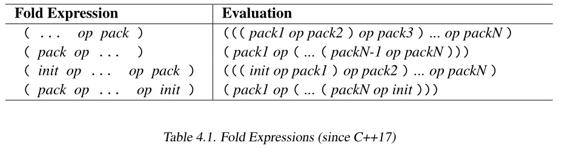

## c++模板学习笔记

* 类的右值可以出现在等号左边，调用移动赋值运算符或者移动构造函数：  
```cpp
#include <iostream>

class Test 
{
public:
	Test(int val = 0) :val{ val } {}
	
	Test(const Test& other) {
		val = other.val;
	}

	Test& operator=(const Test& other) {
		std::cout << "call copy assignment operator" << std::endl;
		val = other.val;
		return *this;
	}

	Test& operator=(Test&& other) noexcept {
		std::cout << "call move assignment operator" << std::endl;
		val = other.val;
		return *this;
	}

	int getValue() {
		return val;
	}
private:
	int val;
};

Test genTestObject() {
	return Test();
}

int main() 
{
	std::cout << "val = " << (genTestObject() = Test(20)).getValue() << std::endl;
}
```  
上述代码的运行结果为：  
   
因此：***笼统的说，右值不能出现在等号左边有点不太准确***。

* 关于左值与右值（左值，右值都是相对于表达式来说的，而不是变量）：左值的演变-->最开始，左值指的是存储在内存中，寄存器中，可寻址的类型的数据，可以出现在等号左边，而右值不能出现在等号左边-->c89中引入了const，左值的定义出现歧义，如：const int x = 5; x确实存储在内存中，但是x不能被赋值修改，与原来的左值定义冲突；并且，c++中的class虽然为右值，也可能出现在等号左边，与原来的右值定义冲突。-->结果，左值的定义范围扩大（不再是数据的引用T&），包括：T&, *pT, pT->data，都定义为左值，可出现在=左边，字符串常量也被定义为左值；所有的字面常量除字符串常量外都被定义为右值，没有相关联的内存空间来引用，作用仅仅为计算过程中间值（为什么字符串常量不是右值呢，思考一下？），所有临时值都是右值。  优化：已知x, y变量均为左值，表达式x = y，计算过程中产生一个右值（y的值）。在未优化之前，编译器产生一条load指令，从内存或寄存器中读取y的值，因此，可以在编译期间将y的值在这里作为一个操作数，优化掉load指令。  

* c++11中的右值：c++11中引入***右值引用，用于支持移动语义***。c++11在***所有的表达式要么是左值，要么是右值的基础上，重新定义了值策略***  
  
    * glvalue：这种表达式的求值是一个占据内存空间的实体对象，标识一个对象，位域，函数--->泛左值
    * prvalue：这种表达式的求值初始化一个对象，位域，计算一个操作数的值。--->纯右值  
    * xvalue：“xvalue”中的x来自“eXpiring value”(过期的值)，这种表达式属于glvalue，虽然是具有存储空间的实体对象，但其存储空间很快将会失效--->将亡值。  
    * ***左值的重新定义为：不是将亡值的泛左值；右值的重新定义为：要么是纯右值，要么是将亡值***。 

    * 左值的类型  
        *  普通的变量，函数  
        * 解引用运算符*的  
        * 一个string常量  
        * 按引用返回的函数调用  
    * 纯右值的类型：  
        * 非字符串的字面值  
        * 取地址&运算符的  
        * 内置算术运算符的   
        * 按值返回的函数调用  
        * lambda表达式  
    * 将亡值：  
        * 返回值为右值引用的函数调用，例如：std::move()，***std::move实际上什么也没有做，只是告诉编译器，这个值很快将会消失，可以修改它的内存***  
        * 类型转换为右值引用  

    * 临时值转换为泛左值（c++17之前通常构造临时对象，用纯右值初始化临时对象，在用临时对象执行操作）：  
    ```cpp
    int f(const int& arg);
    int res = f(4);
    ```  
    4是一个纯右值，f既能接收左值，也能接受右值，所以arg实际是glvalue类型。4(prvalue)-->glvalue在c++17中叫做临时实体化（纯右值向泛左值转化）。这里生成一个临时的int对象，用4初始化内存。临时值转换为泛左值的情况：  
    * 右值绑定到引用类型，如f(4)  
    * 访问纯右值类类型的成员  
    * 通过下标索引纯右值类型的数组  
    * 纯右值类型的数组退化为指针  
    * 纯右值x（类型为X）去初始化std::initialize_list<X>对象  
    * sizeof运算符和typeid作用于纯右值  
    ***从c++17开始，不一定会构造临时对象***  
    ```cpp
    #include <iostream>

    class Test 
    {
    public:
        Test() {}
        Test(const Test&) = delete;
        Test(Test&&) = delete;
    };

    Test makeTest() {
        return Test{};  
    }

    Test genTestObject() {
        return Test();
    }

    int main() 
    {
        auto t = makeTest();
    }
    ```  
这段代码在在c++17之前不能编译通过, return Test{}; 会构造临时Test对象，再执行拷贝构造或者移动构造，但是从17起，直接在t的内存中构造Test，和容器的emplace一样。   

* 函数返回值：  
    * 左值引用：返回左值  
    * 右值引用：返回将亡值 ,std::move()  
    * 拷贝值返回：纯右值  
    
* 模板默认参数的写法：  
    ```cpp  
    template<typename T = std::string>  
    void f(T = "");
    ```

***template<> 中的参数为模版参数，在（）中的参数为调用参数***

* ***模版中一个常见的问题：多个模版参数的函数模版如何定义返回值***   
    ```cpp
    template<typename T1, typename T2>
    T1 Max(T1, t1, T2 t2) {
        return t1 > t2 ? t1 : t2;
    }
    ```  
    * 增加一个模版参数，手动指定，作为返回值的类型：  
    ```cpp
    template<typename RT，typename T1, typename T2>
    RT Max(T1 t1, T2 t2) {
        return t1 > t2 ? t1 : t2;
    }
    //调用
    Max<double>(1, 2.0);  
    ```

    * 让编译器决定，返回值类型后置语法（也有缺点）  
        * c++11  
        ```cpp
        template<typename T1, typename T2>
        auto Max(T1, t1, T2 t2) ->decltype(t1 > t2 ? t1 : t2) {
            return t1 > t2 ? t1 : t2;
        }
        //调用
        Max<int, double, double>(1, 2.0);
        ```  
        * c++14
        ```cpp
        template<typename T1, typename T2>
        auto Max(T1, t1, T2 t2) {
            return t1 > t2 ? t1 : t2;
        }
        //调用
        Max<int, double, double>(1, 2.0);
        ``` 

        缺点1：返回值类型可能为引用，为避免这种情况，->typename std::devay<decltype(t1 > t2 ? t1 : t2)>::type   
        缺点2：返回值类型可能不依赖于传入的参数，使用declval  
    * 使用多个参数的通用类型：std::common_type
    ```cpp
    template<typename T1, typename T2>
    typename std::common_type<T1, T2>::type Max(T1, t1, T2 t2) {
        return t1 > t2 ? t1 : t2;
    }
    ```  
    * 将返回值类型定义成默认模版参数  
    ```cpp
    template<typename T1, typename T2, typename RT = std::decay_t<decltype(t1 > t2 ? t1 : t)>>
    RT Max(T1, t1, T2 t2) {
        return t1 > t2 ? t1 : t2;
    }
    ``` 
    ```cpp
    template<typename T1, typename T2, typename RT = std::common_type_t<T1(), T2()>>
    ```
    ```cpp
    template<typename T1, typename T2, typename RT = 
    std::decay_t<declval<T1>(), declval<T2>()>>
    ```

    * std::common_type<>::type执行了decay，auto类型推导不是指针和引用的情况下，也执行了decay  

    * Max<>(10, 20.0)：模版参数列表为空意味着***所有的模版参数***都需要从调用参数中进行推导   

* constexpr：从c++11开始，可以使用constexpr进行编译期间的一些计算  

* 类模版在类中可以不加<T>，在类外需要加。对于类模板来说，只有相应的成员函数被调用，才会实例化生成相关的函数代码。 

* 在类模板中如果要求T满足某些要求，可以使用静态断言与类型萃取：  
```cpp
template<typename T>
class C {
    static_assert(std::is_default_constructible<T>::value, ""); 
} ;
```

* 类模板中的友元函数：  
```cpp
template<typename T>
class Test{
public:
    friend std::ostream& operator<<(std::ostream& os, const Test<T>& test)
    {
        return os;
    }
};
```
***这里的友元函数不是模版函数，而是一个普通的成员函数，如果在类外定义它就会出错，因为它不是一个模版函数，但是它的参数需要模版参数***。解决的办法是让友元函数成为模版函数，可以使用的方法包括：  
```cpp
template<typename T>
class Test{
public:
    template<typename U>
    friend std::ostream& operator<<(std::ostream& os, const Test<U>& test)
    {
        return os;
    }
};
```  
```cpp
//类模板的前向声明
template<typename T>
class Test;
//声明全局的模版函数
template<typename T>
std::ostream& operator<<(std::ostream& os, const Test<T>& test);

template<typename T>
class Test{
public:
    //此时的友元函数是一个
    friend std::ostream& operator<< <T>(std::ostream& os, const Test<T>& test)
    {
        return os;
    }
};
```
下面这段代码编译不通过：  
```cpp
#include <iostream>

template<typename T>
class Test 
{
public:
	Test() {
	}

	friend std::ostream& operator<<(std::ostream& os, const Test<T>& test);
};

template<typename T>
std::ostream& operator<<(std::ostream& os, const Test<T>& test) {
	os << "hello";
	return os;
}

int main() 
{
	Test<int> t;
	std::cout <<t;
}

```
友元函数成为函数模版即可：
```cpp
#include <iostream>

template<typename T>
class Test;

template<typename T>
std::ostream& operator<<(std::ostream& os, const Test<T>& t) {
	os << "helllo";
	return os;
}

template<typename T>
class Test 
{
public:
	Test() {
	}

	friend std::ostream& operator<<<T>(std::ostream& os, const Test<T>& test);
};

int main() 
{
	Test<int> t;
	std::cout << t;
}
```

* 类模板的特化：***特化允许针对特定的类型进行优化，例如对于某个大对象使用传引用***。可以对整个类的模版参数进行特化，也可以只针对某个成员函数进行特化。
```cpp
template<>
class Test<std::string> 
{
public:
    void test();
};

//成员函数
void Test<std::string>::test() {}
```

* 类模板的局部特化：***针对特定情况使用，一些参数仍然由用户定义***  
```cpp
//一个参数
template<typename T>
class Test<T*>
{
public:
    void test();
};

template<typename T>
void Test<T*>::test() {

}

//多个参数
template<typename T1, typename T2>
class TestM
{};

template<typename T>
class TestM<T, T>
{};

template<typename T>
class TestM<T, int> 
{};

template<typename T1, typename T2>
class TestM<T1*, T2*>
{};

```  

* 默认类模板参数：  
```cpp
template<typename T, typename Container = std::vactor<T> >

* 模版别名：从c++11开始，可以为模版定义别名，并且别名也可以被参数化：
```cpp
template<typename T>
using TestIterator = typename Test<T>::iterator;
//从而，TestIterator<int> start == typename  Test<T>::iterator start;
```

* 调用参数为字符串字面量时，模版参数推导的特殊情况：
    * 按值传递：推导过程中会自动***decay***, T--->const char*
    * 按引用传递：***参数按照引用传递，不会自动进行decay***，T--->const char[10]   
怎么解决这个问题呢？是否只能按照值传递，是否可以当掺入的参数是字符串字面值或者c风格的字符串是，自动将T推导为string？***推导指南：推导指南需要再全局命名空间中声明***  
```cpp
//c++17
Test(const char*) -> Test<std::string>;
```

* 非类型模版参数：类模版使用非类型模版参数的例子就是std::array。  
```cpp
template<typename T, std::size_t MaxSize = 100>
class Test{};
```  
非类型模版参数函数可以用在***将函数或者操作作为参数传递***：  
```cpp
template<int val, typename T>
T addValue(T x) {
    return val + val;
}

std::transform(start_iter, end_iter, dest_iter, addValue<5, int>);
```
非类型模版参数的限制：通常，非类型模版参数只能是整形常量，包括枚举值，指针（对象指针，函数指针，成员指针），左值引用，std::nullptr_t.***浮点数和类对不能作为非类型模版参数***，非类型模版参数可以是编译期间计算的任何表达式，但是>不能出现，否则提前结束对应的模版由尖括号。  


* 模版参数类型使用auto：从c++17开始。使用他的值：std::array<int, MaxSize> elems; 使用他的类型：using size_type = decltype(MaxSize);
```cpp
template<typename T, auto MaxSize>
class Test{};
```

* 从c++17开始，使用type_traits中的value成员，可以使用_v简写，如：std::is_same_v<decltype(T1), decltype(T2)>。就像使用_t简写::type一样。

* 变参模版：传递任意数量，任意类型的参数。
```cpp
//变参模版打印参数
template<typename T, typename...Types>
void printArgs(T firstArg, Types...args)
{
    std::cout << firstArg << std::endl;
    printArgs(args...);
}
//空参数结束递归
void printArgs()
{
   
}
```
args：函数参数包 Types：模版参数包

* c++11中sizeof...操作符：可以对模版参数包和函数参数包使用。sizeof...(Types)。
```cpp
template<typename T, typename...Types>
void print(T firstArg, Types...args)
{
    std::cout << firstArg << std::endl;
    if(sizeof...(args) > 0) {
        print(args...);
    }
}
```
这段代码存在的问题：if语句判断是在运行时期，所以，当只有一个参数时print仍然会在编译期间生成。***解决这个问题可以使用c++17的编译期if***。  

* 折叠表达式：从c++17开始，可以使用一个二元操作符对函数参数包进行计算。
```cpp
template<typename...T>
auto foldSum(T...s) {
    return (... + s); //((s1 + s2) + s3);
}
```
如果函数参数包为空，则此时&&的结果为true，||的结果为false，逗号运算符的结果为void()。  
  

* 使用折叠表达式->*遍历二叉树，有点抽象，但是对于理解学习这种技术还可以，怪花里胡哨的：
```cpp
struct Node{
int value;
Node* left;
Node* right;
Node(int v):value(v), left(nullptr), right(nullptr){}
};

auto left = &Node::left;
auto right = &Node::right;

//使用折叠表达式遍历
template<typename T, typename...TP>
Node* traverse(T np, TP...paths)
{
    retrun (np ->* ... ->* paths); //np ->* path1 ->* path2
}

int main()
{
    Node* root = new Node{0};
    root->left = new Node{1};
    root->left->right = new Node{2};

    Node* node = traverse(root, left, right);
}

//使用折叠表达式打印参数包，这样打印没有空格分隔
template<typename...Types>
void print(Types...args)
{
    (std::cout << ... << args) << std::endl;
}

//思考：展开形式，参数使用方式？
template<typename T>
class AddSpace
{
private:
    const T& data;

public:
    AddSpace(const T& ref):data(ref) {}

    friend std::ostream& operator<<(std::ostream& os, AddSpace<T> s) ]
    {
        return os << s.data << " ";
    }
};

template<typename...Types>
void print(Types...args)
{
    (std::cout << ... << AddSpace(args)) << std::endl;
}
```

* 变参模版的应用：  
    * 将参数传递给堆上构造的对象的构造函数，如make_shared<T>(args1, args2)
    * 构造线程对象时，传递的参数： std::thread t(func, args1, args2)
    * ......
    变参模版经常结合移动语义，完美转发一起使用
```cpp
template<typename T, typename...Args>
shared_ptr<T> make_shared(Args&&...args);

class thread{
public:
    template<typename F, typename...Args>
    explicit thread(F&& func, Args&&...args);
};
//值传递：decay  引用传递：不传递
template<typename...Args>
void f(Args...args);

template<typename...Args>
void f(const Args&...args);

* 变参模版和变参表达式：  
参数包可以出现在类模板中，函数模版中，表达式中，using声明中，推导指南中。在表达式中，可以对参数包进行计算  
```cpp
template<typename...Types>
void func(const Types&...args)
{
    print(args + args...); // args1 + args1, args2 + args2...
}

//加上一个常数
template<typename...Args>
void func(const Args&...args)
{
    print(args + 1 ...);    //1 ...之间有个空格
}

//编译期表达式中可以计算模版参数包
template<typename T1, typename...TN>
constexpr bool isAllSame(T1, TN...)
{
    return (std::is_same<T1, TN>::value && ...);
}

//变参索引
template<typename C, typename...Idx>
void func(typename C, typename...Idx)
{
    print(C[Idx]...);
}

//非类型模版参数也可以是参数包
template<std::size_t...Idx, typename C>
void f(Idx...idx, C c)
{
    print(C[idx]...);
}

//变参模版推导指南
template<typename T, typename...U>
array(T, U...) -> array<std::enable_if_t<(is_same_v<T, U> && ...), T>, (1 + sizeof...(U))>;

//变参基类和using声明
class Customer
{
private:
    std::string name;
public:
    Customer(const std::string& nm): name(nm) {}
    std::string getName() const { return name; }
};

struct CustomerEq{
    bool operator()(const Customer& c1, const Customer& c2) const {
        return c1.getName() == c2.getName();
    }
};

struct CustomerHash{
    std::size_t operator()(const Customer& c) const {
        return std::hash<std::string>()(c.getName());
    }
};
// 从C++17开始
template<typename...Base>
struct Overloader : Base...
{
    using Base::operator()...;
};

int main()
{
    using CustomerOp = Overloader<CustomerHash, CustomerEq>;

    std::unorder_set<Customer, CustomerHash, CustomerEq> coll1;
}

```

* 如果一个名字依赖于模版参数并且是一个类型，则在使用时需要用typename进行标识。T::const_iterator pos  ---> typename T::const_iterator pos。

* 零初始化：对于许多内置类型，包括指针，没有默认的构造函数。任何未初始化的局部变量都是未定义的。
```cpp
template<typename T>
void f() {
    T x;    //x是未定义的
    T y{};  //y如果是内置类型，则此时为0，false，nullptr
    T z();  //c++11之前
}
```
在c++17之前，0初始化的方式为T x = T();但是，前提为拷贝构造函数不是explicit， 从17开始两种方式都可以。T{}， T()。从11开始，可以在类中为非静态成员提供默认值。

* 模版中的this->：
```cpp
template<typename T>
class Base{
public:
    void test() {}
};

template<typename T>
class Derived : Base<T>
{
public:
    void foo() 
    {
        test(); //错误：只能调用到外部的test
        this->test()； //正确
    }
};
```

* 向模版参数传递原始数组和字符串字面值存在的问题：如果是值传递，则"hello"-->T = const char* ，如果是引用传递，则T = const char[6]。可以特化模版特殊处理原始数组和字符串字面值，可以使用推导指南。
```cpp
template<typename T, int N, int M>
bool less(T (&a)[N], T (&b)[M]) {
    for(int i  = 0; i < N && i < M; ++i) {
        return a[i] < b[i];
    }
    return N < M;
}

int x[] = {1, 2, 3};
int y[] = {2, 3, 5};
std::cout << less(x, y) << std::endl;
```
有时候不得不重载或者部分特化来处理未知绑定的数组，这句话啥意思？？？：
```cpp
template<typename T>
struct MyClass;

template<typename T,  std::size_t SZ>
struct MyClass<T[SZ]>   //部分特化，已知绑定的数组
{
    static void print()  {}
};

template<typename T, std::size_t SZ>
struct MyClass<T(&)[SZ]>  //部分特化，已知绑定数组的引用
{
    static void print() {}
};

template<typename T>
struct MyClass<T[]>     //部分特化，未知绑定的数组
{
    static void print() {}
};

template<typename T>
struct MyClass<T(&)[]> //部分特化，未知绑定数组的引用
{
    static void print() {}
};

template<typename T>
class MyClass<T*> //部分特化，指针类型
{

};
```

* 通用lambda表达式：14引入。成员模版的裁剪版，因为lambda本质上是一个匿名类。
```cpp
[] (auto x, auto y)
{
    return x + y;
}
//等价于
class SomeClass{
public:
    SomeClass(); //只能由编译器调用
    template<typename T1, typename T2>
    auto operator() (T1,x, T2 y) {
        return x + y;
    }
};
```

* 变量模版：14引入。变量可以被参数化为特殊的类型，叫做变量模版。
```cpp
template<typename T>
constexpr T pi{3.1415926535892385}; //定义变量的值，但是没有定义类型
std::cout << pi<float> << std::endl;
std::cout << pi<double> << std::endl;

//header.h
template<typename T = unsigned int> T val{};

//translate unit 1
#include "header.h"
int main() 
{
    val<int> = 40;

}

//translate unit 2
void print()
{
    std::cout << val<int> << std::endl;
}

//变量模版可以具有默认参数和默认值
template<typename T = long>
constexpr T val = T{3.1415926};
//使用默认值
std::cout << val<> << std::endl;

//变量模版可以具有非类型参数
 template<int N>
 std::array<int, N> arr{};

 template<auto N>
 constexpr decltype(N) dval = N;    //类型依赖于传递的值

 int main() 
 {
    arr<10>[0] = 42;
 }
```

* 变量模版作为类模板的数据成员
```cpp
template<typename T>
class Test
{
public:
    static constexpr int max = 1000;
};
//则对于不同的特化Test，可以定义不同的值
template<typename T>
constexpr int myMax = Test<T>::max;

auto i = myMax<std::string>; //等价于Test<std::string>::max;

//标准库中得示例
namespace std
{
    template<typename T>
    class numeric_limits{
    public:
        static const bool is_signed = false;
    };
}
//可以定义
template<typename T>
constexpr bool isSigned = std::numeric_limits<T>::is_signed;

//使用
auto i = isSigned<char>;
```

* 模版的模版参数：
```cpp
template<typename T, tempalte<typename Elem> class Cont = std::vector>
class MyStack{
    Cont<T> cont;
public:
    void test();
};

template<typename T, template<typename> class Cont>
void MyStack<T, Cont>::test() {

}
/*在c++17之前，模板的模版参数如果是一个标准库容器，上面这段代码存在一点问题，；例如：容器：template<typename T, template<typename Elem> class allocator = default_allocator<Elem>>，虽然有默认参数，但是会将其忽略，也就是我们传递的容器需要两个模版参数，但是上面Stack中只传递了一个模版参数，导致不匹配：
*/
template<typename T, template<typename Elem, typename Alloc = std::allocator<Elem>> class  Cont = std::vector>
class Test{
public:
    void test();
};

template<typename T, template<typename, typename> class Cont>
void Test<T, Cont>::test() {}
```

* 访问模版参数的中的类型：typename T::size
* 如果基类是一个类模板，派生类中访问基类中的成员函数需要使用this->
* 模版形式的构造函数和赋值操作符不会取代之前定义普通函数。
* _t后缀从c++14开始，_v后缀从c++17开始
* 注意：***移动语义需要和move结合使用，即使函数签名使用T&&，但是传递一个左值引用而不是move()，则会调用左值引用的版本***。T&&是转发引用，而T::Iterator&&是右值引用。
```cpp
class Peraon
{
private:
    std::string name;
public:
    template<typename STR>
    Person(STR&& str) : name(std::move(str)) {}
    Person(const std::string& nm) : name(nm) {}
    Person(std::string&& nm): name(std::move(nm)) {}
};

int main()
{
    Person p1("tmp");   //OK
    Person p2(P1);  // Error

    const Person p3("P3");
    Person p4(p3);  //OK
} 
/*上面这段代码的问题是：重载决议认为对于一个nonconst引用，Person(T&&)比Person(const Person&)更加匹配。那么是否可以声明一个Person(Person&)来处理这种情况呢？ --不能。因为在该类的派生类中，重载决议依然认为模版形式的更加匹配。要解决这个问题，也就是控制模版的匹配，使用std::enable_if*/

//问题：传入的参数是一个std::string或可以构造std::string时，调用拷贝构造，不应该调用T&&
template<typenmae T>
using EnableIfString = std::enable_if_t<std::is_convertiable_v<T, std::string>>;

class Person
{
public:
    template<typename T, typename EnableIfString<T>>
    Person(T&&);
};

```
* std::enable_if：编译期间，根据条件忽略某些模版的匹配。
```cpp
template<typename T>
typename std::enable_if<sizeof(T) > 4>::type test() {}
/*enable_if<condition, Type>：如果condition==true,则type为Type，若Type可以为空或void，若condition==false，则忽略该模版的匹配
*/

/*enable_if的常用写法，将enable_if放在模版声明template的中间可读性不好，所以通常引入一个额外的模版参数，然会将enable_if放在后面。*/
template<typename T, typename = std::enable_if_t<condition, Type>>

/*还可以使用模版别名简化enable_if表达式*/
template<typename T>
using CheckCondition = std::enable_if_t<sizeof(T) > 4>
template<tyname T, typename CheckCondition<T>>
void test() {}
```

* ***不能使用enable_if来禁用之前定义的拷贝构造，移动构造，拷贝赋值运算符，移动赋值运算符这4个特殊的成员函数。因为，模版函数并不会被视为特殊的成员函数，也就是当需要这4个函数时，不会考虑模版函数。使用=delete也无济于事。有一个技巧来解决这个问题(重载决议)：将拷贝构造函数用cv限定，用=delete标记防止隐式生成，再写自己的拷贝构造成员模版***
```cpp
class Test
{
public:
    Test(const volatile&) = delete;

    template<typename T>
    Test(const Test&) {}
};
```

* 从17开始，一个对象即使没有拷贝构造，也没有移动构造，可以传递temporary entities(rvalue)

* ***值传递的退化操作：原始数组和字符串字面值退化为指针，CV限定符被忽略，函数退化为函数指针***

* std::string中减少拷贝代价的方式：SSO：小对像优化，传入的值比较小时，直接在string对象中保存，不必分配堆空间；写拷贝：这种方式在多线程中问题比较大，从11版本开始移除。

* 在模版中参数传递使用T&可能存在的问题：T可能被推导为带有const限定符，从而本来期待一个左值，但是传递右值也可以，避免这种情况的方式：
    * 使用静态断言进行检查：
    ```cpp
    template<typename T>
    void test(T& t) {
        static_assert(!std::is_const_v<T>, "T is const");
    }
    ```
    * 使用enable_if：
    ```cpp
    template<typename T, typename = std::enable_if_t<!std:;is_const_v<T>>>
    void  test() {}
    ```
* std::ref和std::cref：从11开始，对于函数模版，传递参数时可以使用ref和cref。cref不会改变模版中对参数的处理，它对传递进来的参数进行包装，使其表现起来就像引用一样，实际，创建了一个std::reference_wrapper<>对象指向原始的参数，然后将这个对象作为值进行传递，这个对象可以进行隐式类型转换为原始的对象。
```cpp
template<typoename T>
void test(T arg) {
    std::cout << arg << std::endl; 
}

std::string s = "hello";
test(std::cref(s));     /*ERROR：arg已经变成了std::reference_wrapper对象*/
```
***std::reference_wrapper<>的作用是将引用包装成一种对象，从而可以在拷贝它，例如：在类中用std::reference_wrapper<>包装容器中对象的引用。***

* 原始数组和字符串字面值：
```cpp
template<typename T>
void test(T arg1, T arg2)
{
    
}

test("hello", "her");   //Error
```
解决方法：  
* 保证传入的是数组，手动decay
```cpp
template<typename T, std::size_t L1, std::size_t L2>
void test(T(&arg1)[L1], T(&arg2)[L2])
{
    auto a = arg1;
    auto b = arg2;  //退化为指针类型，a， b
}
```
* 使用enable_if检测是否是原始数组，若是，使用万能引用传递  
```cpp
template<typename T, typename = std::enable_if_t<std::is_array_v<T>>>
void test(T&& arg1, T&&arg2)
{}
```

* 处理模版函数中的返回值：不论是传值，还是传引用，如果返回类型为T，则存在隐患，T可能为引用类型：
```cpp
template<typename T>
typename std::remove_reference<T>::type test() {
    return T{};
}

//使用14语法auto，自动decay 
template<typename T>
auto test()
{
    return T{};
}
```

* ***从std::make_pair的变更历史察看参数传递可能存在的问题：***
```cpp
/*最初版本98,使用const &避免大对象的拷贝，但是处理原始数组和字符串字面值容易出错*/
template<typename T1, typename T2>
pair<T1, T2> make_pair<const T1& t1, const T2& t2>
{
    return <T1, T2>(t1, t2);
}

/*03*/
template<typename T1, typename T2>
pair<T1, T2> make_pair<T1 t1, T2 t2>
{
    return pair<T1, T2>(t1, t2);
}

/*11版本支持移动语义*/
template<typename T1, typename T2>
constexpr pair<typename std::decay<T1>::type, typename std::decay<T2>::type> make_pair(T1&& t1, T2&& t2) 
{
    return pair<typename std::decay<T1>::type, typename std::decay<T2>::type>(std::foward<T1>(t1), std:;foward<T2>(t2));
}
```

* 模版元编程在编译期计算是否为素数：
```cpp
template<unsigned p, unsigned d>
struct DoIsPrime {
    static constexpr bool value = (p%d!=0) && DoIsPrime<p, d-1>::value;
};

template<unsigned p>
struct DoIsPrime<p, 2>{
    static constexpr bool value = (p%2)!=0;
};

template<unsigned p>    //primary template
struct IsPrime{
    static constexpr bool value = DoIsPrime<p, p/2>::value;
};

//特化处理特殊情况
template<>
struct IsPrime<0> { static constexpr bool value = false; };
template<>
struct IsPrime<1> { static constexpr bool value = false; };
template<>
struct IsPrime<2> { static constexpr bool value = true; };
template<>
struct IsPrime<3> { static constexpr bool value = true; };
```

* constexpr：11引入。一个constexpr函数可以在编译期计算，但是c++11对于conxtexpr有严格的限制，在14中减少了许多限制。
```cpp
//11版本
constexpr bool doIsPrime(unsigned p, unsigned d)
{
    return d!=2 ? (p%d!=0) && doIsPrime(p, d-1) : (p%2!=0);
}

constexpr bool isPrime(unsigned p)
{
    return p < 4 ? !(p < 2) : doIsPrime(p, p/2);
}

//14版本
constexpr bool isPrime(unsigned int p)
{
    for(unsigned int d = 2; d <= p/2; d++ ) {
        if(p % d == 0) {
            return false;
        }
    }
    return p > 1;
}
```

* 对于编译器来说需要进行编译期计算的上下文：数组的长度，非类型模版参数等，此时会调用constexpr函数进行计算，如果发生错误则导致编译错误；其他上下文中，编译器可能会，可能不会执行计算，但若是执行并且出错，则不会导致编译错误，而是将其放到运行期间运行。比如：
```cpp
constexpr bool isPrime9 = isPrime(9);   
const bool isPrime10 =isPrime(10);  //编译期计算

int x;
constexpr bool isPrimeX = isPrime(x);   //运行时计算


* ***通过局部特化选择执行路径***：
```cpp
/*根据模版参数是否是素数选择执行路径*/
template<int SZ, bool = isPrime<SZ>>
struct Helper;

template<int SZ, true>
struct Helper
{
    //操作
};

template<int SZ, false>
struct Helper
{
    //操作
};

template<typename T, std::size_t SZ>
long test(const std::array<T, SZ>& arr) 
{
    Helper<SZ> h;   //依赖于SZ是否是素数
    //操作
}
```

* 因为***函数模版不支持局部特化***， 必须使用其他机制来根据条件改变函数的行为，例如：  
    * 将特化交给class，在class中写static成员函数
    * 使用enable_if
    * 使用17支持的编译期if

* 成员模版需要注意的一个地方：  
```cpp
class Test
{
public:
    template<typename T, typename...Args, typename = std::enable_if_t<!std::is_same_v<std::decay_t<T>, Test>>>
    Test(T&& t, Args&&...args) {}
};
```

* 返回值推荐写法：  
```cpp
template<typename T>
auto test(const T& t) -> decltype({t.size(), T::size()}) {
    return t.size();
}
```

* C++支持的模版类型：函数模版，类模板，变量模版，别名模版。  

* 可调用对象（也叫作函数对象）：函数指针，仿函数，重载了转换运算符成函数指针或者函数的类   

* tuple: 可以容纳任意数量任意类型的元素，这是其他容器不能做到的。同时，tuple具有很多编译期间计算的特性，可以衔接编译期和运行期，潜力巨大。