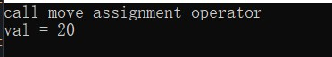
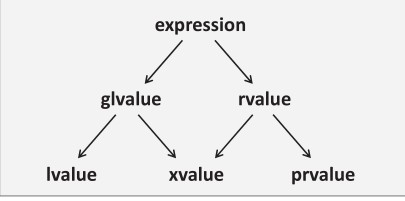

## c++模板学习笔记

* 类的右值可以出现在等号左边，调用移动赋值运算符或者移动构造函数：  
```cpp
#include <iostream>

class Test 
{
public:
	Test(int val = 0) :val{ val } {}
	
	Test(const Test& other) {
		val = other.val;
	}

	Test& operator=(const Test& other) {
		std::cout << "call copy assignment operator" << std::endl;
		val = other.val;
		return *this;
	}

	Test& operator=(Test&& other) noexcept {
		std::cout << "call move assignment operator" << std::endl;
		val = other.val;
		return *this;
	}

	int getValue() {
		return val;
	}
private:
	int val;
};

Test genTestObject() {
	return Test();
}

int main() 
{
	std::cout << "val = " << (genTestObject() = Test(20)).getValue() << std::endl;
}
```  
上述代码的运行结果为：  
   
因此：***笼统的说，右值不能出现在等号左边有点不太准确***。

* 关于左值与右值（左值，右值都是相对于表达式来说的，而不是变量）：左值的演变-->最开始，左值指的是存储在内存中，寄存器中，可寻址的类型的数据，可以出现在等号左边，而右值不能出现在等号左边-->c89中引入了const，左值的定义出现歧义，如：const int x = 5; x确实存储在内存中，但是x不能被赋值修改，与原来的左值定义冲突；并且，c++中的class虽然为右值，也可能出现在等号左边，与原来的右值定义冲突。-->结果，左值的定义范围扩大（不再是数据的引用T&），包括：T&, *pT, pT->data，都定义为左值，可出现在=左边，字符串常量也被定义为左值；所有的字面常量除字符串常量外都被定义为右值，没有相关联的内存空间来引用，作用仅仅为计算过程中间值（为什么字符串常量不是右值呢，思考一下？），所有临时值都是右值。  优化：已知x, y变量均为左值，表达式x = y，计算过程中产生一个右值（y的值）。在未优化之前，编译器产生一条load指令，从内存或寄存器中读取y的值，因此，可以在编译期间将y的值在这里作为一个操作数，优化掉load指令。  

* c++11中的右值：c++11中引入***右值引用，用于支持移动语义***。c++11在***所有的表达式要么是左值，要么是右值的基础上，重新定义了值策略***  
  
    * glvalue：这种表达式的求值是一个占据内存空间的实体对象，标识一个对象，位域，函数--->泛左值
    * prvalue：这种表达式的求值初始化一个对象，位域，计算一个操作数的值。--->纯右值  
    * xvalue：“xvalue”中的x来自“eXpiring value”(过期的值)，这种表达式属于glvalue，虽然是具有存储空间的实体对象，但其存储空间很快将会失效--->将亡值。  
    * ***左值的重新定义为：不是将亡值的泛左值；右值的重新定义为：要么是纯右值，要么是将亡值***。 

    * 左值的类型  
        *  普通的变量，函数  
        * 解引用运算符*的  
        * 一个string常量  
        * 按引用返回的函数调用  
    * 纯右值的类型：  
        * 非字符串的字面值  
        * 取地址&运算符的  
        * 内置算术运算符的   
        * 按值返回的函数调用  
        * lambda表达式  
    * 将亡值：  
        * 返回值为右值引用的函数调用，例如：std::move()，***std::move实际上什么也没有做，只是告诉编译器，这个值很快将会消失，可以修改它的内存***  
        * 类型转换为右值引用  

    * 临时值转换为泛左值（c++17之前通常构造临时对象，用纯右值初始化临时对象，在用临时对象执行操作）：  
    ```cpp
    int f(const int& arg);
    int res = f(4);
    ```  
    4是一个纯右值，f既能接收左值，也能接受右值，所以arg实际是glvalue类型。4(prvalue)-->glvalue在c++17中叫做临时实体化（纯右值向泛左值转化）。这里生成一个临时的int对象，用4初始化内存。临时值转换为泛左值的情况：  
    * 右值绑定到引用类型，如f(4)  
    * 访问纯右值类类型的成员  
    * 通过下标索引纯右值类型的数组  
    * 纯右值类型的数组退化为指针  
    * 纯右值x（类型为X）去初始化std::initialize_list<X>对象  
    * sizeof运算符和typeid作用于纯右值  
    ***从c++17开始，不一定会构造临时对象***  
    ```cpp
    #include <iostream>

    class Test 
    {
    public:
        Test() {}
        Test(const Test&) = delete;
        Test(Test&&) = delete;
    };

    Test makeTest() {
        return Test{};  
    }

    Test genTestObject() {
        return Test();
    }

    int main() 
    {
        auto t = makeTest();
    }
    ```  
这段代码在在c++17之前不能编译通过, return Test{}; 会构造临时Test对象，再执行拷贝构造或者移动构造，但是从17起，直接在t的内存中构造Test，和容器的emplace一样。   

* 函数返回值：  
    * 左值引用：返回左值  
    * 右值引用：返回将亡值 ,std::move()  
    * 拷贝值返回：纯右值  
    
* 模板默认参数的写法：  
    ```cpp  
    template<typename T = std::string>  
    void f(T = "");
    ```

***template<> 中的参数为模版参数，在（）中的参数为调用参数***

* ***模版中一个常见的问题：多个模版参数的函数模版如何定义返回值***   
    ```cpp
    template<typename T1, typename T2>
    T1 Max(T1, t1, T2 t2) {
        return t1 > t2 ? t1 : t2;
    }
    ```  
    * 增加一个模版参数，手动指定，作为返回值的类型：  
    ```cpp
    template<typename RT，typename T1, typename T2>
    RT Max(T1 t1, T2 t2) {
        return t1 > t2 ? t1 : t2;
    }
    //调用
    Max<double>(1, 2.0);  
    ```

    * 让编译器决定，返回值类型后置语法（也有缺点）  
        * c++11  
        ```cpp
        template<typename T1, typename T2>
        auto Max(T1, t1, T2 t2) ->decltype(t1 > t2 ? t1 : t2) {
            return t1 > t2 ? t1 : t2;
        }
        //调用
        Max<int, double, double>(1, 2.0);
        ```  
        * c++14
        ```cpp
        template<typename T1, typename T2>
        auto Max(T1, t1, T2 t2) {
            return t1 > t2 ? t1 : t2;
        }
        //调用
        Max<int, double, double>(1, 2.0);
        ``` 

        缺点1：返回值类型可能为引用，为避免这种情况，->typename std::devay<decltype(t1 > t2 ? t1 : t2)>::type   
        缺点2：返回值类型可能不依赖于传入的参数，使用declval  
    * 使用多个参数的通用类型：std::common_type
    ```cpp
    template<typename T1, typename T2>
    typename std::common_type<T1, T2>::type Max(T1, t1, T2 t2) {
        return t1 > t2 ? t1 : t2;
    }
    ```  
    * 将返回值类型定义成默认模版参数  
    ```cpp
    template<typename T1, typename T2, typename RT = std::decay_t<decltype(t1 > t2 ? t1 : t)>>
    RT Max(T1, t1, T2 t2) {
        return t1 > t2 ? t1 : t2;
    }
    ``` 
    ```cpp
    template<typename T1, typename T2, typename RT = std::common_type_t<T1(), T2()>>
    ```
    ```cpp
    template<typename T1, typename T2, typename RT = 
    std::decay_t<declval<T1>(), declval<T2>()>>
    ```

    * std::common_type<>::type执行了decay，auto类型推导不是指针和引用的情况下，也执行了decay  

    * Max<>(10, 20.0)：模版参数列表为空意味着***所有的模版参数***都需要从调用参数中进行推导   

* constexpr：从c++11开始，可以使用constexpr进行编译期间的一些计算


  