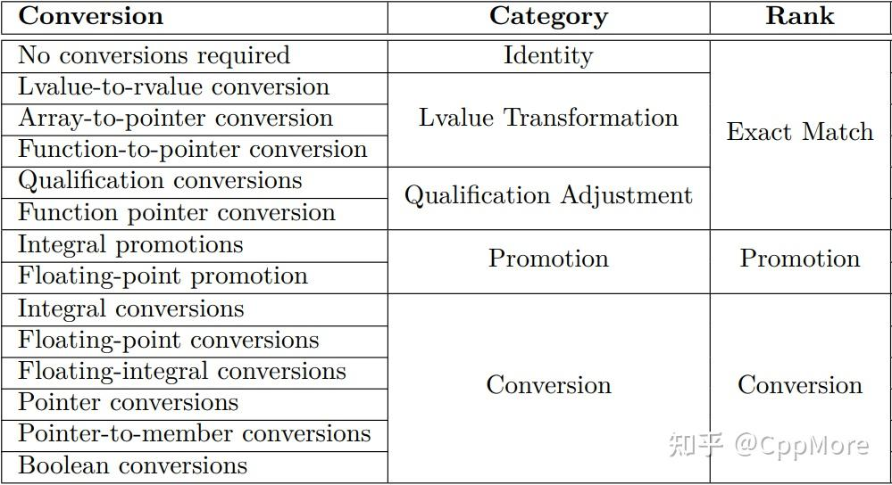

## 重载决议
- 如何来确定函数名的唯一性？  
    &emsp;&emsp;实际上，编译器会通过一种称为Name mangling（名称修饰）的技术来为每个重载函数生成唯一的名称。虽然重载函数的名称是相同的，但其参数不同，因此通过名称+参数再辅以一些规则，生成唯一的名称其实并非难事。但这仍非实现重载函数的关键与难点所在。名称是唯一产生了，但是用户并不知道，也并不能直接通过该名称来调用函数。用户调用的还是重载函数名称本身，此时就需要一套机制来解析实际调用的函数到底是哪个，该机制就是「重载决议」，由C++标准制定。简言之，只要遇到名称相同的函数，重载决议就会出现，用于找出最佳匹配函数。
- 那么问题又来了，它是如何知道存在哪些名称相同的函数？  
&emsp;&emsp;这便是在重载决议出现之前的一项工作，称为Name Lookup（名称查找）。
这一阶段，会根据调用的函数名称，查找函数的所有声明。若函数具有唯一的名称，那么就不会触发重载决议；若查找到多个相同的函数名称，这些函数声明就会被视为一个overload set（重载集）。函数又分为普通函数和函数模板，在Name Lookup阶段都会被查找到。但是函数模板只有实例化之后才能被使用，因此如果存在函数模板，还需要对模板进行特殊的处理，这个阶段就称为Template Handling（模板处理）。经过上述两个阶段的处理，得到的重载集就称为candidate functions（候选函数），重载决议的工作就是在这些candidate functions中，找出最适合的那一个函数。总结一下，当你调用一个重载函数时，编译器首先会进行Name Lookup，找出所有函数声明，然后对函数模板进行Template Handling，实例化出模板函数，产生candidate functions，接着重载决议出现，找出最佳匹配函数。而实际的最佳匹配函数调用，则是通过Name mangling产生的函数名称完成的。

- Name Lookup  
首先来看第一阶段，Name Lookup。该阶段仅仅进行名称查找，并不做任何额外检查。  
Name Lookup的工作主要可以分为两大部分。  
第一部分为Qualified Name Lookup（有修饰名称查找），这主要针对的是带有命名空间的函数调用，或是成员函数。  
第二部分为Unqualified Name Lookup（无修饰名称查找），这种针对的就是普通函数的调用。
    - Qualified Name Lookup  
    带修饰的名称查找并不算复杂，这又可以主要分为两类查找。
    一类是Class Member Lookup，表示对于类成员的名称查找；另一类是Namespace Member Lookup，表示对于命名空间下的名称查找。其实还可以包含枚举名称，因为它也可以使用作用域解析操作符"::"进行访问，但一法通万法，不必单独细论。
        - Class Member Lookup  
        类成员查找，是在访问类成员时进行名称查找的规则。
        成员本质上来说还是两种类型，变量与函数。换个角度来看，成员又可分为静态成员和动态成员，静态成员可以通过"::"进行访问，动态成员可以通过"."或"->"进行访问。
        也就是说，当你使用如上三种方式访问某个变量或函数时，就可能会触发Class Member Lookup。
        首先来看前者，即使用"::"访问时的规则。
            ```cpp
            // Example from ISO C++
            class X {};
            class C {
                class X {};
                static const int number = 50;
                static X arr[number];
            };

            X C::arr[number]; // #1
            ```
            可以将#1处的定义从"::"拆分为前后两部分。

            对于前面的名称X和C，将会在其定义的命名空间进行查找，此处即为全局空间，于是查找到全局作用域下的X和C类。
            对于后面的名称arr和number，将会在C类的作用域下进行查找，它们将作为类成员进行查找。  
            此时就是"::"前面的类型名，告诉编译器后面的名称应该通过Class Member Lookup进行查找。如果搜索发现前面是个命名空间，则会在相应的作用域下查找。  
            由于X是在全局作用域下查找到的，所以并不会找到内部类X，于是该声明会产生编译错误。  
            接着来看后者，关于"."和"->"的规则。看一个简单的例子：
            ```cpp
            struct S {
                void f() {}
            };

            S s;
            s.f();
            S* ps = &s;
            ps->f();        
            ```
            此处要调用f函数，因为使用了"."或"->"操作符，而操作符前面又是一个类，所以f的查找将直接使用Class Member Lookup，在类的作用域下进行查找。
        - Namespace Member Lookup  
        命名空间成员查找，是在访问命名空间下的元素时进行名称查找的规则。  
            当你使用"::"访问元素的时候，就有可能会触发Namespace Member Lookup。

            比如，当把"::"单独作为前缀时，则会强制Name Lookup在全局空间下进行查找。如下述例子
            ```cpp
            void f(); // #1

            namespace mylib {

                void f(); // #2

                void h() {
                    ::f(); // calls #1
                    f();   // calls #2
                }

            } // namespace mylib
            ```
            此时，若是没有在全局作用域下搜索到相应的函数名称，也不会调用#2，而是产生编译错误。若是要在外部访问命名空间内部的f()，则必须使用mylib::f()，否则Name Lookup会找到全局作用域下的#1。

            下面再来看一个稍微复杂点的例子：
            ```cpp
            // Example from ISO C++

            int x;
            namespace Y {
                void f(float);
                void h(int);
            }

            namespace Z {
                void h(double);
            }

            namespace A {
                using namespace Y;
                void f(int);
                void g(int);
                int i;
            }

            namespace B {
                using namespace Z;
                void f(char);
                int i;
            }

            namespace AB {
                using namespace A;
                using namespace B;
                void g();
            }

            void h() {
                AB::g();       // #1
                AB::f(1);      // #2
                AB::f('c');    // #3
                AB::x++;       // #4
                AB::i++;       // #5
                AB::h(16.8);   // #6
            }
            ```
            这里一共有6处调用，下面分别来进行分析。

            第一处调用，#1。

            Name Lookup发现AB是一个命名空间，于是在该空间下查找g()的定义，在29行查找成功，于是可以成功调用。

            第二处调用，#2。

            Name Lookup同样先在AB下查找f()的定义，注意，查找的时候不会看参数，只看函数名称。

            然而，在AB下未找到相关定义，可是它发现这里还有了两个using-directives，于是接着到命名空间A和B下面查找。

            之后，它分别查找到了A::f(int)和B::f(char)两个结果，此时重载决议出现，发现A::f(int)是更好的选择，遂进行调用。

            第三处调用，#3。

            它跟#2的Name Lookup流程完全相同，最终查找到了A::f(int)和B::f(char)。于是重载决议出现，发现后者才是更好的选择，于是调用B::f(char)。

            第四处调用，#4。

            Name Lookup先在AB下查找x的定义，没有找到，于是再到命名空间A和B下查找，依旧没有找到。可是它发现A和B中也存在using-directives，于是再到命名空间Y和Z下面查找。然而，还是没有找到，最终编译失败。

            这里它并不会去查找全局作用域下的x，因为x的访问带有修饰。

            第五处调用，#5。

            Name Lookup在AB下查找失败，于是转到A和B下面查找，发现存在A::i和B::i两个结果。但是它们的类型也是一样，于是重载决议失败，产生ambiguous（歧义）的错误。

            最后一处调用，#6。

            同样，在AB下查找失败，接着在A和B下进行查找，依旧失败，于是接着到Y和Z下面查找，最终找到Y::h(int)和Z::h(double)两个结果。此时重载决议出现，发现后者才是更好的选择，于是最终选择Z::h(double)。

            通过这个例子，相信大家已经具备分析Namespace Member Lookup名称查找流程的能力。

            接着再补充几个需要注意的点。

            第一点，被多次查找到的名称，但是只有一处定义时，并不会产生ambiguous。
            ```cpp
            namespace X {
                int a;
            }

            namespace A {
                using namespace X;
            }

            namespace B {
                using namespace X;
            }

            namespace AB {
                using namespace A;
                using namespace B;
            }

            AB::a++; // OK
            ```
            这里，Name Lookup最终查找了两次X::a，但因为实际只存在一 处定义，于是一切正常。

            第二点，当查找到多个定义时，若其中一个定义是类或枚举，而其他定义是变量或函数，且这些定义处于同一个命名空间下，则后者会隐藏前者，即后者会被选择，否则ambiguous。

            可以通过以下例子来进行理解：
            ```cpp
            // Example from ISO C++

            namespace A {
                struct x {};
                int x;
                int y;
            }

            namespace B {
                struct y {};
            }

            namespace C {
                using namespace A;
                using namespace B;
                int i = C::x; // #1
                int j = C::y; // #2
            }
            ```
            先看#1，由于C中查找x失败，进而到A和B中进行查找，发现A中有两处定义。一处定义是类，另一处定义是变量，于是后者隐藏前者，最终选择int x;这处定义。
            而对于#2，最终查找到了A::y和B::y两处定义，由于定义不在同一命名空间下，所以产生ambiguous。
            到此，对Qualified Name Lookup的内容就基本覆盖了，下面进入Unqualified Name Lookup。
    
    - Unqualified Name Lookup  
        无修饰的名称查找则略显复杂，却会经常出现。
        总的来说，也可分为两大类。
        第一类为Usual Unqualified Lookup，即常规无修饰的名称查找，也就是普遍情况会触发的查询。
        第二类为Argument Dependant Lookup，这就是鼎鼎大名的ADL，译为实参依赖查找。由其甚至发展出了一种定制点表示方式，称为ADL二段式，标准中的std::swap, std::begin, std::end, operator<<等等组件就是通过该法实现的。
        但是本文并不会涉及定制点的讨论，因为这是我正在写的书中的某一节内容:) 内容其实非常之多之杂，本篇文章其实就是为该节扫除阅读障碍而特意写的，侧重点并不同。我额外写过一篇介绍定制点的文章【使用Concepts表示变化「定制点」】，各位可作开胃菜。
        以下两节，分别讲解这两类名称查找。
        - Usual Unqualified Lookup:  
            普通的函数调用都会触发Usual Unqualified Lookup，先看一个简单的例子：
            ```cpp
            void f(char);

            void f(double);

            namespace mylib {
                void f(int);

                void h() {
                    f(3);   // #1
                    f(.0);  // #2
                }
            }
            ```
            对于#1和#2，Name Lookup会如何查找？最终会调用哪个重载函数？
            实际上只会查找到f(int)，#1直接调用，#2经过了隐式转换后调用。
            为什么呢？记住一个准则，根据作用域查找顺序，当Name Lookup在某个作用域找到声明之后，便会停止查找。关于作用域的查找顺序，后面会介绍。
            因此，当查找到f(int)，它就不会再去全局查找其他声明。
            注意：即使当前查找到的名称实际无法成功调用，也并不改变该准则。看如下例子：
            ```cpp
            void f(int);

            namespace mylib {
                void f(const char*);

                void h() {
                    f(3);   // #1 Error
                }
            }
            ```
            此时，依旧只会查找到f(const char*)，即使f(int)才是正确的选择。由于没有相应的隐式转换，该代码最终编译失败。那么具体的作用域查找顺序是怎样的？请看下述例子：
            ```cpp
            // Example from ISO C++
            namespace M {

                class B { // S3
                };
            }

            // S5
            namespace N {
                // S4
                class Y : public M::B {
                    // S2
                    class X {
                        // S1
                        int a[i]; // #1
                    };
                };
            }
            ```
            #1处使用了变量i，因此Name Lookup需要进行查找，那么查找顺序将从S1-S5。所以，只要在S1-S5的任何一处声明该变量，就可以被Name Lookup成功找到。
            接着来看另一个查找规则，如果一个命名空间下的变量是在外部重新定义的，那么该定义中涉及的其他名称也会在对应的命名空间下查找。
            简单的例子：
            ```cpp
            // Example from ISO C++

            namespace N {
                int i = 4;
                extern int j;
            }

            int i = 2;
            int N::j = i; // j = 4
            ```
            由于N::j在外部重新定义，因此变量i也会在命名空间N下进行查找，于是j的值为4。如果在N下没有查找到，才会查找到全局的定义，此时j的值为2。
            而对于友元函数，查找规则又不相同，看如下例子：
            ```cpp
            // Example from ISO C++

            struct A {
                typedef int AT;
                void f1(AT);
                void f2(float);
                template <class T> void f3();
            };

            struct B {
                typedef char AT;
                typedef float BT;
                friend void A::f1(AT);   // #1
                friend void A::f2(BT);   // #2
                friend void A::f3<AT>(); // #3
            };
            ```
            此处，#1的AT查找到的是A::AT，#2的BT查找到的是B::BT，而#3的AT查找到的是B::AT。
            这是因为，当查找的名称并非模板参数时，首先会在友元函数的原有作用域进行查找，若没查找到，则再在当前作用域进行查找。对于模板参数，则直接在当前作用域进行查找。
        - Argument Dependant Lookup  
            终于到了著名的ADL，这是另一种无修饰名称查找方式。
            什么是ADL？其实概念很简单，看如下示例。
            ```cpp
            namespace mylib {
                struct S {};
                void f(S);
            }

            int main() {
                mylib::S s;
                f(s); // #1,OK
            }
            ```
            按照Usual Unqualified Lookup是无法查找到#1处调用的声明的，此时编译器就要宣布放弃吗？并不会，而是再根据调用参数的作用域来进行查找。此处，变量s的类型为mylib::S，于是将在命名空间mylib下继续查找，最终成功找到声明。  由于这种方式是根据调用所依赖的参数进行名称查找的，因此称为实参依赖查找。那么有没有办法阻止ADL呢？其实很简单。
            ```cpp
            namespace mylib {
                struct S {};
                void f(S) {
                    std::cout << "f found by ADL\n";
                }
            }

            void f(mylib::S) {
                std::cout << "global f found by Usual Unqualified Lookup\n";
            }

            int main() {
                mylib::S s;
                (f)(s); // OK, calls global f
            }
            ```
            这里存在两个定义，本应产生歧义，但当你给调用名称加个括号，就可以阻止ADL，从而消除歧义。
            实际上，ADL最初提出来是为了简化重载调用的，可以看如下例子。
            ```cpp
            int main() {
                // std::operator<<(std::ostream&, const char*)
                // found by ADL.
                std::cout << "dummy string\n";

                // same as above
                operator<<(std::cout, "dummy string\n");
            }
            ```
            如果没有ADL，那么Unqualified Name Lookup是无法找到你所定义的重载操作符的，此时你只能写出完整命名空间，通过Qualified Name Lookup来查找到相关定义。

            但这样代码写起来就会非常麻烦，因此，Unqualified Name Lookup新增加了这种ADL查找方式。

            在编写一个数学库的时候，其中涉及大量的操作符重载，此时ADL就尤为重要，否则像是"+"，"=="这些操作符的调用都会非常麻烦。

            后来ADL就被广泛运用，普通函数也支持此种查找方式，由此还诞生了一些奇技淫巧。

            不过，在说此之前，让我们先熟悉一下常用的ADL规则，主要介绍四点。

            第一点，当实参类型为函数时，ADL会根据该函数的参数及返回值所属作用域进行查找。

            例子如下：
            ```cpp
            namespace B {
                struct R {};
                void g(...) {
                    std::cout << "g found by ADL\n";
                }
            }

            namespace A {
                struct S {};
                typedef B::R (*pf)(S); 

                void f(pf) {
                    std::cout << "f found by ADL\n";
                }
            }

            B::R bar(A::S) {
                return {};
            }

            int main() {
                A::pf fun = bar;
                f(fun); // #1, OK
                g(fun); // #2, OK
            }
            ```
            #1和#2处，分别调用了两个函数，参数为另一个函数，根据该条规则，ADL得以查找到A::f()与B::g()。

            第二点，若实参类型是一个类，那么ADL会从该类或其父类的最内层命名空间进行查找。

            例子如下：
            ```cpp
            namespace A {
                // S2
                struct Base {};
            }

            namespace M {
                // S3 not works!
                namespace B {
                    // S1
                    struct Derived : A::Base {};
                }
            }

            int main() {
                M::B::Derived d;
                f(d); // #1
            }
            ```
            此处，若要通过ADL找到f()的定义，可以将其声明放在S1或S2处。

            第三点，若实参类型是一个类模板，那么ADL会在特化类的模板参数类型的命名空间下进行查找；若实参类型包含模板模板参数，那么ADL还会在模板模板参数类型的命名空间下查找。  
            例子如下：
            ```cpp
            namespace C {
                struct Final {};
                void g(...) {
                    std::cout << "g found by ADL\n";
                }
            };

            namespace B {
                template <typename T>
                struct Temtem {};

                struct Bar {};
                void f(...) {
                    std::cout << "f found by ADL\n";
                }
            }

            namespace A {
                template <typename T>
                struct Foo {};
            }

            int main() {
                // class template arguments
                A::Foo<B::Bar> foo;
                f(foo); // OK

                // template template arguments
                A::Foo<B::Temtem<C::Final>> a;
                g(a); // OK

            }
            ```
            代码一目了然，不多解释。
            第四点，当使用别名时，ADL会无效，因为名称并不是一个函数调用。
            看这个例子：
            ```cpp
            // Example from ISO C++

            typedef int f;
            namespace N {
                struct A {
                    friend void f(A&);
                    operator int();
                    void g(A a) {
                        int i = f(a); // #1
                    }
                };
            }
            ```
            注意#1处，并不会应用ADL来查询函数f，因为它其实是int，相当于调用int(a)。

            说完了这四点规则，下面来稍微说点ADL二段式相关的内容。

            看下面这个例子
            ```cpp
            namespace mylib {

                struct S {};

                void swap(S&, S&) {}

                void play() {
                    using std::swap; 

                    S s1, s2;
                    swap(s1, s2); // OK, found by Unqualified Name Lookup

                    int a1, a2;
                    swap(a1, a2); // OK, found by using declaration
                }
            }
            ```
            然后，你要在某个地方调用自己提供的这个定制函数，此处是play()当中。

            但是调用的地方，你需要的swap()可能不只是定制函数，还包含标准中的版本。因此，为了保证调用形式的唯一性，调用被分成了两步。  
                - 使用using declaration  
                - 使用swap()  
            这样一来，不同的调用就可以被自动查找到对应的版本上。然而，只要稍微改变下调用形式，代码就会出错：
            ```cpp
            namespace mylib {

                struct S {};

                void swap(S&, S&) {} // #1

                void play() {
                    using namespace std;

                    S s1, s2;
                    swap(s1, s2); // OK, found by Unqualified Name Lookup

                    int a1, a2;
                    swap(a1, a2); // Error
                }
            }
            ```
            这里将using declaration写成了using directive，为什么就出错了？
            其实，前者将std::swap()直接引入到了局部作用域，后者却将它引入了与最近的命名空间同等的作用域。根据前面讲过的准则：根据作用域查找顺序，当Name Lookup在某个作用域找到声明之后，便会停止查找。编译器查找到了#1处的定制函数，就立即停止，因此通过using directive引入的std::swap()实际上并没有被Name Lookup查找到。

            这个细微的差异很难发现，标准在早期就犯了这个错误，因此STL中的许多实现存在不少问题，但由于ABI问题，又无法直接修复。这也是C++20引入CPOs的原因，STL2 Ranges的设计就采用了这种新的定制点方式，以避免这个问题。

            在这之前，标准发明了另一种方式来解决这个问题，称为Hidden friends。
            ```cpp
            namespace mylib {

                struct S {
                    // Hidden friends
                    friend void swap(S&, S&) {}
                };

                void play() {
                    using namespace std;

                    S s1, s2;
                    swap(s1, s2); // OK, found by ADL

                    int a1, a2;
                    swap(a1, a2); // OK
                }
            }
            ```
            就是将定制函数定义为友元版本，放在类的内部。此时将不会再出现名称被隐藏的问题，这个函数只能被ADL找到。
            Hidden friends的写法在STL中存在不少，想必大家曾经也不知不觉中使用过。
        - Template Name Lookup  
            首先要说的是对于typename的使用，在模板当中声明一些类型，有些地方并不假设其为类型，此时只有在前面添加typename，Name Lookup才视其为类型。  
            不过自C++20之后，需要添加typename的地方已越来越少，已专门写过文章，请参考：新简化！typename在C++20不再必要。  
            其次，介绍一个非常重要的概念，「独立名称」与「依赖名称」。  
            以上两节Name Lookup内容只涉及零星关于模板的名称查找，本节专门讲解这部分查找，它们还是属于前两节的归类。  
            什么意思呢？看一个例子。
            ```cpp
            // Example from ISO C++

                int j;

                template <class T>
                struct X {
                    void f(T t, int i, char* p) {
                        t = i; // #1
                        p = i; // #2
                        p = j; // #3
                    }
                };
            ```
            在Name Lookup阶段，模板还没有实例化，因此此时的模板参数都是未知的。对于依赖模板参数的名称，就称其为「依赖名称」，反之则为「独立名称」。

            依赖名称，由于Name Lookup阶段还未知，因此对其查找和诊断要晚一个阶段，到模板实例化阶段。

            独立名称，其有效性则在模板实例化之前，比如#2和#3，它们诊断就比较早。这样，一旦发现错误，就不必再继续向下编译，节省编译时间。

            查找阶段的变化对Name Lookup存在影响，看如下代码：
            ```cpp
            // Example from ISO C++

            void f(char);

            template <class T>
            void g(T t) {
                f(1);    // non-dependent
                f(T(1)); // dependent
                f(t);    // dependent
                dd++;    // non-dependent
            }

            enum E { e };
            void f(E);

            double dd;
            void h() {
                g(e);   // calls f(char),f(E),f(E)
                g('a'); // calls f(char),f(char),f(char)
            }
            ```
            在h()里面有两处对于g()的调用，而g()是个函数模板，于是其中的名称查找时间并不相同。

            f(char)是在g()之前定义的，而f(E)是在之后定义的，按照普通函数的Name Lookup，理应是找不到f(E)的定义的。

            但因为存在独立名称和依赖名称，于是独立名称会先行查找，如f(1)和dd++，而变量dd也是在g()之后定义的，所以无法找到名称，dd++编译失败。对于依赖名称，如f(T(1))和f(t)，它们则是在模板实例化之后才进行查找，因此可以查找到f(E)。

            一言以蔽之，即使把依赖名称的定义放在调用函数之后，由于其查找实际上发生于实例化之后，故也可成功找到。

            事实上，存在术语专门表示此种查找方式，称为Two-phase Name Lookup（二段名称查找），在下节还会进一步讨论。

            接着来看一个关于类外模板定义的查找规则。

            看如下代码：
            ```cpp
            // Example from ISO C++

            template <class T>
            struct A {
                struct B {};
                typedef void C;
                void f();
                template<class U> void g(U);
            };

            template <class B>
            void A<B>::f() {
                B b; // #1
            }

            template <class B>
            template <class C>
            void A<B>::g(C) {
                B b; // #2
                C c; // #3
            }
            ```
            思考一下，#1,#2,#3分别分别查找到的是哪个名称？（这个代码只有clang支持）

            实际上，#1和#2最终查找到的都是A::B，而#3却是模板参数C。

            注意第16-17行出现的两个模板，它们并不能合并成一个，外层模板指的是类模板，而内层模板指的是函数模板。

            因此，规则其实是：对于类外模板定义，如果成员不是类模板或函数模板，则类模板的成员名称会隐藏类外定义的模板参数；否则模板参数获胜。

            而如果类模板位于一个命名空间之内，要在命名空间之外定义该类模板的成员，规则又不相同。          
            ```cpp
            // Example from ISO C++

            namespace N {
                class C {};
                template <class T> class B {
                    void f(T);
                };
            }

            template <class C>
            void N::B<C>::f(C) {
                C b; // #1
            }
            ```
            此处，#1处的C查找到的是模板参数。

            如果是继承，那么也会隐藏模板参数，代码如下：
            ```cpp
            // Example from ISO C++

            struct A {
                struct B {};
                int a;
                int Y;
            };

            template <class B, class a>
            struct X : A {
                B b; // A::B
                a b; // A::a, error, not a type name
            };
            ```
            这里，最终查找的都是父类当中的名称，模板参数被隐藏。

            然而，如果父类是个依赖名称，由于名称查找于模板实例化之前，所以父类当中的名称不会被考虑，代码如下：
            ```cpp
            // Example from ISO C++

            typedef double A;
            template <class T>
            struct B {
                typedef int A;
            };

            template <class T>
            struct X : B<T> {
                A a; // double
            };
            ```
            这里，最终X::A的类型为double，这是识别为独立名称并使用Unqualified Name Lookup查找到的。若要访问B::A，那么声明改为B::A a;即可，这样一来就变为了依赖名称，且采用Qualified Name Lookup进行查找。

            最后，说说多继承中包含依赖名称的规则。

            还是看一个例子：
            ```cpp
            // Example from ISO C++

            struct A {
                int m;
            };

            struct B {
                int m;
            };

            template <class T>
            struct C : A, T {
                int f() { return this->m; } // #1
                int g() { return m; }       // #2
            };

            template int C<B>::f(); // ambiguous!
            template int C<B>::g(); // OK
            ```
            此处，多重继承包含依赖名称，名称查找方式并不相同。

            对于#1，使用Qualified Name Lookup进行查找，查询发生于模板实例化，于是存在两个实例，出现ambiguous。

            而对于#2，使用Unqualified Name Lookup进行查找，此时相当于是独立名称查找，查找到的只有A::m，所以不会出现错误。
        - Two-phase Name Lookup  
            因为模板才产生了独立名称与依赖名称的概念，依赖名称的查找需要等到模板实例化之后，这就是上节提到的二段名称查找。

            依赖名称的存在导致Unqualified Name Lookup失效，此时，只有使用Qualified Name Lookup才能成功查找到其名称。

            举个非常常见的例子：
            ```cpp
            struct Base {
                // non-dependent name
                void f() {
                    std::cout << "Base class\n";
                }
            };

            struct Derived : Base {
                // non-dependent name
                void h() {
                    std::cout << "Derived class\n";
                    f(); // OK
                }
            };


            int main() {
                Derived d;
                d.h();
            }

            // Outputs:
            // Derived class
            // Base class
            ```
            这里，f()和h()都是独立名称，因此能够通过Unqualified Name Lookup成功查找到名称，程序一切正常。

            然而，把上述代码改成模板代码，情况就大不相同了。
            ```cpp
            template <typename T>
            struct Base {
                void f() {
                    std::cout << "Base class\n";
                }
            };

            template <typename T>
            struct Derived : Base<T> {
                void h() {
                    std::cout << "Derived class\n";
                    f(); // error: use of undeclared identifier 'f'
                }
            };


            int main() {
                Derived<int> d;
                d.h();
            }
            ```
            此时，代码已经无法编译通过了。

            为什么呢？当编译器进行Name Lookup时，发现f()是一个独立名称，于是在模板定义之时就开始查找，然而很可惜，没有查找到任何结果，于是出现未定义的错误。

            那么它为何不在基类当中查找呢？这是因为它的查找发生在第一阶段的Name Lookup，此时模板还没有实例化，编译器不能草率地在基类中查找，这可能导致查找到错误的名称。

            更进一步的原因在于，模板类支持特化和偏特化，比如我们再添加这样的代码：
            ```cpp
            template <>
            struct Base<char> {
                void f() {
                    std::cout << "Base<char> class\n";
                }
            };
            ```
            若是草率地查找基类中的名称，那么查找到的将不是特化类当中的名称，查找出错。所以，在该阶段编译器不会在基类中查找名称。

            那么，如何解决这个问题呢？

            有两种办法，代码如下：
            ```cpp
            template <typename T>
            struct Derived : Base<T> {
                void h() {
                    std::cout << "Derived class\n";
                    this->f();    // method 1
                    Base<T>::f(); // method 2
                }
            };
            ```
            这样一来，编译器就能够成功查找到名称。

            原理是这样的：
            通过这两种方式，就可以告诉编译器该名称是依赖名称，必须等到模板实例化之后才能进行查找，届时将使用Qualified Name Lookup进行查找。这就是二段名称查找的必要性。
            在调用类函数模板时依旧存在上述问题，一个典型的例子：
            ```cpp
            struct S {
                template <typename T>
                static void f() {
                    std::cout << "f";
                }
            };

            template <typename T>
            void g(T* p) {
                T::f<void>();            // #1 error!
                T::template f<void>();   // #2 OK
            }

            int main() {
                S s;
                g(&s);
            }
            ```
            此处，由于f()是一个函数模板，#1的名称查找将以失败告终。

            因为它是一个依赖名称，编译器只假设名称是一个标识符（比如变量名、成员函数名），并不会认为它们是类型或函数模板。

            原因如前面所说，由于模板特化和偏特化的存在，草率地假设会导致名称查找错误。此时，就需要显式地告诉编译器它们是一个类型或是函数模板，告诉编译器如何解析。

            这也是需要对类型使用typename的原因，而对于函数模板，则如#2那样添加一个template，这样就可以告诉编译器这是一个函数模板，<>当中的名称于是被解析为模板参数。

            #1失败的原因也显而亦见，编译器将f()当成了成员函数，将<>解析为了比较符号，从而导致编译失败。

            至此，关于Name Lookup的内容就全部结束了，下面进入重载决议流程的第二阶段——模板处理。
        - Function Templates Handling  
            Name Lookup查找的名称若是包含函数模板，那么下一步就需要将这些函数模板实例化。

            模板实例化有两个步骤，第一个步骤是Template Argument Deduction，对模板参数进行推导；第二个步骤是Template Argument Substitution，使用推导出来的类型对模板参数进行替换。

            下面两节分别介绍模板参数推导与替换的细节。
            - Template Argument Deduction:  
                模板参数本身是抽象的类型，并不真正存在，因此需要根据调用的实参进行推导，从而将类型具体化。

                TAD就描述了如何进行推导，规则是怎样的。

                先来看一个简单的例子，感受一下基本规则。
                ```cpp
                // Example from ISO C++

                template <class T, class U = double>
                void f(T t = 0, U u = 0) {
                }


                int main() {
                    f(1, 'c');         // f<int, char>(1, 'c');
                    f(1);              // f<int, double>(1, 0)
                    f();               // error: T cannot be duduced
                    f<int>();          // f<int, double>(0, 0)
                    f<int, char>();    // f<int, char>(0, 0)
                }
                ```
                调用的实参是什么类型，模板参数就自动推导为所调用的类型。如果模板参数具有默认实参，那么可以从其推导，也可以显式指定模板参数，但若没有任何参数，则不具备推导上下文，推导失败。

                这里存在令许多人都比较迷惑的一点，有些时候推导的参数并不与调用实参相同。

                比如：
                ```cpp
                template <class T>
                void f(T t) {}

                int main() {
                    const int i = 1;
                    f(i); // T deduced as int, f<int>(int)
                }
                ```
                这里实参类型是const int，但最后推导的却是int。

                这是因为，推导之时，所有的top-level修饰符都会被忽略，此处的const为top-level const，于是const被丢弃。本质上，其实是因为传递过去的参数变量实际上是新创建的拷贝变量，原有的修饰符不应该影响拷贝之后的变量。

                那么，此时如何让编译器推导出你想要的类型呢？

                第一种办法，显示指定模板参数类型。
                ```cpp
                f<const int>(i); // OK, f<const int>(const int)
                ```
                第二种办法，将模板参数声明改为引用或指针类型。
                ```cpp
                template <class T>
                void f(T& t) { }

                f(i); // OK, f<const int>(const int&)
                ```
                为什么改为引用或指针就可以推导出带const的类型呢？

                这是因为此时变量不再是拷贝的，它们访问的依旧是实参的内存区域，如果忽略掉const，它们将能够修改const变量，这会导致语义错误。

                因此，如果你写出这样的代码，推导将会出错：
                ```cpp
                template <class T>
                void f(T t1, T* t2) { }

                int main() {
                    const int i = 1;
                    f(i, &i); // Error, T deduced as both int and const int
                }
                ```
                因为根据第一个实参，T被推导为int，而根据第二个实参，T又被推导为const int，于是编译失败。

                若你显示指定参数，那么将可以消除此错误，代码如下:
                ```CPP
                template <class T>
                void f(T t1, T* t2) { }

                int main() {
                    const int i = 1;
                    f<const int>(i, &i); // OK, T has const int type
                }
                ```
                此时，T的类型只为const int，冲突消除，于是编译成功。

                下面介绍可变参数模板的推导规则。

                看如下例子：
                ```CPP
                template <class T, class... Ts>
                void f(T, Ts...) {
                }

                template <class T, class... Ts>
                void g(Ts..., T) {
                }


                int main() {
                    f(1, 'c', .0);   // f<int, char, double>(int, char, double)
                    //g(1, 'c', .0); // error, Ts is not deduced
                }
                ```
                此处规则为：参数包必须放到参数定义列表的最末尾，TAD才会进行推导。

                但若是参数包作为类模板参数出现，则不必遵循此顺序也可以正常推导。
                ```cpp
                template <class...>
                struct Tuple {};

                template <class T, class... Ts>
                void g(Tuple<Ts...>, T) {
                }

                g(Tuple<int>{}, .0); // OK, g<int, double>(Tuple<int>, double)
                ```
                如果函数参数是一个派生类，其继承自类模板，类模板又采用递归继承，则推导实参为其直接基类的模板参数。示例如下：
                ```cpp
                // Example from ISO C++

                template <class...> struct X;
                template <> struct X<> {};
                template <class T, class... Ts>
                struct X<T, Ts...> : X<Ts...> {};
                struct D : X<int> {};

                template <class... Ts>
                int f(const X<Ts...>&) {
                    return {};
                }


                int main() {
                    int x = f(D()); // deduced as f<int>, not f<>
                }
                ```
                这里，最终推导出来的类型为f，而非f<>。

                下面介绍forwarding reference的推导规则。

                对于forwarding reference，如果实参为左值，则模板参数推导为左值引用。看一个不错的例子：
                ```cpp
                // Example from ISO C++

                template <class T> int f(T&& t);
                template <class T> int g(const T&&);

                int main() {
                    int i = 1;
                    //int n1 = f(i);  // #1, f<int&>(int&)
                    //int n2 = f(0);  // #2, f<int>(int&&);
                    int n3 = g(i);    // #3, g<int>(const int&&)
                                    // error: bind an rvalue reference to an lvalue
                }
                ```
                此处，f()的参数为forwarding reference，g()的参数为右值引用。

                因此，当实参为左值时，f()的模板参数被推导为int&，g()的模板参数则被推导为int。而左值无法绑定到右值，于是编译出错。

                再来看另一个例子：
                ```cpp
                // Example from ISO C++

                template <class T>
                struct A {
                    template <class U>
                    A(T&& t, U&& u, int*); // #1

                    A(T&&, int*); // #2
                };

                template <class T> A(T&&, int*) -> A<T>; // #3
                ```
                对于#1，U&&为forwarding reference，而T&&并不是，因为它不是函数模板参数。于是，当使用#1初始化对象时，若第一个实参为左值，则T&&被推导为右值引用。由于左值无法绑定到右值，遂编译出错。但是第二个参数可以为左值，U会被推导为左值引用，次再施加引用折叠，最终依旧为左值引用，可以接收左值实参。若要使类模板参数也变为forwarding reference，可以使用CTAD，如#3所示。此时，T&&为forwarding reference，第一个实参为左值时，就可以正常触发引用折叠。
    - Template Argument Substitution  
        TAD告诉编译器如何推导模板参数类型，紧随其后的就是使用推导出来的类型替换模板参数，将模板实例化。这两个步骤密不可分，故在上节当中其实已经涉及了部分本节内容，这里进一步扩展。这里只讲三个重点。第一点，模板参数替换存在失败的可能性。模板替换并不总是会成功的，比如：
        ```cpp
        struct A { typedef int B; };

        template <class T> void g(typename T::B*) // #1
        template <class T> void g(T);             // #2

        g<int>(0); // calls #2

        ```
        Name Lookup查找到了#1和#2的两个名称，然后对它们进行模板参数替换。然而，对于#1的参数替换并不能成功，因为int不存在成员类型B，此时模板参数替换失败。但是编译器并不会进行报错，只是将其从重载集中移除。这个特性就是广为熟知的SFINAE(Substitution Failure Is Not An Error)，后来大家发现该特性可以进一步利用起来，为模板施加约束。比如根据该原理可以实现一个enable_if工具，用来约束模板。
        ```cpp

        namespace mylib {

            template <bool, typename = void>
            struct enable_if {};

            template <typename T>
            struct enable_if<true, T> {
                using type = T;
            };

            template <bool C, typename T = void>
            using enable_if_t = typename enable_if<C, T>::type;

        } // namespace mylib


        template <typename T, mylib::enable_if_t<std::same_as<T, double>, bool> = true>
        void f() {
            std::cout << "A\n";
        }

        template <typename T, mylib::enable_if_t<std::same_as<T, int>, bool> = true>
        void f() {
            std::cout << "int\n"; 
        }

        int main() {
            f<double>();  // calls #1
            f<int>();     // calls #2
        }
        ```
        enable_if早已加入了标准，这个的工具的原理就是利用模板替换失败的特性，将不符合条件的函数从重载集移除，从而实现正确的逻辑分派。SFINAE并非是专门针对类型约束而创造出来的，使用起来比较复杂，并不直观，已被C++20的Concepts取代。第二点，关于trailing return type与normal return type的本质区别。这二者的区别本质上就是Name Lookup的区别：normal return type是按照从左到右的词法顺序进行查找并替换的，而trailing return type因为存在占位符，打乱了常规的词法顺序，这使得它们存在一些细微的差异。比如一个简单的例子：
        ```cpp
        namespace N {
            using X = int;
            X f();
        }

        N::X N::f();      // normal return type
        auto N::f() -> X; // trailing return type
        ```
        根据前面讲述的Qualified Name Lookup规则，normal return type的返回值必须使用N::X，否则将在全局查找。而trailing return type由于词法顺序不同，可以省略这个命名空间。当然trailing return type也并非总是比normal return type使用起来更好，看如下例子：
        ```cpp
        // Example from ISO C++

        template <class T> struct A { using X = typename T::X; };

        // normal return type
        template <class T> typename T::X f(typename A<T>::X);
        template <class T> void f(...);

        // trailing return type
        template <class T> auto g(typename A<T>::X) -> typename T::X;
        template <class T> void g(...);


        int main() {
            f<int>(0); // #1 OK
            g<int>(0); // #2 Error
        }
        ```
        通常来说，这两种返回类型只是形式上的差异，是可以等价使用的，但此处却有着细微而本质的区别。#1都能成功调用，为什么改了个返回形式，#2就编译出错了？这是因为：在模板参数替换的时候，normal return type遵循从左向右的词法顺序，当它尝试替换T::X，发现实参类型int并没有成员X，于是依据SFINAE，该名称被舍弃。然后，编译器发现通用版本的名称可以成功替换，于是编译成功。而#2在模板参数替换的时候，首先跳过auto占位符，开始替换函数参数。当它尝试使用int替换A::X的时候，发现无法替换。但是A::X并不会触发SFINAE，而是产生hard error，于是编译失败。简单来说，此处，normal return type在触发hard error之前就触发了SFINAE，所以可以成功编译。第三点，forwarding reference的模板参数替换要点。看一个上周我在群内分享的一个例子：
        ```cpp
        template <class T>
        struct S {
            static void g(T&& t) {}
            static void g(const T& t) {}
        };


        template <class T> void f(T&& t) {}
        template <class T> void f(const T& t) {}

        int main() {
            int i = 1;

            f<int&>(i);    // #1 OK
            S<int&>::g(i); // #2 Error
        }
        ```
        为什么#1可以通过编译，而#2却不可以呢？首先来分析#2，编译失败其实显而亦见。由于调用显式指定了模板参数，所以其实并没有参数推导，int&用于替换模板参数。对于T&&，替换为int&&&，1折叠后变为int&；对于const T&，替换为const (int&)&，等价于int& const&，而C++不支持top-level reference，int& const声明本身就是非法的，所以const被抛弃，剩下int&&，折叠为int&。于是重复定义，编译错误。而对于#1，它包含两个函数模板。若是同时替换，那么它们自然也会编译失败。但是，根据4.3将要介绍的规则：如果都是函数模板，那么更特殊的函数模板胜出。const T&比T&&更加特殊，因此f(T&&)最终被移除，只存在f(const T&)替换之后的函数，没有错误也是理所当然。
    - Overload Resolution

        经过Name Lookup和Template Handling两个阶段，编译器搜索到了所有相关重载函数名称，这些函数就称为candidate functions（候选函数）。前文提到过，Name Lookup仅仅只是进行名称查找，并不会检查这些函数的有效性。因此，candidate functions只是「一级筛选」的结果。重载决议，就是要在一级筛选的结果之上，选择出最佳的那个匹配函数。比如：参数个数是否匹配？实参和形参的类型是否相同？类型是否可以转换？这些都属于筛选准则。因此，这一步也可以称之为「二级筛选」。根据筛选准则，剔除掉无效函数，剩下的结果就称为viable functions（可行函数）。存在viable functions，就表示已经找到可以调用的声明了。但是，这个函数可能存在多个可用版本，此时，就需要进行「终极筛选」，选出最佳的匹配函数，即best viable function。终极筛选在标准中也称为Tiebreakers（决胜局）。终极筛选之后，如果只会留下一个函数，这个函数就是最终被调用的函数，重载决议成功；否则的话重载决议失败，程序错误。接下来，将从一级筛选开始，以一个完整的例子，为大家串起整个流程，顺便加深对前面各节内容的理解。
        - Candidate functions  
            一级筛选的结果是由Name Lookup查找出来的，包含成员和非成员函数。对于成员函数，它的第一个参数是一个额外的隐式对象参数，一般来说就是this指针。对于静态成员函数，大家都知道它没有this指针，然而事实上它也存在一个额外的隐式对象参数。究其原因，就是为了重载决议可以正常运行。可以看如下例子来进行理解。
            ```cpp
            struct S {
                void f(long) {
                    std::cout << "member version\n";
                }
                static void f(int) {
                    std::cout << "static member version\n";
                }
            };

            int main() {
                S s;
                s.f(1); // calls static member version
            }
            ```
            此时，这两个成员函数实际上为：
            ```cpp
            f(S&, long); // member version
            f(implicit object parameter, int); // static member version
            ```
            如果静态成员函数没有这个额外的隐式对象，那么其一，将可以定义一个参数完全相同的非静态成员；其二，重载决议将无法选择最佳的那个匹配函数（此处long需要转换，不是最佳匹配函数）。  
            静态成员的这个隐式对象参数被定义为可以匹配任何参数，仅仅用于在重载决议阶段保证操作的一致性。  
            对于非成员函数，则可以直接通过Unqualified Name Lookup和Qualified Name Lookup找到。同时，模板实例化后也会产生成员或非成员函数， 除了有些因为模板替换失败被移除，剩下的名称共同组成了candidate functions。
        - Viable functions

            二级筛选要在candidate functions的基础上，通过一些筛选准则来剔除不符合要求的函数，留下的就是viable functions。筛选准则主要看两个方面，一个是看参数匹配程度，另一个是看约束满足程度。约束满足就是看是否满足Concepts，这是C++20之后新增的一项检查。具体的检查流程如下所述。第一步，看参数个数是否匹配。假设实参个数为N，形参个数为M，则存在三种比较情况。如果N等于M，这种属于个数完全匹配，此类函数将被留下。如果N小于M，此时就需要看candidate functions是否存在默认参数，如果不存在，此类函数被淘汰。如果N大于M，此时就需要看candidate functions是否存在可变参数，如果不存在，此类函数被淘汰。第二步，是否满足约束。第一轮淘汰过后，剩下的函数如果存在Concepts约束，这些约束应该被满足。如果不满足，此类函数被淘汰。第三步，看参数是否匹配。实参类型可能和candidate functions完全匹配，也可能不完全匹配，此时这些参数需要存在隐式转换序列。可以是标准转换，也可以是用户自定义转换，也可以是省略操作符转换。这三步过后，留下的函数就称为viable functions，它们都有望成为最佳匹配函数。
        - Tiebreakers
            终极筛选也称为决胜局，重载决议的最后一步，将进行更加严格的匹配。第一，它会看参数的匹配程度。如前所述，实参类型与viable functions可能完全匹配，也可能需要转换，此时就存在更优的匹配选项。C++的类型转换有三种形式，标准转换、自定义转换和省略操作符转换。标准转换比自定义转换更好，自定义转换比省略操作符转换更好。对于标准转换，可以看下表。  
            
            它们的匹配优先级也是自上往下的，即Exact Match比Promotion更好，Promotion比Conversion更好，可以理解为完全匹配、次级匹配和低级匹配。

            看一个简单的例子：它们的匹配优先级也是自上往下的，即Exact Match比Promotion更好，Promotion比Conversion更好，可以理解为完全匹配、次级匹配和低级匹配。

            看一个简单的例子：
            ```CPP
            void f(int);
            void f(char);

            int main() {
                f(1); // f(int) wins
            }
            ```
            此时，viable functions就有两个。而实参类型为int，f(int)不需要转换，而f(char)需要将int转换为char，因此前者胜出。如果实参类型为double，由于double转换为int和char属于相同等级，因此谁也不比谁好，产生ambiguous。再来看一个例子：
            ```CPP
            // Example from ISO C++

            void f(const int*, short);
            void f(int*, int);

            int main() {
                int i;
                short s = 0;
                f(&i, s);    // #1 Error, ambiguous
                f(&i, 1L);   // #2 OK, f(int*, int) wins
                f(&i, 'c');  // #3 OK, f(int*, int) wins
            }
            ```
            这里存在两个viable functions，存在一场决胜局。#1处调用，第一个实参类型为int，第二个实参类型为short。对于前者来说，f(int, int)是更好的选择，而对于后者来说，f(const int*, short)才是更好的选择。此时将难分胜负，因此产生ambiguous。#2处调用，第二个实参类型为long，打成平局，但f(int*, int)在第一个实参匹配中胜出，因此最终被调用。#3处调用，第二个实参类型为char，char转换为int比转换为short更好，因此f(int*, int)依旧胜出。对于派生类，则子类向直接基类转换是更好的选择。

            ```CPP
            struct A {};
            struct B : A {};
            struct C : B {};

            void f(A*) {
                std::cout << "A*";
            }
            void f(B*) {
                std::cout << "B*";
            }

            int main() {
                C* pc;
                f(pc); // f(B*) wins
            }

            ```
            这里，C向B转换，比向A转换更好，所以f(B*)胜出。

            最后再来看一个例子，包含三种形式的转换。
            ```CPP
            struct A {
                operator int();
            };

            void f(A) {
                std::cout << "standard conversion wins\n";
            }

            void f(int) {
                std::cout << "user defined conversion wins\n";
            }

            void f(...) {
                std::cout << "ellipsis conversion wins\n";
            }

            int main() {
                A a;
                f(a);
            }

            ```
            最终匹配的优先级是从上往下的，标准转换是最优选择，自定义转换次之，省略操作符转换最差。

            第二，如果同时出现模板函数和非模板函数，则非模板函数胜出。

            例子如下：
            ```CPP
            void f(int) {
                std::cout << "f(int) wins\n";
            }

            template <class T>
            void f(T) {
                std::cout << "function templates wins\n";
            }

            int main() {
                f(1); // calls f(int)
            }

            ```
            但若是非模板函数还需要参数转换，那么模板函数将胜出，因为模板函数可以完全匹配。第三，如果都是函数模板，那么更特殊的模板函数胜出。什么是更特殊的函数模板？其实指的就是更加具体的函数模板。越抽象的模板参数越通用，越具体的越特殊。举个例子，语言、汉语和普通话，语言可以表示汉语，汉语可以表示普通话，因此语言比汉语更抽象，汉语比普通话更抽象，普通话比汉语更特殊，汉语又比语言更特殊。越抽象越通用，越具体越精确，越精确就越可能是实际的调用需求，因此更特殊的函数模板胜出。比如在3.2节第三点提到的例子，const T&为何比T&&更特殊呢？这是因为，若形参类型为T，实参类型为const U，则T可以推导为const U，前者就可以表示后者。若是反过来，形参类型为const T，实参类型为U，此时就无法推导。因此const T&要更加特殊。第四，如果都函数都带有约束，那么满足更多约束的获胜。例子如下：
            ```CPP
            // Example from ISO C++

                template<typename T> concept C1 = requires(T t) { --t; };
                template<typename T> concept C2 = C1<T> && requires(T t) { *t; };      

                template<C1 T> void f(T);          // #1
                template<C2 T> void f(T);          // #2
                template<class T> void g(T);       // #3
                template<C1 T> void g(T);          // #4

                int main() {
                    f(0);       // selects #1
                    f((int*)0); // selects #2
                    g(true);    // selects #3 because C1<bool> is not satisfied         
                    g(0);       // selects #4
                }
            ```
            第五，如果一个是模板构造函数，一个是非模板构造函数，那么非模板版本获胜。

            例子如下：
            ```CPP
            template <class T>
            struct S {
                S(T, T, int);                    // #1
                template <class U> S(T, U, int); // #2
            };

            int main() {
                // selects #1, generated from non-template constructor
                S s(1, 2, 3);
            }

            ```
            究其原因，还是非模板构造函数更加特殊。以上所列的规则都是比较常用的规则，更多规则大家可以参考cppreference。通过这些规则，就可以找出最佳匹配的那个函数。如果最后只剩下一个viable function，那么它就是best viable function。如果依旧存在多个函数，那么ambiguous。大家也许还不是特别清楚上述流程，那么接下来，我将以一个完整的例子来串起整个流程。
  