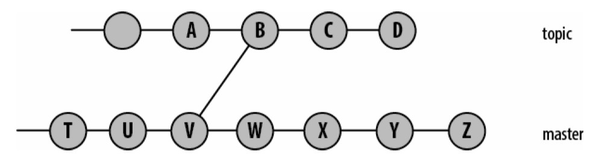
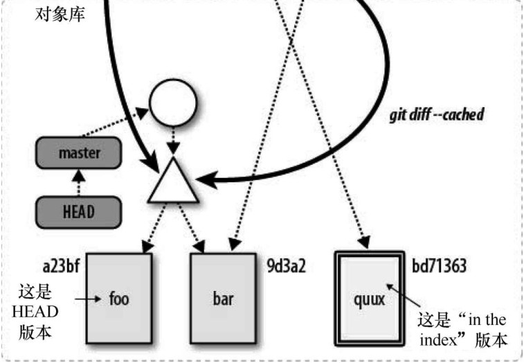

# Git学习笔记

### 基本命令  
* 创建版本库： git init  
* 添加文件：git add files，***注意：对于已经添加到版本库中的文件，下次提交时，不必再执行git add，第一次添加时，索引已经追踪***。使用git add命令，文件的所有内容将会复制到对象库中进行保存，并通过哈希值进行索引。-a，-all选项：遍历版本库，所有文件不论是否修改，都会添加到缓存中进行提交。        
* 查看版本库的状态：git status  
* 提交：  
    * git commit：捕获索引中的变更，添加到提交对象中。  
    * 变更消息：命令行中使用-m参数编写，或者，配置环境变量，如：export GIT_EDITOR=vim  
* 配置提交作者：  
    * 环境变量：GIT_AUTHOR_NAME, GIT_AUTHOR_EMAIL ***注意：环境变量配置会覆盖所有其他配置，优先级最高*** 
    * git config user.name="", git config user.email=""  
* 查看提交： 
    * 查看所有提交：git log  
    * 查看特定提交：git show  哈希值  
    * 查看当前开发分支提交记录的摘要：git show-branch --more=10  
* 删除版本库文件：git rm file ----> git commit ***注意：git rm 命令将会删除本地目录中的对应文件***，虽然文件删除了，但版本库历史记录中仍然会记录，恢复删除的文件使用：git checkout HEAD -- 文件名    
* 将已暂存的文件修改为未暂存的（从索引中取消追踪该文件）： git rm cached  文件名， 不会删除工作目录中的文件，从而导致版本库与工作目录不一致，注意使用。  
* 查找某个文件所有历史记录，即使重命名：git log --follow 文件名
* 文件重命名：git mv old_name new_name ----> git commit  
* 查看配置：git config -l  
* 取消某个配置： git config --unset --global  user.name  
* 配置命令别名，对于输入较多的命令，通过别名减少输入，类似using别名：git config --global alias.show-graph 'log --graph --abbrev-commit --pretty=online', 则输入git show-graph相当于输入git log......  
* 查看对象的内容：git cat-file -p 哈希值 
* 通过哈希值前几个数字查找完整的哈希值：git rev-parse 哈希值前几位  
* 查看某个blob对象的内容： git show origin/master:MakeFile  
* 查看索引中的内容，查看blob对象与文件路径名的对应关系：git ls-files -s  
* 从索引当前状态创建一个树对象：git write-tree  
* git commit == git write-tree + git commit-tree  
* 创建带附注，未签名的标签对象：git tag -m "Tag version 1.0" V1.0 提交ID  
* 查看标签对象的Hash值（索引）：git rev-parse V1.0
* 根据哈希值查看标签对象内容：git cat-file -p 哈希值  
* 查看索引的状态：git status  
* 查看在工作目录中，但没有添加到索引中的文件：git diff   
* 查看添加到索引并且在提交缓存中的文件：git diff cached  
* 添加忽略文件：将文件名添加到.gitignore这个文件中，如：echo temp > .gitignore  

* 从某个提交开始回溯提交图：git log HEAD。给出在提交图中从HEAD开始所有可达提交的日志。 -n 参数限制数量，--stat 列举提交中所更改的文件以及每个更改的文件改动的行数。git log ^X Y 等同于 git log X..Y 左开右闭。  

* 提交范围示例:  
   
topic..master : 根据左开右闭，范围为在master分支，不在topic分支 {W，X,Y,Z}  
  
topic..master：{W,X,Y,Z}。  
***简写：..end 等价于  HEAD..end   start.. 等价于 start..HEAD。A...B代表对称差，A或B可达，但不是A,B同时可达的提交集合***   
  
master...dev = (master or dev) AND NOT (merge-base --all master dev)  

* git log --pretty=short --abbrev-commit master~12..master~10 
--pretty=short调整每个提交显示的信息数量，--addbrev-commit缩写散列ID
。git log ^dev ^topic ^bugfix master ：在master分支，但是不在dev,topic,bugfix分支的提交   
* 查找提交：git bisect  
* 查看指定提交，每一行最后一次修改是谁提交的：git blame  
* 根据给定的字符串，查找字符串相关的变更历史：git log -Sstring 如：git log -Sincldue --pretty=oneline --abbrev-commit init/version.c
* 查找一个分支的原始提交，需要使用到新分支名和源分支名：git merge-base origin-brance new-branch   

* 创建分支：git branch ***branch\[start-commit\]***。省略提交，则默认为当前分支的最近一次提交。仅仅创建分支，并没有切换。  
* 查看有哪些分支：git branch 只列出特性分支，没有列出远程分支，使用-r参数，列出远程分支，使用-a参数，列出特性分支和远程分支。  

* git show-branch:参数选项与git branch一样。  
  
  
\---将输出分为两部分。上方，每一行的\[分支名\]该分支最近提交的日志消息*标记该分支为当前分支。  下半部分，每个分支中的提交矩阵。+表示提交在一个分支中，\*号标记当前分支，-表示一个合并提交。+\*+表示该提交存在于所有分支中。git show-branch遍历所有显示分支上的提交，在他们最近的共同提交处停止。  
* 检出分支（切换分支）：git checkout 分支名
* 删除分支：git branch -d 分支名  
* 恢复删除的分支和引用：git reflog  
* 恢复丢失的提交：git fsck 和配置选项 gc.reflogExpire , gc.pruneExpire   

* git diff：进行树的比较时可以通过提交名，分支名，标签名，工作目录的文件和目录结构以及在索引中暂存文件的完整结构，都可以看作树。git diff命令比较工作目录和索引之间的差异。只要git diff命令有输出，说明工作目录中存在修改的文件，没有添加到缓存中。  
* git diff *commit*：显示工作目录和给定提交之间的差异，常见的用法是使用HEAD或一个分支名作为commit。  
* git diff --cached *commit*：显示索引中变更和给定提交中的变更之间的差异。如果省略*commit*，则默认为HEAD，使用HEAD，该命令会显示下次提交将如何修改当前分支，也就是显示索引中的额外变更或已经暂存的变更。等同于git diff --stage *commit*.   
* git diff *commit1* *commit2* : 比较任意两个提交对象或树对象之间的差异   
   
  
  

* git diff ... 参数选项：  
    * -M：查找重命名  
    * -w (--ignore-all-space)：比较时忽略空白字符  
    * --stat：统计多少行发生了改变

* git merge ***other_branch***：如果修改了工作目录中的文件，或者通过git add或git rm修改了索引，与版本库不一致，Git可能无法一次合并所有分支及工作目录或索引的修改。当前分支始终是目标分支，其他一个或多个分支始终合并到当前分支。其他分支不受合并操作影响，合并提交只会添加到当前分支。  

* 版本库克隆：文件系统： git clone 原始版本库  克隆版本库，  网络：git clone git://xxxx.git。通过文件系统或者网络地址指定的版本库为原始版本库，git clone会创建一个新的Git版本库，不会复制原始版本库的所有信息。正常使用git clone命令时，原始版本库中存储在refs/heads/下的本地开发分支，会成为克隆版本库中的refs/remotes/下的远程追踪分支。而原始版本库中refs/remotes/下的远程追踪分支不会被克隆。原始版本库中的标签会克隆，钩子，配置文件，引用日志，储藏都不克隆。***默认情况下，每个克隆版本库都通过一个称为origin的远程版本库，建立一个链接指向它的父版本库，原始版本库并不会维护与克隆版本库之间的链接，是一个单项关系***。  

* 克隆版本库中修改origin这个名字：   使用git clone命令时，使用--origin选项指定名字  

* 创建，删除，查看，操作远程版本库：git remote xxx。    

* 从远程版本库抓取对象及其相关的元数据：git fetch  
* 合并远程版本库的修改到本地分支：git pull  
* 将对象及其相关元数据推送到远程版本库： git push  
* 查看给定远程版本库的引用列表，查看是否有更新可用：git ls-remote
    
---
---
### 基本概念  
* Git工作原理：在本地工作目录和版本库之间添加了一层***索引***。***索引***负责缓存所有的修改，最后提交到版本库之中。一次提交===>暂存修改 + 提交修改。由于索引负责追踪blob，所以只有在索引中的文件才会提交，也就是说，在本地工作目录中但不在索引中的所有文件，不会被追踪提交。  
* git文件分类：已经追踪的（版本库中的文件），被忽略的（临时文件，编译器生成的构建文件等），未追踪的（工作目录下除上面两种文件之外的文件） 

* 分支：在软件项目中启动一条单独的开发线。  
    * 一个分支通常代表一个单独的客户发布版本。例如：需要开始项目的1.1版本，但是，客户需要使用原来的1.0版本。此时，可以把1.0版本作为一个单独的分支。  
    * 一个分支可以封装一个开发阶段，原型，测试，稳定，临近发布等。如可以将1.1作为一个单独的阶段为维护版本。  
    * 一个分支可以隔离一个特性的开发或bug的修复。

* 标签和分支的区别：标签是一个静态的，不会随版本迭代而改变，分支是动态的。可以把分支名看做是一个指向某个提交的指针（动态的），通过分支名，回溯提交，构建整个项目，回到梦开始的地方。  

* 一个分支的最近提交，称为该分支的头部（HEAD）或tip。  

* 分离HEAD：以下情况，检出提交时，会创建一个匿名分支，称为分离的HEAD  
    * 检出的提交不是分支的头部  
    * 检出一个追踪分支  
    * 检出标签引用的提交。  
    * 执行git bisect命令  
    * 使用git submodule update命令  
    如果处于一个分离的HEAD，并且要在该点通过提交保留住修改，必须先使用git checkout -b new_branch。通过git branch命令可以查看是否位于匿名分支。

* 配置文件：git的配置文件都是.ini文件，配置文件的优先级为：  
    * .git/config：针对特定版本库的配置，优先级最高，使用--file修改  
    * ~/.gitconfig：针对用户层面的配置，优先级次之，使用--global修改  
    * /etc/config：针对系统层面的配置，优先级最低，使用--system修改  

* 版本库：本质是一个数据库，存储项目版本修订与维护的历史信息，这些数据存放在.git目录下。一个版本库负责维护自己的配置数据，也就是在克隆版本库的时候，其配置数据不会进行克隆，如：user.name，user.email  
* 版本库的设计方式：主要两个数据结构***对象库*** 和 ***索引***。为满足分布式VCS，对象库需要满足***有效的复制***。而索引，是版本库的私有数据，版本库自己使用，是临时的。  
* 对象库中的四种****原子对象***：  
    * blob：大二进制对象---->文件，使用原始二进制数据，可忽略数据的具体数据结构形式。***blob仅仅存储文件内容，不存储文件的元数据，例如：文件名，属性，权限等***  
    * tree：目录。存储目录中所有文件的元数据信息，文件名，路径等，可递归嵌套。***实际上相当于版本库某个时刻其状态的一次快照***。    
    * commit：保存版本库每一次迭代时的元数据，包括作者，提交者，日志消息，日期等。***一个提交对象指向一个目录树对象，并且除了根提交都有一个或多个父提交，用于版本变化的追踪***    
    * tag：通常用于分配一个可读名字给一个提交对象  
* 索引：***临时的，动态的，二进制文件，描述版本库的目录结构，索引捕获项目在某个时刻整体结构的一个版本，项目的状态可以用一个提交和一个对象树抽象表示。索引追踪文件内容的同时，也会追踪追踪文件路径名，从而通过文件路径名也可以找到相应的blob对象，也即通过文件名***  
* 可寻址内容名称：对象库被组织成一个内容寻址的存储系统。每个对象都拥有唯一的名称（Hash值），对象ID，，***重点：内容的Hash值。因此，Git追踪的实际上是文件的内容，而非文件名等次要信息，从而--->只要两个文件的内容Hash值相同，Git就认为他们是同一个文件，不论文件名，存储路径是否相同，Git只会保存一个blob对象***。  
* 打包文件：一种存储机制。当文件发生变化，首先比较相似文件的差异性（一个复杂的算法），找到最相似的文件，在旧文件和新文件之间选择一个进行存储，***同时，存储新旧之间的差异***，以便版本追溯。  
* tag：标签对象：轻量级标签（提交对象的引用，版本库私有，不会在对象库中创建永久对象），带标注标签（在对象库中创建永久对象，可以数字签名）。  

* HEAD: 始终指向当前分支的最新提交  
* ORIG_HEAD：某些合并和复位操作，会将先前分支的HEAD记录到ORIG_HEAD中，用于恢复，回滚。  
* FETCH_HEAD：使用远程库时，Git将所有抓取分支的HEAD记录到.git/FETCH_HEAD中，FETCH_HEAD是最近抓取的分支的HEAD的简写，***仅仅在刚刚抓取操作之后有效***  
* MERGE_HEAD：当一个合并操作正在进行时，其他分支的头暂时记录在MERGE_HEAD中  
* 给定一个提交C, C^1为其第一个父提交，C^2为其第二个父提交，以此类推... C~1第一个父提交，C~2为其第一个父提交的父提交，以此类推...  
* diff: 在Linux系统中，diff命令逐行比较两个文本文件的不同。-u选项将产生一个合并格式的差异，这种格式广泛用于共享修改：diif -u 文件1  文件2  
  
原始文件用---标记，新文件用+++标记。@@之间表示两个不同文件版本的上下文行号。以-开始的行表示从原始文件删除该行，+表示从原始文件添加该行，以空格开始的行是两个版本都有的行，由-u选项作为上下文提供。  

* git diff 和 git log的区别：  git diff 不关心文件的历史，不关心分支。git log相反。log操作一系列提交，diff操作两个不同的节点  

* 当一个分支的修改与另一个分支不发生冲突时，Git计算合并结果，并创建一个合并提交代表统一的新的状态。当发生冲突时，这些修改被标记为未合并，由开发人员处理，并在所有冲突解决后做一次最终提交。

* 克隆只是共享代码的第一步，此外。还需要对版本库之间进行关联，为数据交换建立路径。***Git通过远程版本库为这些版本库之间建立关联***。  

* 远程版本库是一个***引用***或***句柄***， 通过文件系统或网络指向另一个版本库，可以使用远程版本库作为简称，代替url。在版本库中可以定义任意数量的远程版本库，创建出共享版本库的阶梯网络。***在建立远程版本库之后，Git使用推模式和拉模式在版本库之间传输数据，例如，习惯做法是偶尔从原始版本库提交数据到克隆版本库，以保持克隆版本库处于同步状态；还可以创建一个远程版本库从克隆版本库传输数据到原始版本库。  

* 要追踪其他版本库中的数据，Git使用远程版本库和远程追踪分支（remote tracking branch）。版本库中每个远程追踪分支都作为远程版本库特定分支的一个代理。要集成本地修改与远程追踪分支对应的远程修改，可以建立一个本地追踪分支来建立集成的基础。  

* 裸版本库和开发版本库：一个Git版本库要么是裸版本库，要么是开发版本库。开发版本库用于常规的日常开发，他保持当前分支的概念，并在工作目录中提供检出当前分支的副本。裸版本库没有工作目录，不用于日常开发，没有检出分支的概念。裸版本库可以简单看做.git目录的内容。***裸版本库是协作开发的关键，其他开发人员从裸板本库clone和抓取fetch，推送push更新。git clone命令加上--bare选项，将会创建一个裸板本库，否则创建一个开发版本库。git init则是创建一个空的版本库，并且可以发展成为开发版本库或者罗版本库。裸板本库中不能创建远程版本库***  

* 追踪分支：一旦克隆一个版本库，就可以与源版本库保持同步，即使进行了本地提交，并创建了本地分支。本地版本库中的任何分支是本地分支，但是也可以进一步划分类别：  
    * 远程追踪分支：与远程版本库相关联，专门用来追踪远程版本库中每个分支的变化。  
    * 本地追踪分支：与远程追踪分支相配对，是一种集成分支，用于收集本地开发和远程追踪分支中的变更。  
    * 任何本地的非追踪分支成为特性分支或开发分支
在克隆操作中，Git会创建一个远程追踪分支，远程追踪分支不是远程版本库中的分支，本地版本库使用远程追踪分支跟踪远程版本库的修改。远程追踪分支origin/master实际是refs/remotes/origin/master，相对的特性分支dev实际是refs/heads/dev。在常规特性分支上的操作都可以在追踪分支上执行。因为远程追踪分支专门用于追踪远程版本库的变更，所以，不应当修改远程追踪分支，即不应当将修改提交到远程追踪分支。  

* Git原生协议指的是Git内部用来传输数据的自定义协议。例如：git://example.com/path/to/repo.git  

---
---
### 思想
* 通过分支名字，引入一个形式上具有层次结构的分支组织。  

* 同一个配置选项，有多种不同的配置方式，联想同名局部变量和全局变量的关系，以及寄存器，缓存，内存，硬盘的层次结构关系  

* blob：数据的本质---二进制，忽略数据结构形式  

* 随着项目进行，文件的添加，删除，修改都会被追踪，为了节省磁盘空间及网络带宽，Git将对象进行压缩后存储在打包文件（pack file）中，这些文件也在对象库里面。 在对象库中以对象内容的Hash值作为对象索引和标识符。 当对象发生变化时，重新计算Hash值，重新存储blob，并不通过文件名和差异进行存储。  

*  文件名和路径由底层文件系统使用，Git仅确保通过文件内容的哈希值，能够构建出对应的文件和目录。  

* 存储一个文件的全部内容作为一个基础版本，存储差异，通过差异去构建其他版本的文件。***Git打包文件的独特之处：由于是内容驱动的，所以，最相似的两个文件不一定就是同一个文件的不同版本，这样减少了实现的复杂性***  

* Git存储哈希值时，将哈希值前两位（SHA1结果为160位，Git使用40位十六进制表示）作为一个子目录，避免将所有的哈希值存储在一个目录下，从而提高文件系统的效率。 

* git add, git  rm, git mv命令并不会立即创建相应的树对象，树对象存储文件的次要信息，文件名，路径等，但是文件路径是由索引进行追踪的，所以，当索引更新时，用新的文件路径和对应的blob对象替换索引中原先的内容，再从更新后的索引创建一个树对象。  

* Git如何追踪文件重命名：重命名时，实际上是删除旧文件，添加新文件的操作，效率很低，尤其是重命名目录---：SVN对此的解决办法是显示追踪每一次重命名，不允许使用删除，再添加来进行重命名的操作。Git基于哈希值进行追踪，所以并不追踪文件的重命名操作，对于重命名做一个文件复制的操作，并且由于内容没有改变，所以只会存储一个blob对象。  

* Git处理忽略文件：.gitjgnore拥有一个文件名模式列表，满足该列表的文件会被忽略。  
    * 空行会被忽略。  
    * 字符串常量匹配同名文件 
    * 目录名由末尾的/标记，匹配同名目录及其子目录，***但不匹配文件，符号链接*** 
    * shell通配符模式  
    * ！对模式规则取反  
.gitignore可以在任何目录下，并且只对当前目录有效，类似与CMakeLists.txt文件。忽略规则优先级：  
    * 命令行指定的模式优先级最高  
    * 当前目录下的.gitignore  
    * 上层目录中的.gitignore，层级越往上优先级越低  
    * .git/info/exclude文件中的模式  
    * 配置变量core.excludefile中的文件模式  
默认情况下，版本库复制时.gitignore也会复制，并且应用。***所以，只有模式适用于所有派生的版本库时，才将该模式放入.gitignore文件中，反之，模式特定于版本库，不同的副本和派生版本不适用，则将该模式放入.git/info/exclude中  

* 提交的三个步骤：首先，git write-tree创建一个树对象，以哈希值命名后放入对象库中，***不会包含索引中任何文件的副本，将当前的目录状态与之前的作比较，派生出一个受影响的文件和列表，对于变化的文件创建新的blob对象，对于变化的目录创建新的树对象***，而后，创建一个新的提交对象，其指向新创建的树，并指向父提交，最后，master分支的引用从最近一次提交指向新的提交。  

* 创建分支时，必须选择某个提交作为分支点，在Git中可以显示或隐式引用指代提交。如哈希值是显示引用，HEAD是最近的提交的引用  

* 引用：是一个哈希值，指向一个对象（通常为提交对象），符号引用：也是一个引用，间接指向一个对象。本地特性分支名，远程追踪分支名，标签都是一个引用。  

* 符号引用：每一个符号引用，都有一个以ref/开始的名称，分层存储在.git/refs/目录中。.git/heads/ref代表本地分支，.git/remotes/ref代表远程分支, .git/tags/ref代表标签，如：***dev本地特性分支是.git/heads/dev的简写，orgin/master是.git/remote/origin/master的简写，标签V2.5是.git/tags/V2.5的简写。所有的符号引用使用，git symbolic-ref进行管理。  

* 引用可以使用全称或者简写，Git使用启发式算法解决标签名与分支名相同造成的二义性问题：匹配优先级从高到低：  
    * .git/ref  
    * .git/refs/ref  
    * .git/refs/tags/ref  
    * .git/refs/heads/ref  
    * .git/refs/remotes/ref  
    * /HEAD  

* .git这个目录名实际是可变的，***所以，Git内部使用$GIT_DIR  

* 若某一个提交存在多个父提交，在该提交必定为一个合并提交。  
---
---
### GitHub  
* 设置SSH:  
    * 生成SSH密钥(id_rsa是私钥，id_rsa.pub是公钥)：ssh-keygen -t rsa -C "2013629445@139.com"  
      
    * 使用私钥与Github进行认证和通信：ssh -T git@github.com   
      

* Github仓库初始化方式：  
  

* 仓库的readme文件：一般会在这个文件中标明本仓库所包含的软件的概要、使用流程、许可协议等信息。

 
  

 