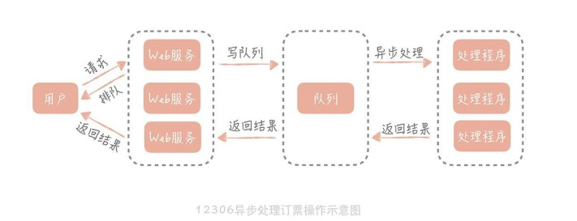
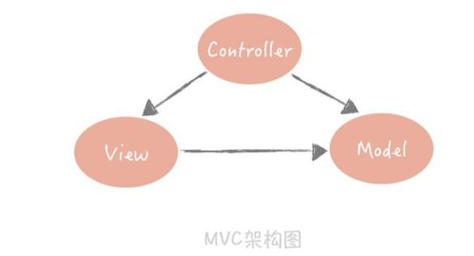
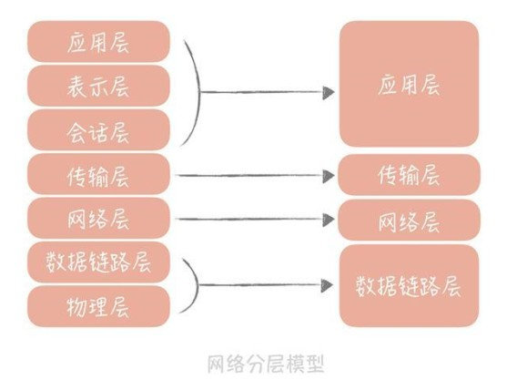
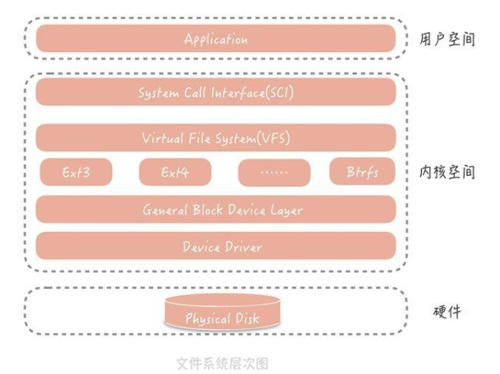
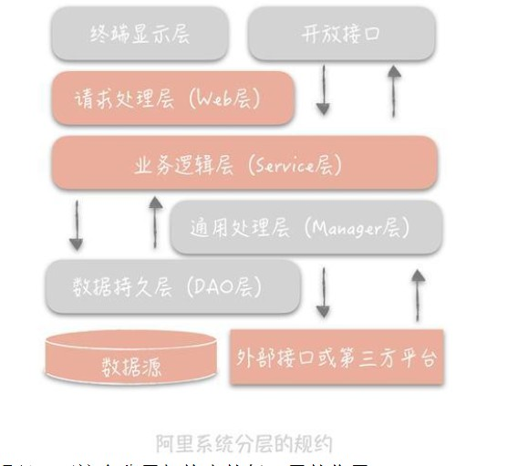
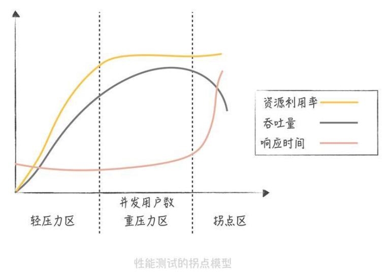
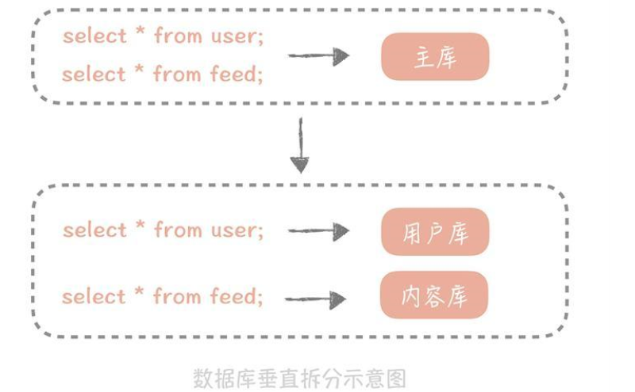
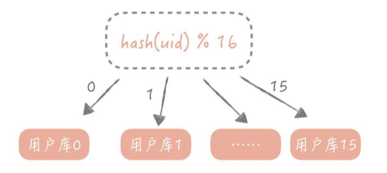
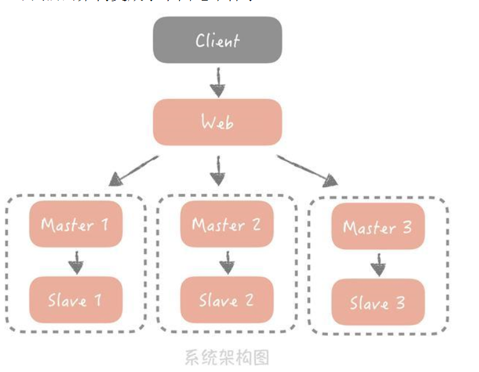
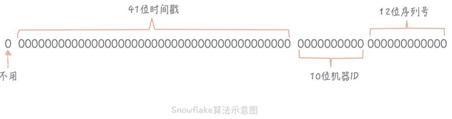

### 高并发学习笔记

* 高并发的含义：简单理解就是通过设计方案来抵抗巨大的网络流量，类似防洪方案。常用方法：  
    * 横向扩展：分布式部署将流量分开(开辟河道)，缓存(拓宽河道)，异步(不要阻塞等待请求完成，而是请求完成时得到通知)。将多个低性能的机器组合起来形成分布式集群共同处理大流量。  

* 缓存：从操作系统到浏览器，从数据库到消息队列，都有缓存的使用，操作系统有多级缓存，文件有Page Cache。使用缓存的作用在于提升系统的性能，在高并发的场景下，缓存可以支撑更多用户的同时访问。普通磁盘的IO时间包括：旋转延迟时间，寻道时间，数据传输时间，仅仅寻道时间就要10ms，而cpu执行指令和内存寻址的时间都在ns级别，从千兆网卡读取数据的时间在us级别。

* 异步处理：同步调用：调用方需要阻塞等待逻辑处理过程；异步调用：调用方不需要阻塞等待，在处理完毕后，通过事件机制或回调函数通知调用方。例如：12306下单时，显示正在排队，但是我们可以返回执行其他操作，此时就是异步调用，后端处理时将请求丢到消息队列中去（处理逻辑移到异步处理程序中），后端也可以去做其他的事情，从而将后端资源释放出来。***不能一味地使用这种架构方式，追求把所有的技术用上，因地制宜***  

* 分层架构：软件分层指的是将整体系统分为多个层次，每个层次有自己独立的职责，多个层次协同提供整体的功能。 

在网络中，网络层负责端到端的寻址和建立连接，传输层负责端到端的数据传输，相邻两层之间还会有数据的交互，这样可以隔离关注点，让不同的层做不同的事情

linuxw文件系统的分层：最上层时VFS（虚拟文件系统），用来屏蔽不同文件系统的差异，提供统一的系统调用接口，下面是实际的文件系统，文件系统又屏蔽不同物理设备之间的差异。某些层次负责对下层不同实现的抽象，对上层提供统一的接口调用。当新增一种文件系统时，只需要按照这种模型设计就可以无缝插入到linux文件系统中。  

* ***为什么要分层***：简化系统设计，让不同的人专注做某一层次的事情，提高复用性，扩展性。高并发系统要进行横向扩展，离不开系统分层。

* 如何进行分层：确定各个层之间的边界，当业务逻辑复杂的时候，将变得困难。
  
终端显示层：模版渲染并显示的层，JS层，JSP等。  
开放接口层：将Service层方法封装成开放接口，同时进行网关安全控制，流量控制等  
Web层：对访问控制进行转发，基本参数校验，不会复用的简单业务处理等  
Service层：业务逻辑  
Manage：通用业务处理。可以将原先Service层的一些通用能力下沉到这一层，例如与缓存和存储交互策略，中间件的接入；也可以在这一层封装第三方调用，比如调用支付服务，调用审核服务等。  
DAO层：数据访问层，与底层MySql等进行数据交互  
外部接口或第三方平台：包括其他部分RPC开放接口，基础平台，其他公司的HTTP接口。 
***Manager层提供原子的服务接口，Service层根据业务逻辑编排原子接口。分层架构一定注意相邻层之间相互依赖，数据流转不可跨层，避免层级调用的混乱，降低维护和重构的可能。***

* 高并发系统设计的目标：高性能，高可用，可扩展。***性能优化的原则：一定不能盲目，必须是问题导向的；脱离了问题，过早地优化增加系统的复杂度，甚至损伤业务；遵循二八原则，优先优化主要的性能瓶颈。优化要有数据支撑，每次优化查看这次优化提高了多少的系统吞吐量；优化过程是持续的；***

* 性能的度量指标：通常来说的话是系统接口的响应时间，单次的响应时间是没有意义的，依据一段时间内的情况分析，统计一些指标：  
    * 平均值：将这段时间所有请求的响应时间之和除以所有请求的数量   
    * 最大值：这段时间内请求响应时间的最大值，过于敏感。  
    * 分位置：99%响应时间，分位置排除了偶发极慢请求的影响，比较适合  
吞吐量和性能响应时间是互为倒数关系的：响应时间为1s，吞吐量为每秒1次。响应时间缩短到10ms，吞吐量则为每秒100次。通常，99%响应时间需要控制在200ms内，不超过1s的请求占比要在99/99%以上。  

* 高并发下的性能优化：过度并发也不好  
      
减少单次任务的执行时间：先看任务是IO密集型还是CPU密集型。CPU密集型需要减少运算次数，提升算法效率，排查这类任务的性能瓶颈可以使用Linux的perf，eBPF来查找耗时最多的方法或者模块。对于IO密集型的任务：数据库系统，缓存系统，Web系统。如果是数据库访问慢，那么可以查看是否有锁表的情况，是否有全表扫描，索引是否合适，是否有JOIN操作，需不需要添加缓存等；如果是网络问题，抓包查看是否有大量超时重传，网卡是否大量丢包等。  

* 高可用性指的是系统在运行时具备较高的无障碍运行的能力。例如：Haddop 1.0中的NameNode是单点的，一旦挂掉，则整个集群将不可用，Hadoop 2.0中则是同时启动两个NameNode，一个处于Active状态，一个处于Standby状态，两者共享存储。高可用系统的暴涨需要系统设计和运维两个方面共同进行保障。  

* 对于百万QPS的高并发系统来说，集群中的单机随时可能发生故障，设计时未雨绸缪，考虑发生故障时如何进行处理，掌握一些优化方法：failover（故障转移），超时控制，降级，限流等。发生故障转移的节点存在两种情况：在完全对等的节点之间发生，在不对等的节点之间发生，即系统中存在主节点和备节点。 
    * 对等节点之间故障转移：比较简单，这类系统中所有节点都要承担读写流量，并且节点中不保存状态，任何一个节点都可以作为另一个节点的镜像。访问一个节点失败，随便访问另一个节点就可以。例如：Nginx中可以配置当某一个Tomcat的请求出现大于500的情况时，重试请求访问另一个Tomcat  
    * 不对等节点复杂得多：比如有一个主节点，多个备用节点，可以是热备（同样提供在线服务的备用节点），冷备（只作为备份使用）。则需要在代码中检测主备机器是否故障，如何做主备之间的切换。最广泛的故障检测机制是“心跳包机制”。可以在客户端或者备份节点上向主节点发心跳包，当一段时间内没有收到回复，则认为主节点发生故障，触发选主操作。选主的结果需要在多个备份节点之间达成一致，需要使用一些分布式算法：例如：Paxos，Raft。

* 系统调用超时控制：复杂的高并发系统通常会有很多模块组成，同时也依赖于很多的组件和服务，比如缓存组件，队列服务等。他们之间的调用最怕的是延迟而非失败，因为失败是瞬间的事情，可以通过重试解决。而延迟通常意味着调用方阻塞在请求上，资源得不到释放，当大量出现这种阻塞请求时，调用方很可能资源耗尽被挂掉。超时控制的重要性示例：有一个项目，模块之间通过RPC调用，超时时间默认30s，平时流量不高系统运行正常，当遇到大流量，RPC服务端出现一定数量慢请求时，RPC客户端线程就会大量阻塞在这些慢请求上长达30s，导致RPC客户端用尽调用线程而挂掉。后面调整了RPC，数据库，缓存以及调用第三方服务的超时时间，这样在出现慢请求的时候就会触发超时，不会造成整体系统雪崩。如何确定超时时间：***收集系统运行日志，统计99%时间的响应时间，根据这个时间作为超时时间。超时控制实际就是不要让请求一直保持，而是超过一段时间后失败***。  

* 降级：为了保证核心服务的运行，牺牲一些非核心服务。例如微博的反垃圾检测，当并发度太高时，就可以将其关闭，并且不会影响核心服务。  

* 限流：对并发的请求进行限速来保护系统，比如对于Web应用，限制单机只能每秒处理1000次请求，超过的部分直接返回错误给客户端。  

* 开发注重的是如何处理故障，关键词是冗余和取舍。冗余指的是有备用节点和集群来顶替故障节点。取舍指的是丢卒保车，保障主题服务的安全。可用性和性能之间是需要取舍的，比如配置下发系统，只追求极致的可用性。  

* 如何让系统易于扩展：在架构设计之初为什么不提前决定机器的数量来提高系统的处理能力？---峰值流量不可控。一般来说，基于成本考虑，在业务平稳期，会预留30%~50%的冗余，但是当遇到突发事件时，流量可能达到2~3倍。此时，更改代码架构来不及，是否可以直接增加3倍的机器，从而支撑三倍的容量？  在单机系统中可以通过增加处理核心增加吞吐量，但是当并行的任务很多时，系统又会因为争抢资源而达到性能上的拐点，对于集群系统来说也是如此，集群系统中，不同的系统分层上存在一些瓶颈点，限制系统横向扩展的能力。例如：系统的流量是每秒1000次请求，对数据库的请求也是每秒1000次，系统虽然扩容了可以处理更多的请求，但是又会导致数据库成为性能瓶颈
    * 哪些系统服务会制约系统的扩展能力：无状态的服务和组件更易于扩展，有状态的服务难以扩展（数据库），向存储集群中增加或者减少机器时，会涉及大量的数据迁移，一般传统的数据库都不支持。***数据库，缓存，第三方，负载均衡，交换机带宽都是系统扩展时需要考虑的因素，当并发达到一定的量级时，哪一个因素会成为性能瓶颈，从而针对性的进行扩展。***

* 池化技术：如何减少频繁创建数据库链接带来的性能损耗。一次数据库连接包含两个过程，首先是建立连接三次握手，而后是MySql服务器校验客户端密码。池化技术的例子包括Http连接池，数据库连接池，Redis连接池等，连接池的管理是池化技术的核心。数据库连接池两个最重要的配置：最小连接数和最大连接数。如果当前连接数小于最小连接数，则创建新的连接处理数据库请求；如果连接池中具有空闲连接。则复用空闲连接；如果没有空闲连接并且当前连接数小于最大连接数，则创建新的连接；如果当前连接数大于等于最大连接数，则按照配置中的等待时间等待空闲连接；如果超过时间，则向用户报告错误。通常线上而言，最小连接数保持在10，最大连接数保持在20~30左右即可。  

* 数据库连接池中的连接出故障的情况：
    * 数据库域名对应的IP变更  
    * MySql有个参数是wait_timeout，表示当一个数据库连接空闲多少时间后就会关闭这条连接  
如何保证连接池中的连接一定是可用的呢（心跳包）？：启用一个线程来定期检查连接，向MySql发送“select 1”，如果返回异常，则从连接池中移除这条连接并尝试关闭。其次，也可以在使用连接之前先检测是否可用，但是会引入额外的开销，在测试中可以使用，上线版本最好不要开启。  

* 线程池中具有新的任务时，对于CPU密集型任务，CPU比较繁忙，只需要创建支持硬件并发数的线程即可，否则多了，线程切换反而会造成额外的开销，可以选择将新的任务放到队列中去即可。对于IO密集型系统，如数据库查询，缓存查询等，任务在执行IO操作的时候就会空闲下来，这时如果是创建新的线程而不是把任务丢进任务队列中，就可以处理更多的任务，提高吞吐量。线程池中的任务队列堆积量是一个重要指标，如果硬件并发线程数和最大线程数设置的比较小，会导致出现任务大量堆积的情况，线程池不要使用无界队列，大量的任务堆积会导致大量的内存被占用而宕机。   

* 数据库主从读写分离：大部分的系统都是读多写少。把读写流量分开。原始的数据库叫做主库，主要支持数据的写入；拷贝的数据库叫做从库，主要支持数据的读取。主从读写分离有两个核心点：一个是数据的拷贝，叫做主从复制，一个是在主从分离的情况下，如何屏蔽主从分离带来的数据库访问方式的变化。  
    * MySql的主从复制依赖于binlog（一个二进制文件，记录MySql上的所有变化）。主从复制就是将binlog从主库复制到从库，一般这个过程是异步的，主库的操作不会等待binlog的复制完成。  

* 数据库的写入请求量大导致的性能而后可用性的问题： 如果单个表的数据量到了千万甚至亿级别，即使使用了索引，索引占用的空间也非常大，数据库就无法缓存全部的索引信息，就会导致必须从磁盘上读取索引数据，降低性能，该如何提升查询性能？同时，数据量增加也占据了磁盘空间，数据库的备份和恢复时间变长，如何让数据库支持如此大的数据量？不同模块的数据，比如用户数据和关系数据全部存储在一个主库中，一旦主库发生故障所有的模块都会受到影响，如何做到不同模块之间的隔离？数据库对于写入的性能要弱于查询的性能，该如何处理更高的并发请求呢？  
    * 对数据进行分片，分摊数据库的读写压力，可以突破单机的存储瓶颈，常见的一种方式是分库分表。 
    * 分库分表是一种常见的数据分片方式，基本的思想是根据某一种策略将数据尽量平均分配到多个数据库节点或者多个表中。不同于主从复制时数据全部的拷贝到多个节点，分库分表后，每个节点只会保存部分的数据，这样可以有效的减少单个数据库节点和单个数据表中存储的数据量，解决数据存储瓶颈同时提升查询性能。同时，因为数据被分配到多个数据库节点上，数据的写入请求从请求单一主库变成请求多个数据片节点，在一定程度上提升并发性能。  

* 垂直拆分：对数据库竖着拆分，也就是将数据库的表拆分到多个不同的数据库中。垂直拆分的原则一般是按照业务来拆分，***核心思想是专库专用，将业务耦合度比较高的表拆分到单独的库中***，整理衣服时，将毛衣，羽绒服，衬衫分开放。将不同业务的数据放在不同的表中，当数据库发生故障时，只会影响到一个模块，实现数据层面的故障隔离。  
  
如果单个业务的数据量特别大，就做数据库和数据表做水平拆分。  

* 水平拆分：将单一的数据表按照某一种规则拆分到多个数据库和数据表中，关注点在数据的特点：  
    * 按照某一字段的哈希值进行拆分，比较适用于实体表，如用户表，内容表。一般按照实体表的ID字段进行拆分，例如想把用户表拆分成16个库，每个库中64个表，可以先对用户ID进行Hash，Hash的目的是将ID尽量打散，然后再对16取模，得到分库后的索引值：  
       
    * 按照某一字段的区间来进行拆分，比较常用的是时间字段，例如可以把一个月的数据放入一个表中。一般，列表数据可以使用这种拆分方式，比如一个人一段时间的订单，一段时间发布的内容，使用这种拆分方式，数据表要提前建立好。  
数据库在分库分表之后，查询方式改变，需要先确定在哪个库表中，这种复杂度可以通过数据库中间件来解决。  

* 分库分表带来的问题：分库分表引入了分库分表键，也叫作分区键、无论是哈希拆分，还是区间段拆分，之后所有的查询都需要带上这个字段，才能找到对应的库表。在用户库中使用ID作为分区键，这时如果需要按照昵称来查询数据，可以按照昵称再做一次分区，但是会极大的增加存储成本。最合适的思路是，建立昵称和分区键的映射关系。分库分表引入的另一个问题是数据库的一些特性难以实现，例如多表的JOIN在单库时是可以通过一个SQL语句完成，但是拆分到多个数据库后就无法跨库执行SQL。  

* 对于分库分表，虽然可以解决单机存储容量瓶颈和写并发量大的问题，但是也会引入注入数据查询必须带上分区键，列表总数需要单独冗余存储等问题。数据库从单库单表迁移到多库多表繁杂且容易出错。  
    * 性能上没有瓶颈就尽量不要分库分表  
    * 要做就一次到位，眼光长远  

* 分布式存储的两个核心问题：数据冗余和数据分片。在传统的关系型数据库中，当面对高并发的查询请求时，可以使用主从读写分离的方式，部署多个库分摊读压力，当存储的数据量达到瓶颈时，可以将数据分片存储在多个节点上，降低单个存储节点的存储压力：  
  
分库分表和主从读写能力的方式解决了数据库的扩展性问题，数据库在分库分表之后，在使用数据库时存在的许多限制，比如说查询的时候必须带着分区键，一些聚合类的查询（像是count()的性能较差），需要考虑计数器等其他解决方案。  

* 数据库中的每一条记录都需要有一个唯一的标识，依据数据库的第二范式，数据表中每一个都需要有一个唯一的主键，其他数据库元素和主键一一对应。主键的选择一般有两种选择方式：  
    * 使用业务字段作为主键，如用户表使用手机号，email使用身份证号  
    * 使用生成的唯一的ID作为主键  
对于大部分场景来说，第一种选择并不适用，比如评论表很难找到一个业务字段作为主键。我们需要考虑的是作为主键的业务字段是否能够唯一标识一个人，一个人可以有多个手机号或者email，一旦出现变更所有引用的外键信息，所以是不合适的。***因此更倾向于使用生成的ID作为主键***。不仅因为唯一性，而且一旦生成就不会变更，可以随意使用。在单库单表的场景下，使用自增ID，但是一旦分库分表如何保证全局唯一的ID。  

* 基于Snowflake算法搭建发号器：为什么不使用UUID（通用唯一标识码）不依赖于任何第三方系统，在性能和可用性上都比较好，一般会使用它生成的Request ID来标记单次请求，但是如果用它来作为数据库主键，会存在一些问题：  
    * 生成的ID最好具有单调递增性，也就是有序的，而UUID不具备这个特点，为什么ID要是有序的呢？***因为在系统设计时，ID有可能成为排序的手段。ID有序会提升数据的写入性能，而且UUID不具备业务含义***。MySql InnoDB存储引擎使用B+树存储索引数据，主键也是一种索引。索引在B+树中是有序排列的 。如果生成的ID具有业务信息，则可以帮助排查问题，例如知道是哪个机房生成的，生成时间，属于哪个业务。最后UUID是由32个16进制字符串组成，作为数据库主键比较浪费空间。  
    * 雪花算法可以弥补UUID的不足，算法简单，满足全局唯一性，单调递增，包含一定业务意义。雪花算法的核心思想是将64bit的二进制数字分成若干部分，每一部分存储特定含义，例如时间戳，机器ID，序列号等，最终生成全局唯一的有序ID。  
      

* 如何实际中使用雪花算法：  
    * 嵌入到业务代码中，在业务服务器中：好处是不需要跨网络调用，性能上会好一些，缺点是需要更多的机器ID来支持更多的业务服务器，由于业务服务器很多，很难保证机器ID的全局唯一性，需要使用ZooKepper等分布式组一致性组件来保证机器每次重启时都能获得唯一的机器ID。  
    * 作为独立的服务器部署：虽然会跨网络调用，但是在内网还好，可以减少机器ID的位数，如果发号器以主备方式部署，同时运行的只有一个发号器，则机器ID可以省略，可以把机器ID写在发号器的配置文件里面。既可以保证唯一性，也不需要引入第三方组件。

* 雪花算法的缺点：依赖于系统的事件戳，时间不准可能生成相同的ID，如果系统时钟不准，可以让他拒绝发号，直到时间准确为止。此外，***如果，发号器的请求不高，假设每毫秒只发一个ID，则会造成生成ID的末位永远是1，导致分库分表的时候，如果使用ID作为分区键就会不均匀。解决办法：  
    * 时间戳不记录毫秒而是记录秒  
    * 生成的序列号的起始号做一下随机，尽量的均衡

* NoSql：  
    * Redis，LevelDB这样的KV存储，相对于传统的数据库的优势是极高的读写性能，一般对性能有比较高的场景会使用  
    * Hbase，Cassandra这样的列式存储存储数据库，适用于一些离线数据统计  
    * MongoDB，CouchDB这样的文档型数据库，特点是模式自由，数据表中的字段可以自由扩展。比如电商系统中商品有很多的字段，不同商品的字段不尽相同，关系型数据库就需要不断增加字段，文档型数据库就简单很多。  
NoSql数据库弥补了传统数据性能的不足，但实际中还是需要依赖于SQL语句强大的查询能力以及传统数据库事务和事务的灵活索引功能，NoSql只能作为一些场景的补充。  

* 使用NoSql提升写入性能：数据库系统大多使用传统的机械磁盘，对于机械磁盘的访问方式有两种，一种是随机IO，一种是顺序IO，随机IO就会有旋转延迟时间，寻道时间，比起顺序IO慢两三个数量级，因此，就需要减少随机IO。对于MySql的InnoDB引擎来说，更新binlog，redolog，undolog都是在做顺序IO。更新datafile和索引文件都是在做随机IO。为了减少随机IO，关系数据库做了很多的优化，比如写入时先写入内存，然后批量刷新到磁盘上，索引在InnoDB中是以B+树的形式存储的，MySql主键是聚簇索引（一种索引类型，数据与索引放在一起），既然数据和索引放在一起，在数据插入或者更新的时候，需要找到要插入的位置，再把数据写到特定的位置上，这样就产生了随机IO，而且一旦发生页分裂，就不可避免做数据的移动，极大地损耗性能。  

NoSql：使用基于LSM树的存储引擎（Log Structued Merge Tree）,牺牲一定的读性能换区写入数据的高性能，HBase，Cassandra，LevelDB都是用这种算法作为存储的引擎。写入数据时，首先写入到一个叫做MemTable的内存结构中，在MemTable里面的数据是按照写入的key进行排序的，为了防止掉电丢失，一般通过写Write Ahead Log的方式将数据备份在磁盘上，MemTable累计到一定规模时，被刷新生成一个新文件，叫做SSTable（Sorted String Table）。当SStable达到一定数量时，将这些文件合并，因为SSTable是有序的，所以合并速度快。从LSM树读取数据，首先从MemTable中查找数据，如果数据没有找到，再从SSTable中查询数据，因为存储的数据是有序的，所以查找很快。但是，因为数据被拆分成多个SSTable，所以读取的效率低于B+树。***NoSql补充关系型数据库的第一件事就是提升读写性能***  

