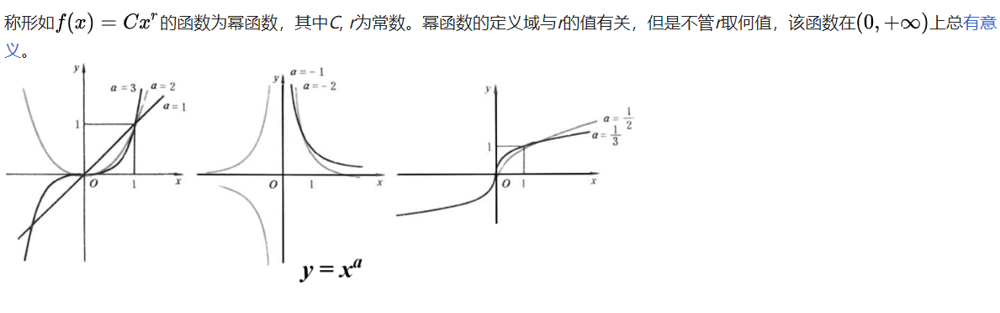
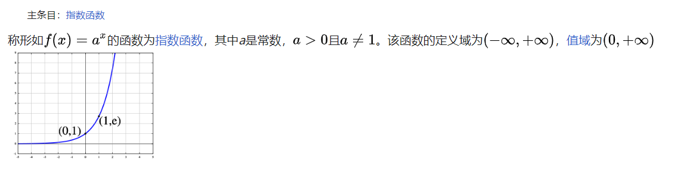
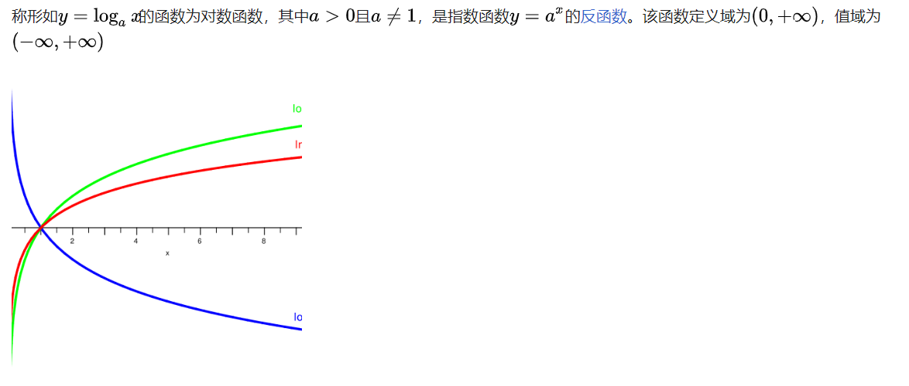
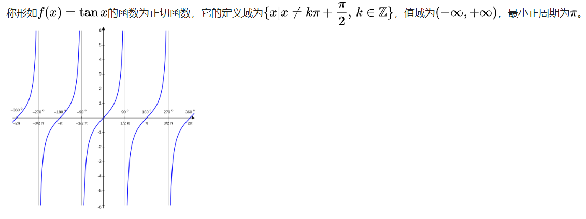
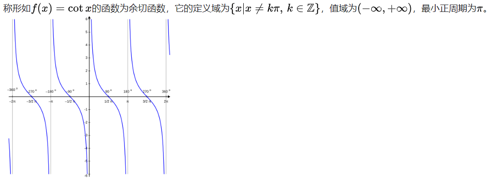
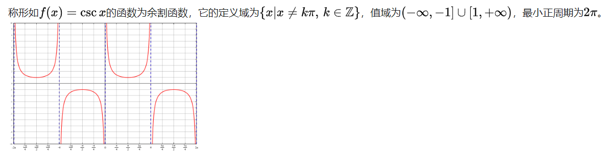
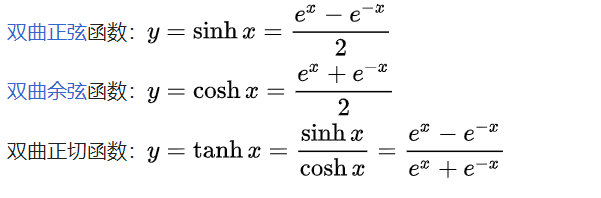
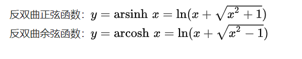

### 初等函数（基本函数）
- 由常函数、幂函数、指数函数、对数函数、三角函数和反三角函数等经过有限次的有理运算（加、减、乘、除、乘方、开方）及有限次函数复合所产生、并且在定义域上能用一个方程式表示的函数。

##### 幂函数  
  

#### 指数函数
  

#### 对数函数  
  

#### 正切
  

#### 余切  
  

#### 余割
  

#### 正割
  

#### 双曲函数
  

#### 反双曲
