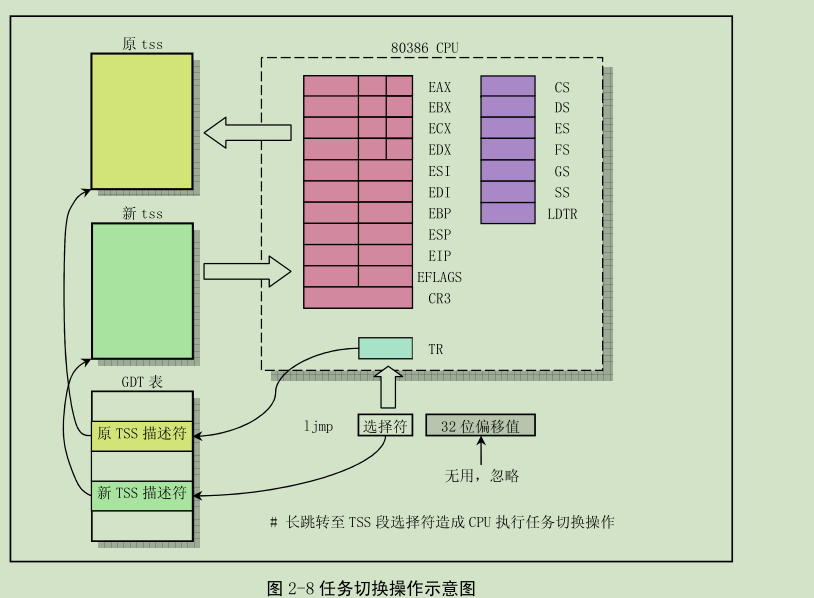
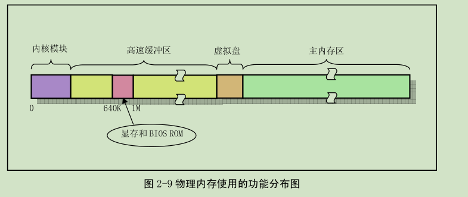

* 如何提供进程之间的边界？---进程管理结构

- Linux内核的主要模块：进程调度，文件系统，内存管理，进程通信，网络接口

- 文件系统提供对外部设备的驱动和存储，虚拟文件系统通过向所有的文件系统提供一个通用接口，隐藏不同硬件设备的物理差异。  
进程间通信需要内存管理系统提供的共享内存，文件系统需要内存管理子系统提供内存虚拟盘设备，需要网络接口实现网络文件系统，内存管理需要文件系统实现内存数据块的交换。

- 硬件中断机制：8259A芯片通过物理引脚得知硬件设备的中断信号，芯片通过判优选择优先级较高的中断，通过引脚通知CPU发生硬件中断，CPU响应后，芯片通过数据线将中断预先编排好的中断号发送给CPU，CPU收到后寻找对应的中断向量。

- 对于Linux内核来说，中断可以分为硬中断和软中断，对于int0---int31（int 0x00 --- int 0x2f）的中断Intel保留使用，属于软中断；对于int32---int255可以由用户自己制定，并且int32---int47通常设定为对应中断控制芯片的中断请求。对于系统调用对应的中断号是int128（int 0x80）。

- 定时中断：定时中断由硬件定时器发出，对应中断控制芯片的IRQ0，在内核中则是int32。当发生定时中断的时候，调用do_timer函数，该函数的参数是当前进程的特权级CPL。如果CPL=0，则将该进程的内核态运行时间+1，否则将用户态运行时间+1.接着减少时间片。如果该进程目前晕想在用户态，则进行时间片减少到0的时候会调用进程调度函数进行重新调度，如果是内核态，则直接返回，因为在内核态运行的程序不允许被调度切换，内核态程序是不可抢占的V。如果当前进程使用了定时器还需要更新定时器。还有一件重要的事情就是在时钟中断函数中检查当前进程的信号位图。


- Linux通过进程表对进程进行管理，task_struct也叫做进程控制块。
```cpp
struct task_struct {
// 属性相关
    long state; //进程状态
    long counter；  // 时间片
    long priority;  // 优先级
    int exit_code;  // 退出码
    unsigned short used_math;   // 是否使用协处理器
    struct desc_struct ldt[3];  // 任务局部描述表,0--空,1--cs 2--ds
    struct tss_struct tss;  // 任务状态段

// 信号相关
    long signal;    // 信号位图
    struct sigaction sigaction[32]; // 信号处理信息，包含处理程序，标志
    long blocked;   // 阻塞信号的信号位图


// 段相关：逻辑地址 ， 长度
    unsigned long start_code;   // 代码段地址。注意是逻辑地址
                                // CS：IP，保护模式下逻辑地址是：
                                // 段选择子：偏移量

    unsigned long end_code; // 代码段长度，字节数
    unsigned long end_data; // 代码段长度 + 数据段长度，字节数
    unsigned long brk;  // 总长度
    unsigned long statrt_stack; // 堆栈的逻辑地址

// ID 相关

    long pid;   
    long father;    // ppid
    long pgrp;  // 父进程组号
    long session;   // 会话号
    long leader;    // 会话首领

    unsigned short uid;     // 用户ID
    unsigned short euid;    // 有效用户ID
    unsigned short suid;    // 保存的用户ID
    unsigned short gid;     // 组ID
    unsigned short egid;    // 
    unsigned short sgid;

// 时钟相关：滴答数
    long alarm;      // 报警定时值
    long start_time; // 进程开始运行时刻
    long utime;      // 用户态运行时间
    long stime;      // 内核态运行时间
    long cutime;     // 子进程用户态运行时间
    long cstime;     // 子进程内核态运行时间 

// 文件系统相关
    int tty;    // 进程使用tty的，若没有使用，则为-1
    unsigned short umask;   // 文件创建属性屏蔽位
    struct m_inode *pwd;    // 当前工作目录的i节点结构
    struct m_inode *root;   // 根目录的i节点结构
    struct m_inode *executable; // 可执行文件的i节点结构
    unsigned long close_on_exec;    // 执行时关闭文件句柄位图标志
    struct file* filp[NR_OPEN]; // 文件结构指针表，最多32项，
                                // 索引即为文件描述符

};

```

- 进程上下文：所有寄存器的值，进程状态以及堆栈内容
- 进程状态：睡眠（可中断等待状态，不可中断等待状态），就绪，运行，暂停，终止
    - 可中断等待状态：调度器不会进行调度，只有产生中断或者释放了进程等待的资源，或者产生信号需要处理，调度器才会将其状态修改为就绪状态
    - 不可中断等待状态：例如进程创建过程，但是还没有创建完成，只能通过weak_up函数才能将其设置为就绪状态
    - 暂停状态：当进程收到SIGSTOP,SIGTSTP,SIGTTIN,SIGTTOU进入暂停状态，收到SIGCONT进入就绪状态

- 进程访问资源，条件未达到时发生了什么：进程必须资源放弃CPU的使用权，通过调用sleep_on()或者sleep_on_interruptible()，在该函数里面会去调用调度程序

- ！！进程什么时候不能被抢占，什么时候不能被中断：进程在内核态运行时不能被抢占，进程在执行临界区代码时不能被中断，此时会禁止中断

- 进程初始化：
    1. 从磁盘加载内核到内存
    2. 规划内存：内核区，高速缓冲区，虚拟盘区，主内存区
    3. 调用初始化函数：初始化内存管理，中断管理，块设备，字符设备，进程管理，
    4. 移动到任务0运行，通过fork创建任务1，在任务1中继续执行应用环境初始化并执行shell登录程序

- 如何从内核执行头程序移动到任务0：通过宏函数move_to_user_mode。该宏使用中断返回指令进行特权级的切换。

- 任务0的特殊性：任务0的代码也是内核代码。任务0的task_struct中，代码段和数据段的基质是0，段限长是64kb。内核代码段和数据段的基质是0，限长是16MB。因此***任务0的代码段和数据段包含在内核代码段和数据段中***。move_to_user_mode前后特权级发生了改变但是代码执行流没有改变。

- 特权级发生变化和iret中断返回指令的关系：入栈：原来的ss，esp，efalgs，cs，eip，--->新的ss，esp-->iret。方法是在中断返回指令调用前手动设置栈中该指令所需要的内容，并且设置CS中特权级为3。因为特权级发生变化，又会导致段寄存器进行重新加载，最终结果就是以特权级3运行任务0的代码。这里的用户态堆栈还是之前的堆栈，重新设置内核态堆栈为task_struct所在页面的顶端：PAGE_SIZE + (long)&init_tsak。在创建任务1时会同时复制task_struct，其中包括用户态堆栈，所以要求不能使用用户态堆栈，保持其干净。

- 进程创建：
    1. 在进程槽中寻找空闲项，空闲项=nullptr
    2. 在主内存中分配一页的内存空间，复制task_struct到新的页，设置状态为TASK_UNINTERRUPTIBLE
    3. 修改新进程的task_struct，设置父进程ID，清楚信号位图，统计值，时间片，设置tss.eax = 0作为返回值，设置tss.esp0为页面顶端，设置tss.ss0,设置tss.ldt为GDT中的索引值。设置新进程的代码段，数据段基质，限长，如果有打开的文件，需要将打开次数+1，最后子啊GDT中设置新进程的TSS和LDT，修改进程状态为就绪并返回新进程号。

- Linux 0.11 进程调度策略：
遍历进程表，选择处于就绪态（TQASK_RUNNING）并且运行时间最少的进程（时间片最大）。如果所有就绪态的时间片都为0，则根据priority重新计算时间片：counter / 2 + proority。重复直到选择出一个进程，使用switch_to进行切换。如果没有任何一个进程运行，则选择进程0，并且不论其状态，直接选择。

- 进程切换：  
检查切换到的进程是否是当前进程，如果是，则什么也不做，直接退出。否则内核全局变量current指向目标进程，保存当前上下文到进程中，根据目标进程的TSS恢复寄存器，实现切换。  


- 进程终止：  
内核负责释放其资源，包括使用的内存，打开的文件等。在内核函数do_exit()中，释放内存页面，关闭打开的所有文件，更新当前工作目录，根目录，可执行程序的i节点结构，如果有子进程，则让init进程成为子进程的父进程。如果是一个会话的leader，并且有控制终端，则释放控制终端，并且向所有的子进程发送SIGHUP挂断信号，所有子进程终止。将自己的状态设置为TASK_ZOMBIE，向自己的父进程发送SIGCHILD信号。***进程终止了，但是他的task_struct仍然存在还没有释放，因为父进程中会使用到相关的数据***。其释放的时机在于父进程调用wait或者wait_pid函数获取到子进程终止，父进程此时会访问该终止子进程task_struct中的运行时间，累加到自己的运行时间上，最后在释放task_struct所在的页面，并从进程表中清除子进程。  

- 内存：  
  
当一个进程需要读取块设备中的数据时，系统首先将数据读取到缓冲区，当要写数据到块设备上时，系统首先将数据写到缓冲区，再通过设备驱动程序写到设备中。

- linux 0.11中的地址区分：
    - 进程或程序层面的逻辑地址：我们应用程序员仅仅和逻辑地址打交道，也就是段限长内的偏移量
    - 线性地址：应用程序中的逻辑地址与段基地址构成
    - 物理地址：

- 缺页加载机制：当程序访问的页面不在内存中时，MMU产生缺页错误， CR2寄存器存储引起错误的指令，内核从磁盘中加载该页面，建立映射关系重新执行指令。当没有空闲的虚拟页时，二级存储区（磁盘）中的一部分空间作为交换分区存储从内存中腾出来的页面数据。

- fork函数后的写拷贝机制：调用fork函数之后，父子进程共享同一个内存页面。并且将父进程的内存页面设置为只读，当父子进程任意一个进行写入时，触发写保护异常，为该进程分配新的物理页并且复制要写入的内存页面到新的页面。如果是通过系统调用进行写入，则会现将进程打算写入的数据写入缓冲区，然后验证是否存在内存页面共享的情况，如果有并且是当前打算写入的页面，则触发写保护异常。

- 内核对物理内存的管理：  
内核中使用***字节数组***mem_map[]管理所有的物理内存页，其中的值记录页面的使用次数。对于虚拟页和物理页之间的映射关系通过修改页目录和页表进行管理。
    - get_free_page：分配物理页。扫描字节数组找到值为0的空闲项。如果没有找到则返回0，表示物理内存已经使用完，如果找到，则计算出对应的物理地址，然后将该内存页面进行清0，返回物理页的地址
    - free_page:用于释放物理内存页。首先判断该内存页起始地址是否小于1M，1M以下是内核物理页，则显示出错信息。或者大于实际内存最高地址，显示出错信息。计算字节数组中的索引：(addr - 1M) / 4k，若该字节值为0.显示出错信息，释放空闲物理页，否则将该值-1，返回成功。
    - free_page_tables：与copy_page_tables一样，以一个页表对应的物理内存块进行操作单位（4M）。释放或者复制指定线性地址和页表个数的内存空间，将会对页目录表以及对应的页表进行修改。free_page_tables首先检查线性地址是否在4M对齐，若不是显示出错信息；判断对应的物理地址是否属于内核空间，若是，显示出错信息。计算在页目录表中占据的所有页目录项，释放所有的页目录项以及每个页目录项对应的页表，最后刷新页交换缓冲区。
    - copy_page_tables: 验证原地址和目的地址是否在4M对齐；计算需要复制的页目录项数，将原目录项和对应的页表项复制到新的页目录项和页表项，此时只有新进程的页表需要开辟一个内存也进行存放。然后将新旧进程页目录项和页表项设置为只读，执行写拷贝策略。
    - put_page：将指定的一个物理内存页映射到指定的线性地址处。首先检查地址有效性，上下两个边界；然后根据地址计算对应的目录项，如果该目录项存在，则取其对应页表；否则申请一个新的页作为页表，设置对应的页表项。
    - do_wp_apge:页写保护函数。首先检查地址是否在进程的代码区域，因为代码区域是只读的，若是，则终止程序；否则进行写拷贝。
    - do_no_page：缺页异常处理函数。首先计算指定的线性地址在进程空间中的偏移量。如果偏移量大于代码段和数据段长度之和，或者进程刚开始创建，则申请新的物理内存页，并映射到进程的线性地址空间中去，然后返回。否则尝试进行页面共享操作，若成功，则返回；否则，申请新的物理内存页，从设备中读入一页信息；若加入该项信息时，指定线性地址+1页长度超过进程代码段和数据段长度之和，将超过的部分清零，然后将该页映射到指定的线性地址处。