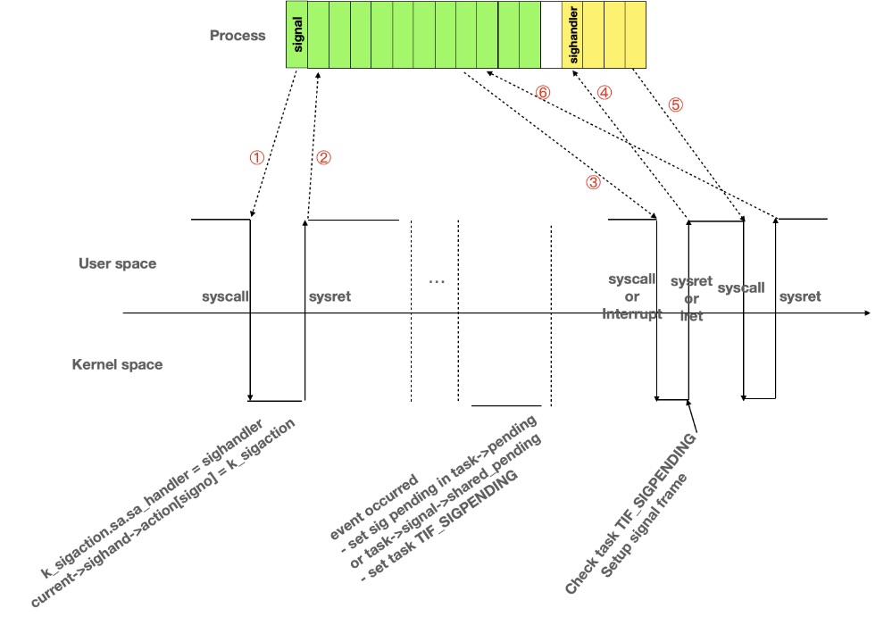
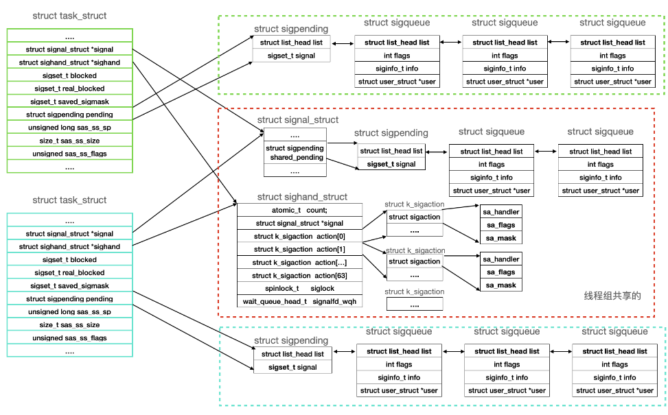

- Linux内核中使用 task_struct 结构来表示一个进程，这个结构体保存了进程的所有信息：
```cpp
//Linux将所有的 task_struct 串联成一个双向循环链表
struct list_head tasks;
```

- 任务ID：三种形式，分别为pid，tgid，group_leader
```cpp
pid_t pid;
pid_t tgid;

struct task_struct *group_leader; 
```
    - pid：每个进程都有自己的 pid，它在内核中是唯一的，在Linux中，我们可以使用ps -ef查看所有的进程，其中 PID 就是进程号。pid可以给用户查看指定进程的信息，可以通过pid给指定的进程发送信号

    - tgid: 是线程组的意思，所谓的线程组是什么意思呢？内核中不管是线程或者是进程都是使用 task_struct 来表示，一个进程也可以称为主线程，由它创建多个线程，这些线程和进程的主线程就称为一个线程组。每个线程都有自己的pid，而 tgid 则等于进程的主线程的 pid，这样也就可以区分谁是主线程，谁是被主线程创建出来的

    - group_leader：指向线程组主线程的进程描述符通过 getpid 返回的是 tgid，也就是说同一个线程组共享一个 pid

- 信号处理

应用程序注册信号，信号事件发生后，内核将信号置为pending状态，在中断返回或者系统调用返回时，查看pending的信号，内核在应用程序的栈上构建一个信号处理栈帧，然后通过中断返回或者系统调用返回到用户态，执行信号处理函数。执行信号处理函数之后，再次通过sigreturn系统调用返回到内核，在内核中再次返回到应用程序被中断打断的地方或者系统调用返回的地方接着运行。

如果应用程序没有注册对应的信号处理函数，那么信号发生后，内核按照内核默认的信号处理方式处理该信号，比如访问非法内存地址，发生SIGSEGV，内核将进程终止。
```cpp
//sigset_t
#define _NSIG_WORDS (_NSIG / _NSIG_BPW)
typedef struct {
    unsigned long sig[_NSIG_WORDS];  // 是一个位掩码，对应的信号会置位/清零
} sigset_t;

//signal_struct
struct signal_struct {
    ...
	  /* shared signal handling: */
	  struct sigpending   shared_pending; // 线程组的pending信号
	  ...
}

//sigpending
struct sigpending {
    struct list_head list; // sigqueue的链表头，用来链接处于pending状态的信号
    sigset_t signal; // 处于Pending的sig号集合
};


//sighand_struct
struct sighand_struct {
    atomic_t        count;
    struct k_sigaction  action[_NSIG]; // 描述信号的action,即信号发生时，如何处理该信号
    spinlock_t      siglock;
    wait_queue_head_t   signalfd_wqh;
};

//sig
//task_struct
struct task_struct {
	...
    struct signal_struct *signal; // 指向线程组的struct signal结构体
    struct sighand_struct *sighand; // 描述的action，即信号发生后，如何处理
    sigset_t blocked, real_blocked; // 该线程阻塞的信号，信号被阻塞，但是可以pending
                                    // 当取消阻塞后，就可以执行信号处理
    sigset_t saved_sigmask; /* restored if set_restore_sigmask() was used */
    struct sigpending pending; // 该线程的pending信号
    unsigned long sas_ss_sp;  // 用户执行信号执行栈、栈大小、flag
    size_t sas_ss_size;       // 可以通过系统调用sigaltstack指定
    unsigned sas_ss_flags;
    ...
};

```
这些数据结构组织在一起，如下图。每个线程有一个自己私有的信号pending链表，链表上是发送给该线程，需要该线程自己去处理的信号。struct sigpending的成员head_list是pending信号sigqueue的链表头，成员signal是这些pending信号的信号编号掩码。
另外，属于同一个进程的线程组共享一个信号pending链表，这个链表上的信号没有绑定特定的线程，该线程租中的任意线程都可以处理。
线程组还共享sighand数据结构，里面有64个信号的action。每个action用来描述如何处理该信号，比如忽略、默认方式处理、或者执行用户注册的信号handler。



---
---

signal_struct结构，其中保存进程对每一种可能信号的处理信息，该结构的定义如下：
```cpp
 struct signal_struct 
 { 
    atomic_t count; 
    struct k_sigaction action[_NSIG]; 
    spinlock_t siglock; 
};
``` 
count是个原子数，siglock是个信号量，这两个都是为了互斥访问action数组的辅助数据。其关键是action数组，它记录进程对每一种信号的处理信息。其中： 
```cpp
struct k_sigaction { struct sigaction sa; };
struct sigaction {
     __sighandler_t sa_handler; 
    unsigned long sa_flags; 
    void (*sa_restorer)(void); 
    sigset_t sa_mask; /* mask last for extensibility */ 
}; 
```
数据结构sigaction中描述的是一个信号处理程序的相关信息，其中：sa_handler是信号处理程序的入口地址，当进程要处理该信号时，它调用这里指出的处理程序；sa_flags是一个标志，告诉Linux该进程是希望忽略这个信号还是让内核处理它；sa_mask是一个阻塞掩码,表示当该处理程序运行时，进程对信号的阻塞情况。即当该信号处理程序运行时，系统要用sa_mask替换进程blocked域的值。

```cpp
/* Signal handlers: */
struct signal_struct    *signal;
struct sighand_struct    *sighand;
sigset_t      blocked;
sigset_t      real_blocked;
sigset_t      saved_sigmask;
struct sigpending    pending;
unsigned long      sas_ss_sp;
size_t        sas_ss_size;
unsigned int      sas_ss_flags;
```
    - blocked：sigset_t 是一个位图，每个位都表示一个信号。blocked 表示的是该进程的哪些信号被阻塞暂不处理

    - pending：表示进程接收到了哪些信号，需要被处理

    - sighand：用户可以定义相应信号的处理方法，其信息保存在这里

    - sas_ss_xxx：信号的处理默认使用的是进程用户空间的函数栈，也可以开辟新的栈专门用于信号处理，这三个变量就是用户维护这个栈信息

在 signal 中，定义了 struct sigpending shared_pending，这个 shared_pending 和 pending 的区别是，pending 表示该 task_struct 收到的信号，而 shared_pending 是整个线程组共享的。也就是说，对于 pending 中接收到的信号，只能由这个 task_struct 来处理，而 shared_pending 中收到的信号，可以由线程组中的任意一个线程处理


