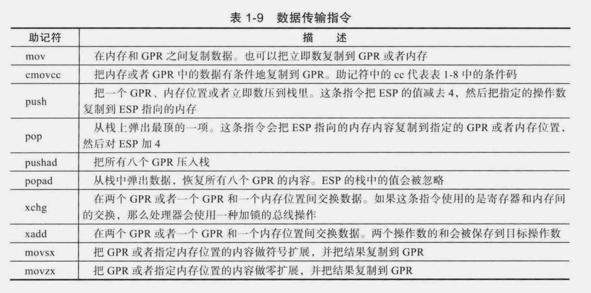

## Intel 格式汇编语法

- call 指令和 ret指令会将EIP入栈和出栈，其他条件跳转指令会修改EIP的值，但不会访问栈，这是他们之间的区别

- 操作数的类型：立即数，寄存器，内存
    - 立即数：硬编码到指令中，成为指令的一部分。用于指定算数常量，逻辑常量，偏移值。只能在源操作数中使用立即数。
    - 寄存器操作数：存在于通用寄存器中
    - 内存操作数：指定数据在内存中的位置，可以作为源操作数或者目的操作数，在一条指令中，源操作数和目的操作数不能同时为内存操作数

 - 使用内存操作数计算时：实际地址 = 基址寄存器 + 索引寄存器 * 放大因子 + 偏移值。基址寄存器可以使任何通用寄存器，索引寄存器是除ESP之外的寄存器。放大因子是1,2,4,8，偏移值是常量。基址寄存器可以理解为c++中的指针，访问某个数据结构时，使用基址加偏移的方式引用数据成员。索引寄存器用于数组元素的访问。直接的偏移值用于全局变量或者静态变量的访问。  

 | 寻址方式 | 实例 |
 |----------|------|
 |偏移  | mov eax, [Val] |
 |基址 | mov eax, [ebx] |
 | 基址 + 偏移 | mov eax, [ebx + 10] |
 | 偏移 + 索引 | mov eax, [Array + index * 4] |
 | 基址 + 索引 + 偏移 | mov eax, [Array + index * 4 + 10] |

 
  
 
  

  

  

  

  

  

  
  
  


- 指示符：用于定义内存模型和代码块的起始位置。
    - func_name proc: 表示函数开始
    - .model flat,c : 告诉汇编器使用平坦内存模型，c风格命名规范
    - .code: 包含可执行代码的内存块起点
    - func_name endp: 函数结束
    - end: 代表整个文件结束，汇编器不会处理后面的代码

- 函数序言用于保存调用者的EBP寄存器并且开辟新的栈帧。Visual C++调用约定：EBX, EBP, ESI, EDI属于非易变寄存器，被调用函数进行保存和恢复，EAX，ECX，EDX属于易变寄存器，被调用函数不负责保存。

- 函数基本形式：
```cpp
//进入函数，创建栈帧
push ebp
mov ebp, esp
//函数逻辑....
mov eax, [ebp + 4]      ； + 4代表的是返回地址
mov ebx, [ebp + 8]
//....

//恢复ebp
pop ebp
ret     ； 返回值存放在eax寄存器
```

- 乘除法指令实例：
```cpp
.model flat,c
.code

; extern "C" int IntegerMulDiv(int a, int b, int* prod, int* quo, int* rem)
; 返回值：0 除数是0
; 

IntergerMulDiv proc

; 函数序言
push ebp
mov ebp, esp
push ebx

; 检查除数是否为0
xor eax, eax  ; 设置错误返回码，xor指令会更新EFLAGS中的标志位
mov ecx, [ebp + 8]  ; 取出a
mov edx, [ebp + 12] ; 取出b
or edx, edx         ; 逻辑操作结合标志检测跳转
jz InvalidDivisor

; 乘法
imul edx, ecx  ; edx = edx * ecx
mov ebx, [ebp + 16]     ; ebx存储prod，是一个指针
mov [ebx], edx          ; 保存乘积

; 计算商和余数
mov eax, ecx    ; eax = a
cdq     ; 被除数，对eax中的数据做符号扩展，结果保存在EDX:EAX里面
idiv dword ptr [ebp + 12]   ; 有符号除法，dword ptr表示ebp + 12是int*，商保存在eax, 余数保存在edx

mov ebx, [ebp + 20] ; 指针参数，先取参数到寄存器，再使用寄存器寻址进行读写操作
mov [ebx], eax
mov ebx, [ebp + 24]
mov [ebx], edx
mov eax, 1  ; 设置成功返回值

; 函数结语
InvalidDivisor: 
    pop ebx     ; 因为代码中使用了ebx作为临时存储用，并且压入函数开始ebx保存旧值，所以pop
    pop ebp
    ret

IntegerMulDiv endp
end    ; 代码文件结束
```

- 使用栈空间存储临时变量并回收实例:通过EBP向高地址方向引用参数，向低地址方向引用局部变量
```cpp
.model flat.c
.code

; void func(int a, int b, int c, int* r1, int* r2.  int*r3)
; *r1 = a + b + c;
; *r2 = a * a + b * b + c * c;
; *r3 = a * a * a + b * b * b + c * c * c;

; 函数序言
func proc

push ebp
mov ebp, esp
sub esp, 12     ; 开辟空间
push ebx
push esi
push edi

; 加载参数
mov eax, [ebp + 8]  ; a
mov ebx, [ebp + 12]  ; b
mov ecx, [ebp + 16]  ; c
mov edx, [ebp + 20]  ; r1
mov esi, [ebp + 24]  ; r2
mov edi, [ebp + 28]  ; r3

; 计算r1
mov [ebp - 12], eax
add [ebp - 12], ebx
add [ebp - 12], ecx

; 计算r2
imul eax,eax
imul ebx,ebx
imul ecx,ecx
mov [ebp - 8], eax
add [ebp - 8], ebx,
add [ebp - 8], ecx

; 计算r3
imul eax, [ebp + 8]
imul ebx, [ebp + 12]
imul ecx, [ebp + 16]
mov [ebp - 4], eax
add [ebp - 4], ebx
add [ebp - 4], ecx

; 赋值
mov eax, [ebp - 12]
mov [ebp + 20], eax
mov ebx, [ebp - 8]
mov [ebp + 24], ebx
mov ecx, [ebp - 4]
mov [ebp + 28], ecx

; 函数结语
pop edi
pop esi
pop ebx
mov esp, ebp    ; 栈回收
pop ebp
ret

func endp
end
```

- 在汇编语言中访问全局变量，访问其他翻译单元中的函数实例：dword用于分配存储空间，并且可以选择性的初始化值，缩写为dd。public将符号声明为公共的，从而在汇编函数中可以进行访问。
```cpp

extern "C" int Num;
extern "C" int MemoryAddressing(int,int*,int*,int*,int*);

int main()
{
    for(int i = -1; i < Num + 1; i++) {
        int v1 = -1, v2 = -1, v3 = -1, v4 = -1;
        int rc = MemoryAddressing(i, &v1, &v2, &v3, &v4);
    }
    return 0;
}

// 汇编语言版本,多种寻址模式
.model flat,c

; 简单查找表.const只读
.const     ; 定义包含只读数据的代码块
NumVals dword 0, 1, 1,, 2, 3, 5, 8, 13
    dword 21, 34, 55, 89, 144, 233, 377, 610

Num dword ($ - NumVals) / sizeof(dword)
public Num

.code

MemoryAddressing proc
push ebp
mov ebp, esp
push ebx
push esi
push edi

; 检查i，保证i有效
xor eax, eax
mov ecx, [ebp + 8]  ; 取出i
cmp ecx, 0
jl InvalidIndex     ; i = 1作为初始值 < 0 , 则跳转
cmp ecx, [Num]
jge InvalidIndex    ; 若 i > Num，则跳转

; 基址寄存器寻址方式
mov ebx, offset NumVals     ; ebx = NumVals
mov esi, [ebp + 8]          ; esi = i
shl esi, 2      ; esi = i * 4
add ebx, esi    ; ebx = NumVals + i * 4
mov eax, [ebx]  ; 加载表值
mov eax, [ebp + 12]     ; eax = v1

; 基址寄存器 + 偏移量
mov esi, [ebp + 8]  ;   esi = i
shl esi, 2       ;  esi = i * 4
mov eax, [esi + NumVals]    ; 加载表值
mov edi, [ebp + 16]
mov [edi], eax

; 基址寄存器 + 索引寄存器
mov ebx , offset NumVals    ; ebx = NumVals
mov esi, [ebp + 8]
shl esi, 2      ; esi = i * 4
mov eax, [ebx + esi]    ; 加载表值
mov [edi], eax

; 基址寄存器 + 索引寄存器 * 比例因子


MemoryAddressing endp
end

```

- 内嵌汇编:  任意两个指令间要么被分号(；)分开，要么被放在两行；
放在两行的方法既可以从通过\n的方法来实现，也可以真正的放在两行；
可以使用1对或多对引号，每1对引号里可以放任一多条指令，所有的指令都要被放到引号中。
volatile是可选的，你可以用它也可以不用它。如果你用了它，则是向GCC声明“不要动我所写的Instruction List，我需要原封不动的保留每一条指令”，否则当你使用了优化选项(-O)进行编译时，GCC将会根据自己的判断决定是否将这个内联汇编表达式中的指 令优化掉。
```c
__asm__("":::"memory"); // 告诉GCC内存可能被修改

/* 带有表达式的内嵌汇编语法：asm volatile("intruction list":output:input;colober/modify)
 * 4个部分通过:隔开，任何一个部分都可以为空。指令列表中寄存器需要使用两个%。基本汇编和带表达式的汇编* 通过：进行区分。两种格式对寄存器的语法不通，前者只需要使用一个%即可。
 */
```
输出部分："=a"(cr0)，是一个操作表达式，指定一个输出操作。(cr0)：括号括住的部分是一个c/c++表达式或者一个变量的内存地址，等价于cr0 = 输出值。"=a"：引号中的内容叫做操作约束，=用于说明表达式中cr0是一个只写的，字母a是寄存器EAX/AX/AL的简写，说明表达式右边的来源是eax寄存器，也就是cr0 = eax。操作约束：=：只写，+：可读可写，为空：默认只读。  
输入部分：说明在执行汇编代码之前，所指定的寄存器中应当存放的值。
```c
#define get_seg_byte(seg,addr) \
({  \
    char res; \
    __asm__("push %%fs; \
            mov %%ax, %%fs; \
            movb %%fs:%2, %%al;\
            pop %%fs;"\
            :"=a"(res)\
            :""(seg),"m"(*(addr)));\ 
})
```
""(seg):表示执行代码之前将seg的值放到寄存器eax中，""表示使用上一个相同的寄存器。  
(*(addr))：表示一个内存偏移值。  
   