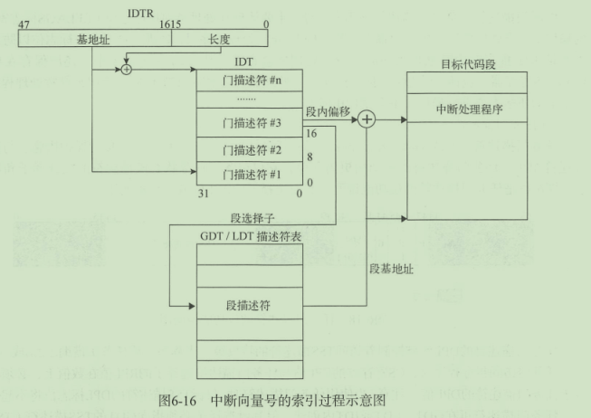

* Intel的处理器现在主要有32位的IA-32体系结构和64位的IA-32e体系结构。这两种体系结构包含多种运行模式；常用的模式由IA-32的保护模式和64位模式，其他模式主要用于模式切换和兼容。
    - 实模式：为处理器提供Inter 8086处理器的运行环境，并追加了保护模式和系统管理模式的切换扩展  
    - 保护模式：32位处理器的主要运行模式，为软件的运行提供丰富的功能，严格的安全性检测和向后兼容性  
    - 系统管理模式：32位处理器的标准功能，提供一种对操作系统透明的机制来执行电源管理和OEM的特殊功能。一旦切换至系统管理模式，处理器将进入一个隔离的地址空间运行 
    - 虚拟8086模式：处理器为保护模式提供的一种运行模式，允许处理器在保护模式下执行8086软件和多任务环境
    - IA-32e模式：64位处理器的主要运行模式，包含两种子模式：兼容模式和64位模式，64位模式为处理器提供64位的线性地址空间并支持超过64GB的物理地址寻址，兼容模式可以使大部分保护模式的应用程序无序修改就可以运行在64位处理器。
  
处理器上电后首先运行在，CR0控制寄存器的的PE标志位控制处理器进入保护模式，EFLAGS标志寄存器的VM标志位控制处理器在保护模式和虚拟8086模式之间切换（切换过程往往通过任务切换或者中断/异常返回程序进行），在开启分页机制的保护模式下，IA32_EFER寄存器的LME标志位可以使处理器进入IA-32e模式。在IA-32e模式下，代码段描述符的L标志位可以使处理器运行在64为模式或兼容模式。不论处理器运行在何种模式，一旦收到SMI信号就会进入SMM模式，此时只有执行RSM指令，处理器才会回到产生SMI信号之前的模式。  

* 通用寄存器：IA-32体系结构下的通用寄存器有EAX,EBX,ECX,EDX,ESI,EDI,EBP,而ESP被处理器用作栈指针寄存器。一条指令的执行必须依赖特定的寄存器，ECX，ESI，EDI经常用作字符串指令操作，DS段寄存器经常使用EBX来保存段内偏移地址  
    - EAX：用于累加或保存计算结果
    - EBX：作为DS数据段寄存器的段内偏移指针
    - ECX: 字符串和循环操作的计数器  
    - EDX：IO地址指针  
    - ESI：作为DS数据段寄存器的段内偏移指针（源地址指针）
    - EDI：作为ES数据段寄存器的段内偏移指针（目标地址指针）
    - ESP：栈指针
    - EBP：栈帧（栈内偏移指针）
IA-32e体系结构如果在64为模式下，虽然32位宽作为通用寄存器的默认未宽，但是他们有能力支持64位宽的操作数。Intel在64为模式中加入了8个新的通用寄存器，从而处理器可以使用R8~R15，RAX,RBX,RCX,RDX,RDI,RSI,RBP,RSP，

* CPUID指令：CPUID汇编指令用于鉴别处理器信息，检测处理器支持的功能，他在任何模式下的结果都相同。EFLAGS标志寄存器的ID标志位（第21位）可以检测出处理器是否支持CPUID指令，若支持，软件可自由操作该标志位。CPUID指令的执行结果保存在EAX，EBX，ECX，EDX中，在64位模式下，这些信息依然是32位的，因此处理器只使用RAX，RBX，RCX，RDX，寄存器的低32位保存执行结果，高32位被清零。CPUID可以查询两类信息：基础信息，扩展信息。  

* EFLAGS标志寄存器：包含控制标志位，系统标志位，状态标志位。处理器初始化时将ELAGS设置为00000002h
  
某些特殊的汇编指令可以直接修改标志寄存器的标志位，LAHF，SAHF，PUSHF，PUSHFD，POPF，POPFD，可以实现EFLAGS标志寄存器与栈（EAX寄存器）的互相保存，只要EFLAGS标志寄存器有备份，程序就可以借助BT，BTS，BTR，BTC等指令修改和检测标志位。当程序通过调用门执行任务切换时，处理器会把EFLAGS标志寄存器的值保存到任务状态段TSS内，并将目标任务状态段TSS内的值更新到EFLAGS标志寄存器中。

* 状态标志：EFLAGS的状态标志，可以反映出汇编指令计算结果的状态，ADD， SUB， MUL， DIV
  
* 方向标志：DF方向标志位控制字符串指令（如MOVS，CMPS，SCAS，LODS，STOS）的操作方向。置位DF标志可使字符串指令按从高到低的地址方向（自减）操作数据。复位则从低到高的地址方向操作数据。汇编指令STD与CLD可用于置位和复位DF方向标志位。
* 系统标志和IOPL区域：标志寄存器的系统标志和IOPL区域，负责控制IO端口地址访问权限，屏蔽硬件中断请求，使能单步测试，任务嵌套，使能虚拟8086模式等。
  
修改系统标志位和IOPL区域，必须拥有0特权级。AC标志位只对3特权级的数据进行对对齐检测。如果发现数据未对齐，触发#AC异常；置位RF标志位将临时禁止断点指令触发#DB异常；IF标志位对不可屏蔽中断不起作用；通过CLI，STI，POPF，POPFD和IRET汇编指令操作IF标志位。

* 控制寄存器：Intel处理器的6个控制寄存器CR0--CR6，通过控制寄存器的标志位可以控制处理器的运行模式，开启扩展特性，记录异常状态等
  
在IA-32体系结构下面，控制寄存器的位宽是32位，IA-32e体系结构会将控制寄存器扩展至64位，除地址寄存器外，其它扩展位均做保留使用，并且必须写入0。CR2和CR3不会对写入的地址进行检测（物理地址与线性地址均不检测）
  
在CR0.PE=0时，置位CR0.PG会触发#GP异常，CR0.CD与CR0.NW标志位联合控制处理器的缓存和读写策略：
  

* 地址空间：虚拟地址空间，物理地址空间。虚拟地址空间又分为逻辑地址，有效地址，线性地址等。这些地址之间是可以相互转换的，不同的处理器运行模式，其所在的地址空间不同。将当前地址空间转换为物理量地址空间的过程通常需要多层地址转换，在程序执行时触发缺页异常，此时，异常处理程序会为异常地址分配空闲的物理页  
    * 虚拟地址：抽象地址的统称，大多不能独立转换为物理地址，逻辑地址，线性地址，有效地址，平坦地址
        * 逻辑地址：格式为Segment:Offset,段内偏移地址Offset也叫作有效地址，高级编程语言中获取的地址就是有效地址，逻辑地址最终会被转换成线性地址，不同的运行模式下转换方式不同  
        * 线性地址：逻辑地址中的段基地址和偏移地址组成，因此，程序中无法直接访问线性地址，平坦地址是一种特殊的线性地址，将段基地址和段长度覆盖了整个线性地址空间 
    * 物理地址：真实存在于设备上，通过处理器的引脚直接或间接的与外部设备，RAM，ROM，相连接，物理地址空间中不仅包含RAM，ROM，还包含设备。在开启分页机制的前提下，线性地址需要经过页表映射才能转换成物理地址，否则直接映射成为物理地址。
        * IO地址：IO地址空间与内存地址空间隔离，IO地址空间有65536个可独立寻址的IO端口组成，寻址范围为0~FFFFH，必须借助特殊的IN/OUT指令才能进行访问。其中的端口地址F8H~FFH保留使用。  
        * 内存地址：内存地址不仅仅只是物理内存，还有其他外部硬件设备的地址空间，这些设备与物理内存共享地址空间，随着时间推移，内存地址空间在保持向前兼容性的同时，不断增强寻址能力，从而造成可用物理内存的片段化，不连续化，所以可用物理内存空间，设备地址空间，以及内存地址空洞才会穿插在内存地址空间中，操作系统借助BIOS的INT 15中断服务程序的主功能编号AX=E820h可以获取内存地址空间信息。

* 实模式：如今仅仅作为引导启动操作系统和更新硬件设备的ROM固件。实模式的特点是采用独特段寻方式进行地址访问，处理器在此模式下可以直接访问物理地址，实模式下，通用寄存器的位宽是16位，寻址能力有限，通常只能寻址到1MB地址空间。
    * 段寻址方式：采用逻辑地址编址。线性地址 = 段基地址 << 4 + 偏移地址；实模式的寄存器位宽只有16位，因此，段的长度无法超过64KB，而且，实模式不支持分页机制，线性地址直接映射为物理地址。实模式的这种逻辑编址方式将16位扩展到20位，并且段基地址是按照16B边界对齐的。
    * 实模式的中断向量表：中断/异常向量表将中断/异常向量号与中断/异常处理程序相关联。实模式采用逻辑地址表示来表示每个程序的起始地址。IVT有256项，每项占4B，IVT总共需要1KB空间。通常，IVT保存于物理地址0处。计算机启动后，会在地址0处创建中断向量表IVT，如果要在运行过程中修改或保存中断向量表，可以借助LIDT和SIDT指令。
       

* 保护模式：保护的是什么？先看实模式，实模式的段机制仅仅规定了逻辑地址与线性地址，却没有限制段的访问权限，导致应用程序可以肆无忌惮的访问系统核心。在保护模式下，若要对系统核心进行操作，需要足够的权限，所以保护的意义就是：操作系统可以在处理器级别防止程序有意无意的破坏其他程序和数据。保护模式使用新的段管理机制和分页机制代替实模式仅基于段的寻址方式。在新的分段机制中扩大了处理器的寻址能力和权限检测，引入分页机制将线性的内存地址空间分页化，立体化，便于处理器对内存片段的组织和管理，虽然支持分段和分页两种管理机制，分段是必选，分页是可选，处理器必须先经过段机制将逻辑地址转换成线性地址，然后使用分页管理机制把线性地址转换成物理地址
   

* 段寄存器：ES CS SS DS FS GS LDTR TR共8个。可以通过MOV指令对寄存器进行读写（LDTR和TR除外）。
```cpp
Struct SegMent{
WORD	Selector段选择子；//16位selector
WORD	Attribute；//16位的Attribute
DWORD	Base；//32位的Base
DWORD	Limit	//32位的Limit
}；
```
   
读一个段寄存器只读16位，写一个段寄存器写96位。
只有在保护模式下，80386的全部32根地址线有效，可寻址高达4G字节的线性地址空间和物理地址空间，可访问64TB（有2^14 个段（补充将解释数量大小由来），每个段最大空间为 2^32字节）[即一个段最大4G字节空间]的逻辑地址空间，可采用分段存储管理机制和分页存储管理机制。这不仅为存储共享和保护提供了硬件支持，而且为实现虚拟存储提供了硬件支持。 通过提供4个特权级（0~3特权级别）和完善的特权检查机制，既能实现资源共享又能保证代码数据的安全及任务的隔离
保护模式下，有两个段表：GDT（Global Descriptor Table）和LDT（Local Descriptor Table），每一张段表可以包含8192 (2^ 13)个描述符，因而最多可以同时存在[ 2张表 *2^13 = 2^14个段 ]。虽然保护模式下可以有这么多段，逻辑地址空间看起来很大，但实际上段并不能扩展物理地址空间，很大程度上各个段的地址空间是相互重叠的。目前所谓的64TB [ 2^(14+32)= 2^46 ]逻辑地址空间是一个理论值，没有实际意义。在32位保护模式下，真正的物理空间仍然只有2^32字节那么大。

* 保护模式：采用逻辑地址编址方式，但是，此时的段寄存器保存的不再是段的基地址，而是一个索引值，这个值叫做段选择子---selector。处理器根据段选择子从短描述符表中索引出与之对应的段描述符加载到段寄存器，段寄存器再从段描述符中获取段的基地址。保护模式有4个特权级，内核运行在0特权级，其他应用和系统服务运行在1-3特权级，某些指令只能在0特权级下运行，其他特权级会触发异常。
   
保护模式还引入了CPL，DPL，RPL三种特权级类型帮助处理器检测执行权限。
    * CPL：Current Privilege Level，当前特权级，CPL描述当前程序的执行特权级，他保存在CS或SS段寄存器的第0位或第1位。通常CPL是当前代码段的执行特权级，当处理器执行不同特权级的代码时，处理器才会修改CPL特权级  
    * DPL：Descriptor Privilege Level描述符特权级，DPL用于描述段描述符或门描述符，保存于段描述符或门描述符的DPL区域内，当处理器访问段描述符或门描述符时，处理器将会对比描述符中的DPL值，段寄存器中的CPL值以及段选择子的RPL值。  
    * RPL：Requested Privilege Level，请求特权级，RPL是段选择子的重载特权级，用于确保程序有足够的权限去访问受保护的程序，它保存于段选择子的第0位和第1位，RPL和CPL均用于检测目标段的访问权限，即使程序有足够的权限去访问受保护的程序，，但是如果CPL权限不足，程序依然无法访问目标段。当段选择子的RPL值大于CPL（数值越大特权级越低），RPL将会覆盖CPL，反之亦然。
  
* 段描述符结构：在分段存储管理机制的保护模式下，每个段由如下三个参数进行定义：段基地址(Base Address)、段界限(Limit)和段属性(Attributes)。
段三参数：段基地址(Base Address) + 段界限(Limit) + 段属性(Attributes)。  

    - 段基地址：规定线性地址空间中段的起始地址。在80386保护模式下，段基地址长32位。因为基地址长度与寻址地址的长度相同，所以任何一个段都可以从32位线性地址空间中的任何一个字节开始，而不象实方式下规定的边界必须被16整除。  

    - 段界限：规定段的大小。在80386保护模式下，段界限用20位表示，而且段界限可以是以字节为单位或以4K字节为单位。（段界限是0还是4k为单位由段属性中的粒度位控制）

    - 段属性：确定段的各种性质。  
    【1】段属性中的粒度位（Granularity），用符号G标记。G=0表示段界限以字节位位单位，20位的界限可表示的范围是1字节至1M字节，增量为1字节；G=1表示段界限以4K字节为单  位，于是20位的界限可表示的范围是4K字节至4G字节，增量为4K字节。  
    【2】类型（TYPE）：用于区别不同类型的描述符。可表示所描述的段是代码段还是数据段，所描述的段是否可读/写/执行，段的扩展方向等。  
    【3】描述符特权级（Descriptor Privilege Level）（DPL）：用来实现保护机制。  
    【4】段存在位（Segment-Present bit）：如果这一位为0，则此描述符为非法的，不能被用来实现地址转换。如果一个非法描述符被加载进一个段寄存器，处理器会立即产生异常。 图5-3(第二幅图)显示了当存在位为0时，描述符的格式。操作系统可以任意的使用被标识为可用（AVAILABLE）的位。  
    【5】已访问位（Accessed bit）：当处理器访问该段（当一个指向该段描述符的选择子被加载进一个段寄存器）时，将自动设置访问位。操作系统可清除该位。  
       

* 根据描述符类型，解释段属性对照表：
   
 
  
* 段选择子只是一个16位的段描述符索引值。线性地址部分的选择子是用来选择哪个描述符表和在该表中索引一个描述符的。选择子可以做为指针变量的一部分，从而对应用程序员是可见的，但是一般是由连接加载器来设置的。段选择子与段寄存器之间的关系：段选择子是段寄存器的一部分。段选择子的格式如下图所示：  
 
    -  索引（Index）：在描述符表中从8192(注：2^13)个描述符中选择一个描述符。处理器自动将这个索引值乘以8（描述符的长度），再加上描述符表的基址来索引描述符表，从 而选出一个合适的描述符。  
    - 寻址描述符：描述符表自身的基址 + 选择子的索引表指示位（Table Indicator，TI）：选择应该访问哪一个描述符表。0代表应该访问全局描述符表（GDT），1代表应该访问局部描述符表（LDT）。总共就两张表
    - 请求特权级（Requested Privilege Level，RPL）：保护机制  有3种主要的资源受到保护：内存，I/O端口以及执行特殊机器指令的能力
补充：
全局描述符表的第一项是不能被CPU使用，所以当一个段选择子的索引（Index）部分和表指示位（Table Indicator）都为0的时（即段选择子指向全局描述符表的第一项时），可以当做一个空的选择子。当一个段寄存器被加载一个空选择子时，处理器并不会产生一个异常。但是，当用一个空选择子去访问内存时，则会产生异常。

   
处理器将Index * 8作为偏移量，从GDT或LDT中取得目标描述符，对CPL，RPL，DPL特权级进行检测，如果检测通过，处理器将描述符加载到寄存器的缓存区中。为了减少地址转还能时间与编码的复杂性，处理器为保护模式下的CS, SS, DS, ES, FS, GS加入了缓存区域。缓存区域中记录段描述符的基地址，限长，属性信息。段描述符可以定义数千个，但是同一时刻只能使用6个段.处理器通过缓存信息，可以直接进行地址转换，免去重复读取内存中段描述符的时间开销。多核处理器系统中，在多核处理器系统中，当描述符表改变时，软件有义务重新将段描述符加载到段寄存器，否则，处理器可能继续使用缓存区中的段描述符。
   
加载段选择子到段寄存器的过程中，GDTR/LDTR寄存器是一个48位的伪描述符，其中保存全局描述符表或局部描述符表的首地址和长度，为了避免3特权级的对齐错误，伪描述符应该按照双字进行地址对齐。
   
    * 全局描述符表：本身不是一个段描述符，而是一个线性地址空间中的数据结构。使用GDT之前，要使用LGDT汇编指令将其线性基地址和长度加载到GDTR寄存器中，由于段描述符的长度为8B，则GDT的线性基地址按照8B边界对齐可以使得处理器效率最高，GDT的长度为8N - 1（N是段描述符项数）全局描述符表的是一个保存多个段描述符的“数组”，其起始地址保存在全局描述符表寄存器GDTR中。GDTR长48位，其中高32位为基地址，低16位为段界限。寻址：32位基址+16位偏移由于GDT 不能有GDT本身之内的描述符进行描述定义，所以处理器采用GDTR为GDT这一特殊的系统段。注意：全局描述符表中第一个段描述符设定为空段描述符。GDTR中的段界限以字节为单位。对于含有N个描述符的描述符表的段界限通常可设为8*N-1。

    * 局部描述符表：是一个LDT段描述符的系统数据段，因此处理器必须使用GDT的一个段描述符来管理他。使用之前，要使用LLDT汇编指令将GDT表中的LDT段描述符加载到LDTR寄存器，容纳后处理器自动完成加载伪描述符结构体的工作，为了避免地址转换，LDTR寄存器同样会保存LDT表的段选择子，线性基地址和长度。

* 全局描述符表的第0个表项是空段选择子，处理器的CS或SS段寄存器不能记载NULL段选择子，否则触发#GP异常，其他段寄存器可以使用NULL段选择子进行初始化。操作系统要运行在保护模式下，必须为操作系统创建至少一个全局描述符表，并将操作系统运行所必须的程序和数据保存在表中，而局部描述符表可以创建0个或者多个。

* 有大约15条机器指令被CPU限制只能在内核态执行，这些机器指令如果被用户模式的程序所使用，就会颠覆保护模式的保护机制并引起混乱，所以它们被保留给操作系统内核使用。如果企图在ring 0以外运行这些指令，就会导致一个一般 保护异常（general-protection exception）。 对内存和I/O端口的访问也受类似的特权级限制。

* .数据段选择子->DS和CS段寄存器：数据段选择子（体现了数据和代码的本质都是数据）的整个内容可由程序直接加载到各个段寄存器（如SS或DS等）当中。这些内容里包含了 请求特权级（Requested Privilege Level，简称RPL） 字段。然而，代码段寄存器（CS）的内容不能由装载指令（如MOV）直接设置，而只能被那些会改变程序执行顺序的指令（如JMP、INT、CALL）间接地设置。而且CS拥有一个由CPU维护的 当前特权级字段（Current Privilege Level，简称CPL）。 二者结构如下图所示：
      
 特性：代码段寄存器（CS）中的CPL字段（2位）的值总是等于CPU的当前特权级，所以只要看一眼CS中的CPL，你就可以知道此刻的特权级了。

* CPU保护内存的机制：.CPU保护内存过程   
      
 因为越高的数值代表越低的特权，上图中的MAX()用于选择CPL和RPL中特权最低的一个，并与描述符特权级（Descriptor Privilege Level，简称DPL）比较。如果DPL的值大于等于它（即描述符权限要小于Min（当前权限，请求特权限级）），那么这个访问可正常进行了。RPL背后的设计思想是：允许内核代码加载特权较低的段。比如，你可以使用RPL=3的段描述符来确保给定的操作所使用的段可以在用户模式中访问。
但堆栈段寄存器是个例外，它要求CPL，RPL和DPL这3个值必须完全一致，才可以被加载。
CPL：当前特权级（Current Privilege Level) 保存在CS段寄存器（选择子）的最低两位，CPL就是当前活动代码段的特权级，并且它定义了当前所执行程序的特权级别）CS段寄存器独有
DPL：描述符特权（Descriptor Privilege Level） 存储在段描述符中的权限位，用于描述对应段所属的特权等级，也就是段本身能被访问的真正特权级。
RPL：请求特权级RPL(Request Privilege Level) RPL保存在选择子的最低两位。RPL说明的是进程对段访问的请求权限，意思是当前进程想要的请求权限。RPL的值可自由设置，并不一定要求RPL>=CPL，但是当RPL<CPL时，实际起作用的就是CPL了，因为访问时的特权级保护检查要判断：max(RPL,CPL)<=DPL是否成立。所以RPL可以看成是每次访问时的附加限制，RPL=0时附加限制最小，RPL=3时附加限制最大。
 

CPU会在两个关键点上保护内存：当一个段选择符被加载时，以及，当通过线性地址访问一个内存页时。因此，保护也反映在内存地址转换的过程之中，既包括分段又包括分页。当一个数据段选择符被加载时，就会发生下述的检测过程：

 * 保护模式的段管理机制：在保护模式下，无论是程序还是数据，都必须使用段描述符进行修饰，保护模式可以不开启分页机制，但是段管理机制是必须的。
    
    * L：保护模式下，此标志位保留为0
    * AVL：被系统软件使用，保留为0
    * D/B：表示代码段的操作数位宽。或者栈段的操作数位宽以及上边界（32位代码/数据段此标志位为1，16位为0）
        * 可执行代码段，此标志位指定有效地址和操作数的默认宽度，置位时默认使用32位地址，32位或者8位操作数，复位时默认使用16位。前缀66h可以调整默认操作数，前缀67h可以调整有效地址宽度  
        * 栈段(SS寄存器中的数据段)：此标志位指定指针的默认操作数，置位使用32位栈指针（ESP），复位16位，如果栈段时向下扩展的数据段，此位指定栈段的上边界。  
        * 向下扩展的数据段，此标志位指定上边界位宽，置位上边界是FFFFFFFFh(4GB)，复位FFFFh(64KB)
    * DPL：段描述符的特权级
    * G: 段限长的颗粒度，置位时以4KB为颗粒度，复位时以字节为颗粒度  
    * 段长度：记录段限长，Limit区域通过2部分组成一个20位的长度，置位则段长度为4KB~4GB，复位则1B~1MB
    * P：标志此段是否已经在内存中，如果段寄存器加载一个不在内存中的段描述符（P = 0），触发#NP异常，
    * S: 段描述符的类型，置位为代码段/数据段，复位为系统段
    * Type：段/门描述符的类型
        * 代码段描述符：如果段描述符的S标志位与第43位（Type标志位）同时被置位，则这个段描述符为代码段描述符
            
            * A标志位（Accessed 已访问）：记录代码段是否已经被访问过。处理器只会复位该标志位，不会置位，程序自己进行置位(修改A和P标志位时同时使用LOCK前缀锁总线)
            * R(Readable 可读)：可执行程序虽然可以被处理器运行，但是程序段中的数据必须置位此标志位，在特权级允许前提下，可以将CS段寄存器作为操作前缀，或者将代码段描述符载入到数据段寄存器，来读取代码段中的数据。但是。可执行程序段始终不能写入数据
            * C（Conforming 一致性）：代码段可以分为一致性代码段和非一致性代码段，低特权级的代码段（程序）可执行或者跳转到一个高特权级（或相同特权级）的一致性代码段，并在执行高特权级代码段的过程中保持地特权级的CPL不变，也就是说不会因为代码段进入高特权级而更新CPL值。反之，如果要跳转到一个不同特权级的非一致性代码段，只有使用调用门或者任务门，否则触发#GP异常。所有的数据段都是非一致性的，意味着数据段不能被低特权级的程序访问
    
        * 数据段描述符：如果S复位并且第43位复位，则段描述符的类型为数据段描述符
           
    * 系统段描述符
       
        * LDT段描述符：记录LDT表的位置，长度，访问权限，位功能与TSS描述符相同，LDT段可以在各程序或者任务之间起到隔离作用，操作系统利用为每个任务创建独立的页表结构也可以达到隔离作用 
        * TSS描述符：保存任务的处理器状态信息。和其他的段一样，处理器必须借助TSS描述符才能对任务的状态段进行访问和管理。
           
        与其他段描述符基本相似，B标志位（Busy）代表任务是否处于忙状态，忙状态就是正在运行或者挂起。TSS描述符只能保存在GDT中，不能保存在LDT和IDT中，任务寄存器（TR）与LDTR寄存器的结构很相似，TR任务寄存器保存TSS段描述符和TSS段选择子，将TSS段选择子加载到段寄存器将会触发#GP异常。如果TI标志位置位，使用CALL和JMP指令访问TSS段选择子将触发#GP异常，IRET指令将触发#TS异常。TSS段主要用于任务切换（或者特权级切换），保存处理器的寄存器状态，以及切换到对应的特权级栈空间，当任务返回时能够还原执行现场。TSS段分为动态区域和静态区域，当任务在切换过程中挂起时，处理器将会执行现场保存在动态区域
           
           

        当任务在切换过程中挂起时，处理器只会读取静态区域的数据，不会更新静态区域中的数值
           
        静态的栈空间，不会因为任务切换而发生改变，但是SS和ESP寄存器值将会随着任务的切换而更新。对于处理器级的任务切换：
        - 当程序通过JMP或者CALL指令跳转到GDT中的TSS描述符，会发生任务切换
        - 使用JMP或者CALL指令跳转到GDT或者LDT中的任务门段描述符，任务切换会发生。
        - 如果一个IDT表项使用任务门描述符来保存中断或者异常处理程序，在触发中断和异常时会发生任务切换  
        - 如果当前任务的EFLAGS.NT标志置位，在执行IRET指令时，会发生任务切换
        上面4种是硬件级的任务切换。程序也可以使用软件逻辑实现任务切换，例如使用独立页表空间切换方式的（切换页表和JMP指令切换任务）的Linux系统内核，它只借助TSS的静态区域为特权级提供栈空间，而任务的执行现场通过手动方式保存在栈或者PCB中。
    * 调用门描述符：调用门描述符：让不同特权级的的程序实现受控切换，通常用于受特权级保护的操作系统或程序中。调用门的特点是借助CALL指令穿过调用门可以访问更高特权级（CPL >= DPL）的代码段。如果目标代码段是非一致性的，会发生栈切换（一致性的代码段不会改变CS寄存器的CPL值）。当特权级发生切换的时候，必定伴随栈切换，而且栈特权级与CPL特权级保持一致。JMP指令只能穿过相同特权级（CPL == DPL）的非一致性代码段，但是CALL和JMP都可以访问更高特权级的一致性代码段。系统描述符，任务门描述符，中断门描述符和陷阱门描述符，都可以作为IDT的表项。
       
        * 段选择子：指定段选择子
        * 段内偏移：段内偏移量，指定程序入口地址
        * DPL：描述符特权级
        * P: 调用门是否有效
        * 参数个数：发生栈切换时需要复制的参数数量
    
* 保护模式的中断/异常处理机制：中断/异常用于实时监控操作系统，处理器和程序的运行。是真实存在于处理器中的事件，当处理器捕获到中断/异常之后，会强制挂起当前程序或者任务，转而去执行中断/异常处理程序，处理哦完毕之后，处理器唤醒被挂起的任务，就像程序没有被中断一样继续执行。中断可以在程序执行时触发，也可以来自一个硬件设备请求，或者来自INT n命令。异常只能在检测到处理器执行故障时触发，处理器介意检测的异常种类很多，例如通用保护性异常，页错误异常，机器内部错误异常等。
每种体系结构都会根据处理器中断/异常的触发条件将其归类，使用一对数字对同一类型的
中断/异常进行标识，这个标识数字就是向量号。然后处理器通过向量号从IDT中索引出中断/异常处理程序的入口地址。向量号的数值范围是0-255，其中0-21向量号被Intel处理器作为异常向量号或保留使用，剩余的32-255作为中断向量号给用户使用
   
中断和异常共用一个IDT，前32项用于索引异常处理程序，其他项用于索引中断处理程序，用户可以自由为外部硬件设备指派中断向量号，这也是外部硬件设备与处理器的主要通信方式。IDT借助门描述符将向量号与处理程序联系起来，就像GDT与LDT的关系，IDT是一个门描述符数组（每个门描述符占8B），第一个表项是有效的不是NULL描述符。由于IDT只能有256项，所以IDT不能包含超过256个门描述符。IDT可以保存在线性地址的任何位置，为了使处理器达到最佳缓冲性能，应当尽量按照8B进行对齐，则IDT长度为8N - 1字节，对于GDT，TSS，LDT计算均是如此。处理器通过IDTR寄存器得到IDT的位置，在使用IDT前，必须使用LIDT指令将IDT的线性基地址和（32位）和长度（16位）加载IDTR寄存器，通常情况下，IDT创建于操作系统初始化过程。
    * 陷阱门描述符和中断门描述符：二者在位图结构上，与调用门描述相似，他们都包含了一个远跳转地址（段选择子和段内偏移），这个远跳转地址为处理器提供中断/异常处理程序的入口地址。不同之处在于处理器对IF标志位（EFLAGS标志寄存器）的操作上，当处理器通过中断门描述符执行中断/异常处理程序时，处理器会复位IF标志位以防止其他的中断干扰请求处理器执行IRET指令后，还原保存在栈中的EFLAGS寄存器（包括IF标志位）的值，但是处理器通过陷阱门描述符执行中断异常处理程序，不会对IF标志位进行操作。
       
    * 任务门描述符(Task Gate Descriptor)：可以在任务切换过程中提供一些间接的保护措施。仅仅包含了任务状态段TSS的段选择子和属性信息。任务门描述符的DPL区域控制访问TSS描述符的特权级。当程序（或任务）借助CALL指令或者JMP指令穿过任务门访问目标程序时，CS寄存器的CPL值与任务门描述符选择子的RPL值在数值上必须小于等于任务门描述符的DPL值（当使用任务门描述符时，目标TSS描述符的DPL标志将不起作用）。任务门描述符可以在GDT，LDT，IDT内创建，但是其段选择子必须指向GDT的TSS描述符（TSS描述符只能在GDT中创建）
       
       
    在Linux内核中，无论何种中断或者异常。都只是使用中断门描述符和陷阱门描述符。从没有使用任务门描述符，而且IA-32e模式取消了任务门描述符这一功能。在不开启分页机制的前提下，处理器可以直接通过段管理机制将逻辑地址转换为物理地址（此时线性地址与物理地址相等），不过，仅仅开启段管理的情况下，因为缺少页管理机制的物理内存管理十分困难。

* 保护模式的页管理机制：保护模式下，处理器可以借助段管理机制将逻辑地址转换成
线性地址，开启页管理机制后，处理器必须经过页管理才能将线性地址转换成物理地址，这一个转换过程必须经过多层级页表索引才能访问到目标物理地址或IO设备内存。在页管理机制的各层级页表中，不仅保存着目标物理页的基地址，还记录着访问物理页的权限以及缓存类型等属性信息，软件可以通过MOV CR0置位PG标志位来开启页管理机制。在开启页管理机制之前，需要确保CR3控制寄存器已经载入了页目录（顶层页表）的物理基地址，处理器将从页目录开始进行页转换。保护模式支持32位分页模式，PSE分页模式，PAE分页模式。
    * 32位分页模式：保护模式的基础管理模式，置位CR0.PG进入该模式。该模式，线性地址位宽和物理地址位宽均为32位，32位分页模式没有扩展物理地址的寻址能力，相对简单。
       
    32位分页模式将32位线性地址分割成三段，使用两级页表进行管理，其中第31位到第22位用于索引目录页表(PDT)， 21到12位用于索引页表(PT)。此处的页目录表PDT和页表PT均包含1024个表项，每个表项占用4B空间，共占用4KB的内存空间，一个物理页容量为4KB，两级页表共容纳1024 * 1024 * 4KB = 4GB。这个地址范围刚好覆盖4GB的线性地址空间。在CR3控制寄存器(也叫作页目录基地址寄存器 PDBR)以及其下的两级页表表项中，不仅包含物理页的基地址，同时包含控制访问权限和缓存类型等属性信息
       

* 寄存器：
在x86架构中，"ES" 是指附加段寄存器（Extra Segment Register）。ES寄存器是一个16位的特殊寄存器，用于存储附加数据段的段选择子（Segment Selector）。

在x86架构中，除了代码段寄存器（CS）和堆栈段寄存器（SS）之外，还有三个附加段寄存器，分别是附加数据段寄存器（ES）、数据段寄存器（DS）和附加段寄存器（FS）或附加段寄存器（GS）。

这些附加段寄存器的作用是为了提供额外的段寄存器，用于存储与数据相关的段选择子。通过使用不同的附加段寄存器，程序可以方便地访问多个数据段，而不需要频繁地修改DS寄存器的值。

ES寄存器通常用于处理字符串操作、数据传输和其他需要访问额外数据段的操作。例如，使用ES寄存器可以方便地将数据从一个数据段复制到另一个数据段。

在汇编语言中，可以使用ES寄存器来引用附加数据段中的数据。例如，ES:DI 表示附加数据段中的目的操作数地址。

需要注意的是，对ES寄存器的直接访问和修改在保护模式下受到限制，因为保护模式中存在段描述符表和段选择子的复杂机制。不过，在实模式下，可以直接访问和修改ES寄存器的值。

总结：ES寄存器是x86架构中的附加段寄存器，用于存储附加数据段的段选择子。它提供了方便的方式来访问额外的数据段，用于字符串操作、数据传输和其他需要访问多个数据段的操作。

* 堆栈：堆栈（Stack）是操作系统中用于管理程序执行的一种数据结构。它在内存中以一种特定的方式组织和存储数据，并提供了一种后进先出（Last In, First Out）的访问模式。

堆栈的本质是一块连续的内存区域，用于存储程序执行期间的临时数据、函数调用信息和局部变量等。它通常位于进程的虚拟地址空间中，由操作系统在程序运行时动态分配和管理。

堆栈的主要作用是跟踪函数的调用和返回，并提供局部变量的存储空间。当程序调用一个函数时，相关的调用信息（如返回地址、参数等）会被压入堆栈。函数执行期间，局部变量和临时数据也会被分配到堆栈上。当函数执行完毕后，堆栈会按照后进先出的顺序弹出相应的数据，将控制权返回给调用者。

堆栈与程序之间存在紧密的关系。程序中的函数调用和返回都依赖于堆栈来保存相关信息。每当函数被调用时，当前函数的执行上下文（如返回地址、寄存器状态等）会被保存到堆栈上，以便在函数返回时能够恢复到正确的执行位置。局部变量和临时数据也通过堆栈来进行分配和管理。

操作系统负责管理堆栈的创建、销毁和维护。它会为每个线程或进程分配独立的堆栈空间，并确保堆栈的正确使用。操作系统还提供了一组特定的指令和机制，用于操作堆栈，如压栈（Push）、出栈（Pop）等指令。

总结：堆栈是操作系统中用于管理程序执行的数据结构，用于存储函数调用信息、局部变量和临时数据等。它与程序紧密相关，负责跟踪函数调用和返回，提供局部变量的存储空间。操作系统负责管理堆栈的创建、销毁和维护，以及提供相关的指令和机制来操作堆栈。

* 当使用 BIOS 中断 10h（INT 10h）来调用视频服务时，使用不同的功能号和寄存器参数可以实现不同的操作。下面是一些常见的寄存器参数说明：
- AH 寄存器：功能号  
    *  00h: 设置视频模式
    *  01h: 设置光标形状
    *  02h: 设置光标位置
    *  03h: 获取光标位置
    *  05h: 设置显示页
    *  06h: 滚动一行
    *  07h: 读取字符并属性
    *  08h: 在光标位置显示字符和属性
    *  09h: 在光标位置显示字符串和属性
    *  0Ah: 获取字符和属性
    *  0Bh: 设置颜色调板

- AL 寄存器：字符或颜色属性,当功能号需要一个字符或颜色属性时，可以将字符或属性值存储在 AL 寄存器中
- BH 寄存器：页号, 用于指定要操作的文本或图形显示页号
- BL 寄存器：前景色, 用于指定文本前景色（字符颜色）
- CH 寄存器：行号,用于指定行号，如设置光标位置时的行号
- CL 寄存器：列号, 用于指定列号，如设置光标位置时的列号
- DH 寄存器：开始行号, 用于指定滚动操作的开始行号
- DL 寄存器：结束行号, 用于指定滚动操作的结束行号
。

