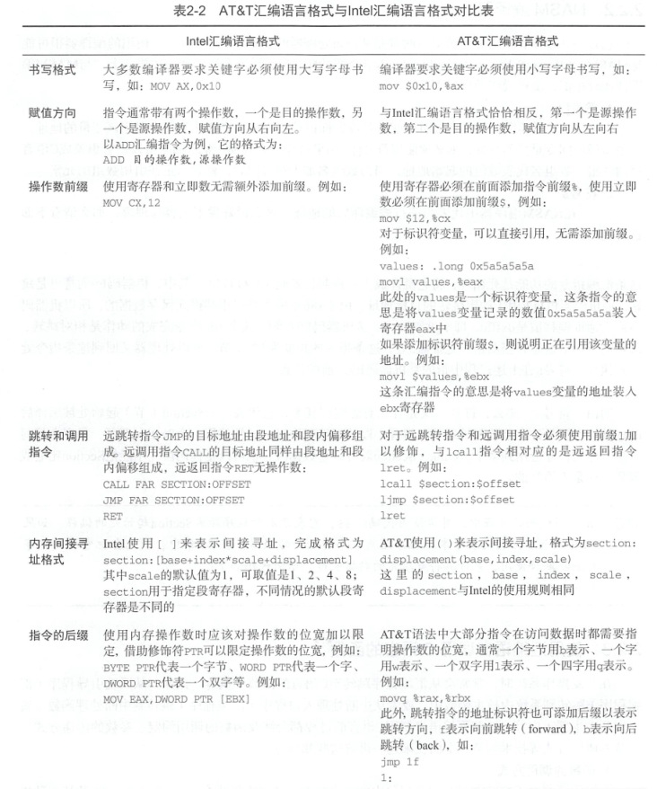
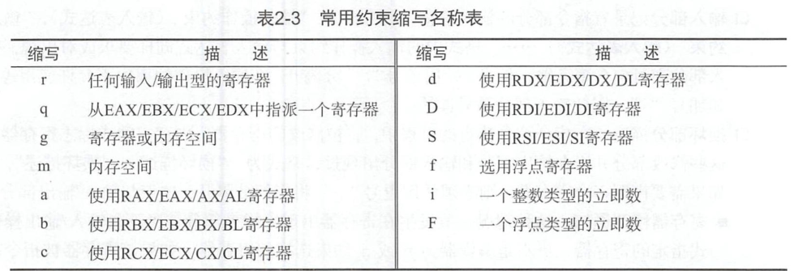

#### 操作系统的组成结构  
分为内核层和应用层。内核层主要负责硬件管理，资源分配，为应用层提供接口支持，保证应用程序的稳定运行；应用层主要负责人机交互。
* 引导启动：计算机从BIOS上电自检开始到跳转到内核程序执行前，执行前的一段或几段程序。引导启动程序用于检测计算机硬件，配置内核运行时的参数，然后将检测到的参数交给内核解析，内核根据解析的结果对自己进行配置。引导启动程序曾经分为Boot和Loader，现在合并为BootLoader。常见的有Grub和Uboot，这些引导启动程序自带终端，可以通过命令行控制内核的加载和使用。  
* 内存管理：管理物理内存，为其他模块开辟内存提供便利，为页表映射和地址变换提供配套函数。Linux内存管理使用的伙伴算法，可以长时间保持内存的稳定分配，防止内存碎片过多，是一种稳定成熟的算法。内存线性地址空间的红黑树管理算法，将原有的线性地址结构转换为树形结构，缩短搜索时间，在每次插入时调整树的结构。  
* 异常/中断处理：异常---程序运行时的错误，除零，断溢出，页错误，无效指令，调试错误等。中断---处理器接收到硬件的中断请求信号，中断处理与外围硬件设备联系密切，直接影响性能，所以通常分为中断上半部和下半部，上半部要求快速响应中断信号。取得数据后尽快开启中断处理（为了能够尽快接收其他中断信号），下半部用来执行中断内容，例如数据解析，驱动程序状态调整等耗时的内容，下半部还可以将中断处理放在一个新的进程中（优先处理优先级更高的进程）  
* 进程管理：主要包括进程调度和进程间通信（SIGNAL信号，管道，共享内存，信号量等）  
* 设备驱动：操作系统把驱动程序从内核中移除出去（为了便于驱动程序的调试，实现即插即用设备，缩减内核体积），仅当使用驱动时再将其动态的挂载到内核空间  
* 文件系统：把机械硬盘的部分或全部扇区（也可以是内存）组织成一个便于管理的结构化单元，组成一个内存式硬盘（比普通机械硬盘高出一个数量级），缺点是掉电数据丢失，linux中的sys文件系统就是在这种内存式硬盘中创建的。常见的FAT，EXT文件系统对扇区的组织形式各有特色，但是都是给原生操作系统提供方便。  
* 系统调用API：例如POSIX标准，不同的接口标准封装和函数实现不一样，但本质都是为了应用程序提供便利的接口。  
* Linux下常用命令： 
    * gcc：GNU C语言编译器
    * as：GAS汇编语言编译器，编译AT&T格式的汇编语言
    * nasm：NASM汇编语言编译器，用于编译Intel格式的汇编语言
    * ld：链接器
    * make：编译工具
    * dd：复制指定大小的内存块，并在复制过程中转换数据格式
    * mount：挂载命令，将u盘，光驱，软盘等挂载到指定路径
    * umount：卸载
    * sync：数据同步命令，将缓存中的数据写回到存储设备
    * objdump：反汇编，将可执行文件翻译成汇编语言
    * objcopy：文化提取命令，将源文件内容提取出来，转存到目标文件中  

  

* 函数调用约定：描述执行函数时返回地址和参数的入栈规律。不同的C语言编译器有各自的函数调用约定  
    * stdcall：  
        * 参数从右向左入栈  
        * 函数执行结束，参数出栈由被调用函数负责，当CPU执行RET指令时，处理器自动将栈指针寄存器向上移动模拟出栈操作（ESP，栈是从高地址向低地址）
        * 函数名修饰使用__作为前缀，使用@加上参数个数作为后缀
    * cdecl:GNU C编译器默认调用约定，在64位操作系统下，GNU C编译器不使用栈的方式传递参数，使用寄存器传递参数，函数调用者将参数从左向右放入RDI, RSI, RDX, RCX, R8, R9这几个通用寄存器中，XMM0~XMM7用来保存浮点数参数，RAX用于保存函数返回值   
        * 参数从右向左入栈  
        * 参数出栈由调用函数负责，调用函数使用leave,pop或向上移动栈指针的方式模拟出栈  
        * 每个函数调用者都具有处理参数出栈的代码，最终生成的可执行文件相比stdcall较大  

* 参数传递方式：一种是寄存器传递，一种是内存传递。在x64下，大多数编译器使用寄存器传参。  
    * 寄存器传递：优点是执行速度快，但是只有少数的调用约定默认使用寄存器传递参数，由于内核层和应用层是相互隔离的，传递参数最方便的方式就是通过寄存器携带参数，在X86的Linux下，系统调用API通常使用该方式  
    * 内存传递：函数参数通过入栈的方式传递到目标函数。在x86的Linux下，中断处理过程和异常处理过程使用内存传递参数，但是从Linux 2.6开始，逐渐改变为寄存器传参  

* GNU C内嵌汇编语言：
```c
//空操作函数
#define nop() __asm__ __volatile__ ("nop \n\t")
```
在操作某些特殊的寄存器，主板上的某些IO端口，或者对性能要求苛刻的场景下，C语言无法完全替代汇编语言。__asm__:声明这一行代码是一个内嵌汇编表达式；__volatile__：告诉编译器这行代码不要被优化  

* GNU C内嵌汇编语言的完整格式：指令部分：输出部分：输入部分：损坏部分。 如果将表达式当做函数，则指令部分相当于函数代码，输出部分箱单与返回值，输入部分相当于参数。
    * 指令部分： 汇编代码本身，必须存在。当指令表达式存在多条汇编代码时，可以全部书写在一对引号中，相邻两条指令之间使用分号或换行符隔开；也可以将汇编代码放在多对引号中，当汇编代码使用寄存器时必须再添加一个%表示对寄存器的引用。
    * 输出部分：格式："输出操作约束"(输出表达式), "输出操作约束"(输出表达式), ...... 输出表达式部分主要保存指令部分的执行结果，通常是一个变量。输出操作约束必须使用=或+进行修饰，=表明输出表达式是一个纯粹的输出操作，+表明输出表达式既用于输出操作，也用于输入操作，是可读写的。
    * 输入部分："输入操作约束"(输入表达式), "输入操作约束"(输入表达式), .... 输入操作约束不允许使用+和=，是只读的
    * 损坏部分：描述指令执行过程中将被修改的寄存器，内存空间或标志寄存器，并且这些寄存器没有在输入和输出部分出现过；"损坏描述", "损坏描述", ...
        * 寄存器修改通知：这种情况发生在寄存器出现于指令部分，又不是输入输出表达式指定的寄存器，也不是编译器为r或g约束的寄存器，如果该寄存器被指令部分修改，就应该在损坏部分描述，因为一旦编译器发现后续代码中需要使用到该寄存器，就会在内嵌汇编语句中做好数据保护和恢复工作。在损坏部分声明的寄存器不能出现在输入输出部分，不会被指派为q, r, g约束的寄存器  
        * 内存修改通知：除了寄存器的内容会被篡改，内存中的内容也会被修改，如果在输入输出部分修改了内存，并且该内存没有用m进行约束，则需要在损坏部分用memory进行声明。编译器会在汇编语句执行完成之后，重新装载这部分内存  
        * 标志寄存器修改通知：当内嵌汇编表达式中包含影响R|EFLAGS的指令时，必须在损坏部分使用cc向编译器进行声明    
    
    * 操作约束：每个输入输出表达式必须指定自身的操作约束，输出表达式中还有限定寄存器操作的修饰符；操作约束分为：寄存器约束，内存约束，立即数约束
        * 寄存器约束：限定表达式的载体是一个寄存器，这个寄存器可以明确指派，也可以模糊指派交给编译器自行分配，寄存器约束可以使用寄存器的全名，也可以使用缩写名称
        ```c
        __asm__ __volatile__ ("movl %0,%%cr0"::"eax"(cr0));
        __asm__ __volatile__ ("movl %0,%%cr0"::"a"(cr0));
        ```
        如果使用缩写，编译器将会根据指令部分的汇编代码来确定寄存器的实际位宽
          

        * 内存约束：限定表达式的载体是一个内存空间，使用m约束  
        ```c
        __asm__ __volatile__ ("sgdt %0":"=m"(__gdt__addr)::);
        __asm__ __volatile__ ("lgdt %0"::"m"(__gdt__addr));
        ```

        * 立即数约束：只能用于输入部分，限定表达式的载体是一个数值，如果不想借助内存和寄存器，可以使用立即数约束
        ```c
        __asm__ __volatile__ ("movl %0, %%ebx"::"i"(50));
        ```

        * 修饰符：只能用在输出部分，包括=，+，&，&告诉编译器不得为任何输入操作表达式分配该寄存器，只能写在输出约束部分的第二个字符上（=，+之后），编译器在输入部分赋值之前，先对&号修饰的寄存器进行赋值，一旦后面的输入表达式向该寄存器赋值，会造成输入和输出数据混乱。只有在输入约束中使用过模糊约束（q，r，g等缩写），使用&才有意义。
    * 序号占位符：序号占位符是输入输出操作约束的数值映射，每个内嵌汇编表达式最多只有10条输入输出约束，这些约束按照书写顺序依次被映射为序号0-9，指令中要引用序号占位符，得使用%进行修饰，%0对应第一个操作约束......，指令部分为了区分符号占位符和寄存器，使用两个%%进行修饰，编译时，编译器根据每个占位符代表的表达式替换到相应的寄存器或内存中。

* 柔性数组（零长数组，变长数组）：GNU C语言对标准C语言进行了扩展，允许使用长度为0的数组
```c
struct s{ int n; log d[0]; };
int m = 10;
struct s* p = malloc(sizeof(struct s) + sizeof(long[m]));
```
s中的数组成员d与指针很相似，在为p开辟内存空间时，仅仅需要执行一次malloc操作，因此，柔性数组可以减少内存分配的次数，还能保持结构体空间的连续性。

* GNU C允许case关键字匹配一个数值范围，代替if/else，
```c
case 'a'...'z':break;
```

* typeof(x)获取x的数据类型，在编写宏定义时有用

* 可变参数宏：
```c
#define print__debug(fmt, arg...) \
printk(fmt, ##arg)
```

* 元素编号：标准C语言规定数组和结构体必须按照固顺序对成员进行初始化赋值，GNU C进行了扩展，使得数组可以在初始化期间借助下标对某些元素（可以是连续或者不连续）进行赋值，也允许数组和结构体按照任意顺序对成员进行初始化
```c
unsigned char data[MAX]
{
    [0]= 10, 
    [10...50] = 100,
    [55]=55,
};

struct file_operations ext2_file_operations = 
{
    open:ext2_open,
    close:ext2_close,
};
```

* 当前函数名：GNU C为当前函数的名字准备了两个标识符，__PRETTY__FUNCTION__(保存经过修饰的名字)和__FUNCTION__（保存函数在源码中的名字），在C函数中，这两个标识符代表的名字相同

* GNU C语言允许使用特殊属性对函数，变量，和类型进行修饰，以便对他们进行手工代码优化和定制。在声明处使用__attribute__((ATTRIBUTE))即可指定。如果存在多个属性，使用,隔开。
```c
/*noreturn属性表明函数从不返回，这样编译器在优化时会剔除不必要的警告信息*/
#defien ATTRIB_NORET __attribute__((noreturn))

/*packed属性的作用是取消结构在编译时的对齐优化，使其按照实际占用的字节数对齐，这个属性经常出现在协议包的定义中*/
struct example
{
    int a;
    char b;
    float c;
} __attribute__((packed));
```