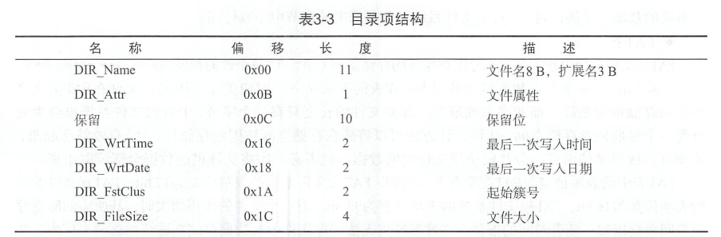

* Boot：负责开机启动和加载Loader， Loader负责配置硬件工作环境和加载内核

* 计算机上电后，首先经过BIOS上电自检，BIOS会检测硬件设备是否存在问题，如果检测无误，再根据BIOS的启动项配置选择引导设备（软盘启动，U盘启动，硬盘启动，网络启动）。

* BIOS选择根据软驱启动，则会检测软盘的第0磁头第0磁道第1扇区，如果该扇区以0x55和0xaa结尾，则认为该扇区是一个引导扇区（Boot Sector），于是把该扇区的数据拷贝到内存地址为0x7c00处，然后将控制权交给这段程序，一个引导扇区是无法装载下整个操作系统的，甚至获取硬件信息的程序都装不下，所以Boot Sector引导扇区仅仅作为一级助推器，***其任务为加载Loader到内存中***。

* BIOS在向引导扇区中的引导程序转交控制权之前，会对处理器进行初始化，包括设置处理器的代码段寄存器CS和指令指针寄存器IP，当BIOS跳转到引导程序时，CS值为0x0000，IP的值为0x7c00，此时的处理器处于实模式下，实际内存地址 = 段地址 * 16 + 段偏移。 

* 在x86架构的汇编语言中，es、ss和sp是寄存器的名称，用于管理内存访问和栈操作。

1. es寄存器（Extra Segment Register）：它用于指定额外的段寄存器，用于访问额外的内存段。在保护模式下，es寄存器主要用于字符串操作指令中的目标段地址。

2. ss寄存器（Stack Segment Register）：它用于指定栈段的段选择子，即栈的起始地址。ss寄存器与sp寄存器一起用于管理栈帧和函数调用。当执行函数调用或返回时，栈指针sp会相应地在栈上移动，而ss寄存器则指定了栈的段地址。

3. sp寄存器（Stack Pointer Register）：它用于指示当前栈帧的栈顶地址。栈指针sp指向栈中最新压入的数据的位置，它会随着栈的操作进行自动调整。在函数调用时，函数的参数和局部变量通常存储在栈上，sp寄存器用于管理栈上的数据。

* 将boot.bin写入boot.img: bs：指定传输的块大小为512，count=1：写入到目标文件的块数量 conv=notrunc写入数据后不截断输出文件
bochs -f ../bochs-2.6.8/.bochsrc 
```c
dd if=boot.bin of=boot.img bs=512 count=1 conv=notrunc
```

* 簇：由于扇区容量有限，可能导致磁盘访问频繁，所以引入簇的概念，，簇将2的整数次方个扇区作为一个“原子”存储单元，是FAT类文件系统的最小存储单位。因此，文件在FAT类文件系统的存储单位是簇，即使文件只有一个字节，也会分配一个簇，好处是可以根据簇来实现文件指针偏移，可以访问文件的某个部分，而不用全部将文件读出来。

* 保留扇区：保留扇区起始于FAT12文件系统的第一个扇区，引导扇区位于保留扇区内，FAT表从第二个扇区开始。  

* FAT类文件系统的目录项结构：


* 逻辑区块号转换为CHS（柱面/磁头/扇区）格式：  
  

* 软盘扇区的读取需要借助BIOS的中断服务程序来完成。从根目录中搜索加载程序loader的逻辑，先保存根目录的起始扇区号，依据根目录占用扇区数确定将要搜索的扇区数，从根目录读入一个扇区到缓冲区，遍历缓冲区中的每个目录项，寻找与加载程序名字相同的目录项  

* loader.asm的编译和拷贝进软盘命令d，当boot.bin写入软盘时，boot.img已经有了FAT12文件系统，此时应当使用mount命令挂载软盘，使用cp命令将loader.bin拷贝到软盘文件系统, -t vfat指明磁盘的文件系统，-o loop负责把一个文件描述成磁盘分区（dd命令将boot.bin强行写入到boot.img的过程就相当于进行了格式化，所谓格式化就是将文件系统的所有结构数据写入磁盘扇区的过程）:
```c
nasm loader.asm -o loader.bin

mount boot.img /media/ -t vfat -o loop
cp loader.bin /media/
sync
umount /media/
```

* Loader加载程序的任务：
    * 检测硬件信息：通过BIOS中断服务程序来获取和检测硬件信息，BIOS在上电自检出的大部分信息只能在实模式下获取，而且内核运行在非实模式下，因此必须在内核程序开始运行之前检测硬件参数，提供给内核程序使用。包括物理地址空间信息（ROM，RAM，设备寄存器空间，内存空间等资源的物理地址范围），交给内存管理单元模块进行维护，通过VBE功能可以检测显示器支持的分辨率，显示模式，刷新率，以及物理显存地址，根据这些信息配置正确的显示模式  
    * 处理器模式切换：从BIOS运行的实模式，到32位操作系统的保护模式，到64位操作系统使用的IA-32e模式，Loader引导加载程序必须经历这三个模式，在各个模式切换的过程中，Loader引导加载程序必须手动创建各运行模式的临时数据，并按照标准流程执行模式间的跳转，包括配置系统临时页表的工作，保证页表覆盖的地址空间满足程序使用要求，临时段结构也是如此。  
    * 向内核传递数据：Loader可以向内核程序传递两种数据：一种是控制信息，控制内核程序的执行流程，一种是硬件数据信息，初始化内核程序
        * 控制信息用于控制内核执行流程或限制内核的某些功能，这些数据是与内核早已经商定的协议，属于纯软件控制逻辑，如启动模式（字符界面或图形界面），启动方式（网络或者本地），终端重定向（串口或显示器）等信息。
        * 硬件数据通常是指Loader检测出来的硬件数据信息，Loader引导加载程序将这些数据信息多半保存在固定的地址中，然后将数据起始内存地址和数据长度作为参数传递给内核，内核程序在初始化时分析配置使用，包括内存信息，VBE信息等 

* 读取内核程序时为什么需要内核程序的转存空间：因为内核程序的读取操作是通过BIOS的中断服务实现的，而BIOS运行在实模式下，在实模式下只支持上限为1MB的物理地址空间寻址，所以必须先将内核程序读入到临时转存空间，随后再拷贝到1MB以上的内存空间（内核程序最开始在磁盘里面，引导程序也在磁盘里面）。开启A20功能，关闭外部中断，加载保护模式结构数据，进入保护模式，为FS段寄存器加载新的数据段值，加载完成退出保护模式  

* 物理地址空间信息有一个结构体数组构成，计算机平台的地址空间划分情况都能从这个结构体数组中反映出来，包括可用物理内存空间，设备寄存器空间，内存空洞  

* 实模式：在实模式下面，程序可以操作任何地址空间，无法限制程序的执行权限，可寻址的内存空间有限，优点是给设置功能带来方便，缺点是给程序的执行带来隐患，一旦程序执行错误，很可能导致整个系统崩溃  

* 保护模式：处理器按程序的执行级别，分别为0,1,2,3四个等级，最高等级0由内核使用，最低等级3由应用程序使用，等级1和等级2介于内核程序和应用程序之间，通常作为系统服务使用，等级划分的决定权在开发者手里，但是一些特殊的汇编指令只能在0特权级下才能执行；保护模式的另一个功能是引入分页的功能，将庞大的地址空间划分为固定大小的页面，不仅便于还礼，而且减少应用程序内存空间的浪费。相比之下，段机制从结构组织的复杂性，到段间权限检测的繁琐性，以及执行效率上都显得臃肿，随着页机制的出现，诞生了IA-32e模式简化了段级保护措施的复杂性，升级内存寻址能力，扩展页内存管理单元的结构和页面大小，推出新的系统调用方式和高级可编程控制器  

* 从实模式到保护模式：在模式切换之前，处理器必须完成的工作：创建一段在保护模式下执行的代码，创建系统数据结构，包括IDT/GDT/LDT描述符表，任务状态段TSS结构，至少一个页目录和页表（开启分页机制条件下），至少一个异常/中断处理模块，初始化寄存器，包括GDTR寄存器,IDTR寄存器（可推迟到进入保护模式后，使能中断前）
，控制寄存器CR1~4，MTTRs内存范围类型寄存器 
    * 系统数据结构：系统进入保护模式前，必须创建一个拥有代码描述符和数据段描述符的GDT（Global Descriptor Table，全局描述符表）（第一项必须是NULL描述符），并且一定要使用LGDT汇编指令将其加载到GDTR寄存器。保护模式的栈寄存器SS，使用可读写的数据段即可，对于多段式操作系统，可采用LDT（Local Descriptor Table，局部描述符表）（必须保存在GDT表的描述符中）来管理应用程序，多个应用程序可独享或共享一个局部描述符表LDT，如果开启分页机制，必须准备至少一个页目录项和页表项（如果使用4MB页表，准备一个页目录即可）；
    * 中断和异常：在保护模式下，中断和异常处理程序皆由IDT（中断描述符表 Interrupt Descriptor Table），IDT由若干门描述符组成，如果采用中断门和陷阱门描述符，他们可以直接指向异常处理程序；若采用任务门描述符，则必须为程序准备TSS段描述符等结构，如果处理器允许接收外部中断请求，那么IDT必须为每个中断处理程序建立门描述符，通常是在切换到保护模式之前，使用LIDT将IDT加载到IDTR寄存器  
    * 分页机制：CR0控制寄存器的PG标志位控制分页机制是否开启，开启PG标志位前，必须在内存创建一个页目录和页表（此时的页表和页目录不能使用同一个物理页），然后将页目录的物理地址加载到CR3。当准备就绪后，可以同时设置CR0的PE和PG标志位，开启分页机制。（分页机制往往和模式切换机制同时进行）。
    * 多任务机制：如果希望使用多任务机制或者允许改变特权级，则必须在首次任务切换之前，创建至少一个任务状态段TSS结构和附加的TSS段描述符。当特权级切换至0,1,2时，栈段寄存器与栈指针寄存器都从TSS段结构中取得，在使用TSS段结构前，必须使用汇编指令将其加载到TR寄存器，这个过程只能在进入保护模式之后。此表也必须保存在全局描述符表GDT，而且任务切换不会影响其他段描述符，LDT表，TSS段结构以及TSS段描述符的创建，只有处理器才能在任务切换时设置TSS段描述符的忙状态位，否则TSS段描述符的忙状态位始终复位。如果不想开启多任务机制，也不允许改变特权级，则无需加载TR任务寄存器，也无需创建TSS段结构。