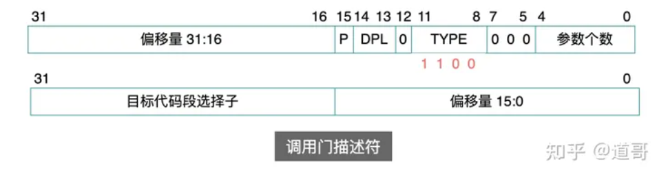
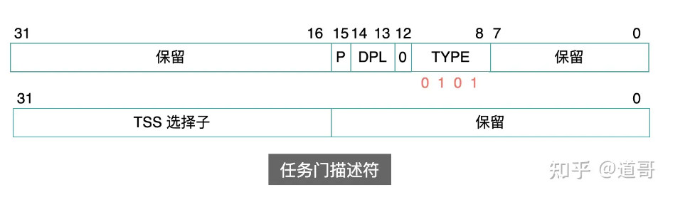
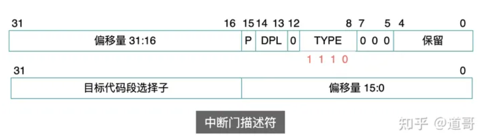
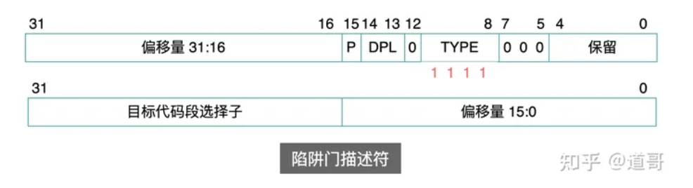

所谓的门，就是一个通道。通过这个通道，可以进入另一个代码段中进行执行。
在x86中，有下面这些门：  
* 调用门：用于低特权级代码转移到高特权级代码;
* 任务门：用于不同任务之间的调度;
* 中断门：用于异步执行中断处理程序;
* 陷阱门：也用于执行中断处理程序，不过这里的中断是处理器内部产生的;  
门描述符与之前介绍的段描述符本质是一样的，都是用来描述一个代码段的信息，只不过门描述符增加了一层间接性。

下面是4个门描述符的结构(32位系统)：  
   
   
   
   
从以上这4个门描述符的结构中可以看出: 它们并没有直接记录目标代码段的开始地址和界限，而是记录了目标代码段的选择子。  
也就是说：先通过门描述符找到代码段选择子，然后再用这个选择子到 GDT 中去查找真正的目标代码段描述符，最终找到目标代码段的开始地址和界限、属性等信息.  
  
所以说，这些门就是增加了一层间接性。  
这层间接性，为操作系统提供了诸多好处。  
首先，对于中断处理来说，把所有的中断描述符放在一个表中，可以对中断处理程序的地址进行解耦。  
其次，对于执行代码段的转移来说，可以利用门来提供更灵活的特权级别控制，实现更加复杂的操作。  
关于任务门中的TSS选择子:  所谓的任务门可以简单理解为用于任务切换。因为一个 TSS 段中，保存的就是一个任务的上下文信息快照。  
只要处理器发现选择子指向的描述符是一个任务门(通过 TYPE 字段)，它就执行任务切换:  
1. 保存当前 CPU 中的上下文到当前任务的 TSS 段中;
2. 再把 TSS 选择子中所指向的那个 TSS 段中的上下文内容，加载到 CPU 寄存器中，这样就实现了任务切换。   
  
从调用门的名字就可以看出，它是为系统调用服务的。  
  
再来看一下它的描述符结构：
```
参数个数：调用者传递多少个参数给目标代码(是通过栈空间来传参的);
DPL：表示这个调用门本身的特权级;
目标代码段选择子：最终调用的目标代码段的选择子，需要用这个选择子到 GDT 中寻找目标代码段的基地址;
偏移量：调用的代码距离目标代码段开始地址的偏移字节数;
```
从以上这些字段来看，这简直就是为：从低特权级的用户代码，调用高特权级的操作系统代码，量身定做的，只要处理器在特权级上放过用户程序一马就可以了。  

事实上也正是如此：当用户请求调用门时，操作系统会进行如下特权级检查：  
- 当前特权级 CPL (用户程序)和请求特权级 RPL，必须 [高于或等于] 调用门中的 DPL;
- 即在数值上：CPL <= DPL，RPL <= DPL。(注意：这是调用门描述符里的 DPL)  

当前特权级 CPL(用户程序)，必须 [低于或等于] 目标代码段中的 DPL;
即在数值上：CPL >= 目标代码段描述符中的 DPL。

从以上规则可以再次看出：即使通过调用门，目标代码段只允许相同或者更低的特权级代码进入，也验证了之前所说的：高特权级代码不会主动转移到低特权级的代码中。  
  
如果特权级检查被通过，进入目标代码段之后，当前特权级CPL是否会改变呢？  
  
这就依赖于目标代码段描述符中的TYPE字段中的 C 标志位的值：  
- TYPE.C = 1：CPL 保持不变，仍然为用户程序中的特权级 3;
- TYPE.C = 0: CPL 改变，变成目标代码段的特权级;
